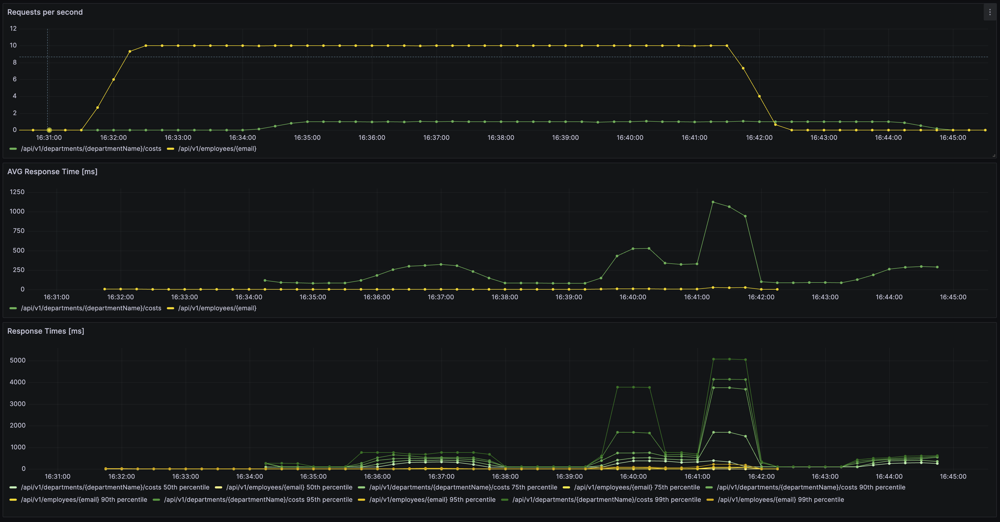

# Work In Progress
App to analyze distributed microservices app and DB performance using Gatling and OpenTelemetry.

## Modules:
* **company** - a simple CRUD microservice. Data model consists of two tables: department and employee. They are in many-to-many relationship (an employee can work in multiple departments, while a department may have multiple employees).
* **data-generator** - a utility tool to generate SQL file(s) to populate test database with significant amount of data. This code does not use collections and streams for performance reasons.
* **load-test** - a module running pre-defined load tests using Gatling.
* **monitoring** - dashboards showing the company app performance in Grafana. Micrometer is used to gather data in Prometheus. (WiP)

# Running locally
Requires JDK17+, Docker, and Docker Compose installed on your machine.

## Generating test data
Run following commands:
```shell
./gradlew clean :data-generator:build && java -jar data-generator/build/libs/data-generator-0.0.1-SNAPSHOT.jar 100000
```
This generates SQL scripts that inserts 10 000 departments (fixed value), 100 000 employees (configurable), and generates random relations between them. Generated files are put in `data-generator` module under `output` directory. Import them into application database (check `docker-compose.yml` for credentials).

These files are also used during load tests to generate random requests.

These files may be extremely large (several GB), thus they are not tracked in Git.

## Running company app locally
Run following command:
```shell
./gradlew clean :company:build && docker-compose up --build
```

## Sample HTTP requests
Check `http/requests.http` file.

## Performance testing
Gatling gradle plugin is used. Run following commands:
```shell
./gradlew clean :load-test:gatlingRun-pl.lunasoftware.demo.microservices.loadtest.DepartmentSimulation
./gradlew clean :load-test:gatlingRun-pl.lunasoftware.demo.microservices.loadtest.EmployeeSimulation
```
First one load tests endpoint that fids the given employee. Second one load tests endpoint that finds the given department and calculates its cost (computationally expensive).

## Monitoring
Company app serves Spring Boot Actuator data which are scrapped by Prometheus. Grafana dashboard is available under [http://localhost:3000/d/e1f890c5-2799-411b-b267-f344670afe6c](http://localhost:3000/d/e1f890c5-2799-411b-b267-f344670afe6c).


## Hints
Adjust CPU limits in `docker-compose.yml` to avoid Gatling starvation by the load-tested Company App. Default configuration limits app to 6 cores + another 2 cores for its DB.

# Known issues
* Load test module reads generated data from SQL file in an ineffective way and will fail for around 500+ RPS. 250 is currently safe.
* There are occasional 404s during load tests that should not happen as SQL file imported into DB is used to generate random requests.
* Prometheus looses data when app is irresponsive.

# Future plans
* Add Tempo and Loki to Grafana Stack
* Add DB monitoring
* Prepare local setup using Minikube
* Deploy it on some remote servers and orchestrate cloud using K8S, consider using Terraform
* Prepare CI/CD for above
* Add another microservice to demo backpressure / circuit breaker

