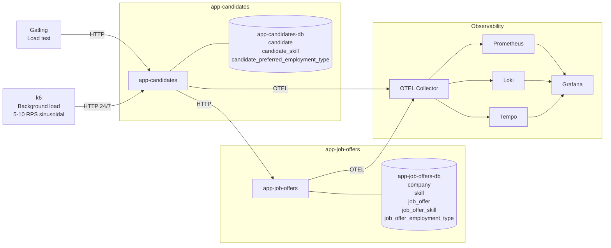

# Work In Progress

App to analyze distributed microservices system and DB performance using Gatling and OpenTelemetry.

## Modules:

* **app-job-offers** - a microservice managing job offers. Data model consists of five tables: company, skill,
  job_offer, job_offer_skill, and job_offer_employment_type.
  A job offer belongs to one company and may require multiple skills at specific seniority levels.
* **app-candidates** - a microservice managing candidates, acting as a client for app-job-offers to find matching
  offers.
  Data model consists of three tables: candidate, candidate_skill, and candidate_preferred_employment_type.
* **data-generator** - a utility tool to generate SQL file(s) to populate job-offers and candidates databases with
  significant amounts of data.
  This code does not use collections and streams for performance reasons.
* **load-test** - a module running pre-defined load tests using Gatling. UUIDs for requests are randomly picked from
  `01-candidates.sql` file generated by the **data-generator** module.
* **load-background** - a module sending continuous 24/7 background load using k6. Runs as a Docker Compose service.
  Sends requests to `app-candidates` at 5–10 RPS following a sinusoidal curve with a 5-minute period. Starts only after
  the Spring Boot apps are healthy. UUIDs for requests are randomly picked from `01-candidates.sql` file generated by
  the **data-generator** module.
* **observability** - dashboards showing app performance and logs in Grafana. OTEL agent exports data to OTEL collector.
  It pushes data to proper backends. Prometheus gathers metrics from Spring Boot Actuator and Micrometer.
  Loki is used for aggregating logs. Tempo gathers traces about methods time execution.


```mermaid
flowchart LR
    gatling["Gatling\nLoad test"]
    k6["k6\nBackground load\n5-10 RPS sinusoidal"]

    subgraph candidates_svc["app-candidates"]
        candidates["app-candidates"]
        candidatesdb[("app-candidates-db\ncandidate\ncandidate_skill\ncandidate_preferred_employment_type")]
    end

    subgraph joboffers_svc["app-job-offers"]
        joboffers["app-job-offers"]
        joboffersdb[("app-job-offers-db\ncompany\nskill\njob_offer\njob_offer_skill\njob_offer_employment_type")]
    end

    subgraph observability["Observability"]
        otel["OTEL Collector"]
        prometheus["Prometheus"]
        loki["Loki"]
        tempo["Tempo"]
        grafana["Grafana"]
    end

    gatling -->|HTTP| candidates
    k6 -->|HTTP 24/7| candidates
    candidates -->|HTTP| joboffers
    candidates --- candidatesdb
    joboffers --- joboffersdb
    candidates -->|OTEL| otel
    joboffers -->|OTEL| otel
    otel --> prometheus
    otel --> loki
    otel --> tempo
    prometheus --> grafana
    loki --> grafana
    tempo --> grafana
```

# Running locally

Requires JDK25+, Docker (with Compose) installed on your machine.

## Generating test data

Run following command:

```shell
./gradlew clean :data-generator:build && java -jar data-generator/build/libs/data-generator-1.0.0.jar [candidates] [jobOffers] [companies]
```

All arguments are optional. Defaults:

- `candidates` — 100 000
- `jobOffers` — 50 000
- `companies` — 10 000

Example generating 200 000 candidates, 100 000 job offers and 20 000 companies:

```shell
./gradlew clean :data-generator:build && java -jar data-generator/build/libs/data-generator-1.0.0.jar 200000 100000 20000
```

This generates SQL scripts that insert companies, skills (52 predefined technology names), job offers with their
required skills, employment types and offered salaries, and candidates with their preferred skills, employment types and
expected salaries. Both Job offers and candidates have unique geographical locations (latitude and longitude).

Generated files are placed in the `data-generator/output` directory, split by service. File names are prefixed with a
number to indicate the correct import order (respecting foreign key constraints):

```
data-generator/output/
  job-offers/
    01-companies.sql
    02-skills.sql
    03-job-offers.sql
    04-job-offer-employment-types.sql
    05-job-offer-skills.sql
  candidates/
    01-candidates.sql
    02-candidate-preferred-employment-types.sql
    03-candidate-skills.sql
```

Import them into the respective application databases (check [compose.yml](compose.yml) for credentials).

`01-candidates.sql` is used by **load-test** and **load-ambient** modules to generate requests with random candidates UUID.

These files may be extremely large (several GB), thus they are not tracked in Git.

## Starting microservices locally

Run following command:

```shell
make start
```

or full command:

```shell
./gradlew clean :app-job-offers:build :app-candidates:build && docker compose up --build
```

Please note that the new v2 of Docker Compose is used. If you are using older Docker version, use `docker-compose`
instead of `docker compose`.

## Matching score

`app-job-offers` scores each candidate–offer pair as a weighted sum of four sub-scores, all in `[0.0, 1.0]`:

| Sub-score  | Weight | Description                                                                                                     |
|------------|--------|-----------------------------------------------------------------------------------------------------------------|
| Skills     | 50%    | Weighted coverage of offer skills adjusted for seniority gap and missing mandatory skills.                      |
| Salary     | 20%    | Quadratic decay — lower score the closer the expected salary is to the offer ceiling.                           |
| Distance   | 15%    | Haversine distance with cosine decay — score=1.0 at distance=0, score=0.0 at the radius boundary.               |
| Experience | 15%    | Exponential decay based on the gap between candidate years and the minimum expected for the required seniority. |

SQL bounding box pre-filters offers cheaply; Haversine and the full scoring run only on the reduced set.

## Sample HTTP requests

Check [http/requests.http](http/requests.http) file.

## Background load (Grafana k6)

The `load-background` module sends continuous ambient traffic to `app-candidates` 24/7.
It runs as a Docker Compose service and starts only after both Spring Boot apps report healthy on `/actuator/health`.
Candidate UUIDs are read from the SQL data file into a `SharedArray` at startup — shared across all VUs, loaded once
into RAM.

### RPS profile

Load oscillates sinusoidally between **5 and 10 RPS** with a 5-minute period:

```
RPS
 10 |     *         *         *
  9 |    * *       * *       * *
  8 |   *   *     *   *     *   *
  7 |  *     *   *     *   *     *
  6 | *       * *       * *       *
  5 +*---------*---------*---------*-> t
     0    1    2    3    4    5    6
```

### Starting together with services

```shell
make start-ambient
```

or full command:

```shell
./gradlew clean :app-job-offers:build :app-candidates:build && docker compose --profile ambient up --build
```

By default, k6 targets `http://app-candidates:8080` via Docker network and uses `01-candidates.sql` file generated by
the **data-generator** module to pick candidate UUIDs randomly, when generating requests.

### Starting separately (services already running)

`ambient-load` always recreates the k6 container so env vars take effect immediately.

```shell
make ambient-load
```

or full command:

```shell
docker compose --profile ambient up --build --force-recreate --no-deps load-background
```

It is possible to override default target host and candidates data file.
To do so, override `targetHost` (host that requests are sent to) and/or `candidatesDataFile` (SQL file with candidate UUIDs):

```shell
make ambient-load targetHost=http://192.168.0.140:8080 candidatesDataFile=/path/to/01-candidates.sql
```

or full command:

```shell
TARGET_HOST=http://192.168.0.140:8080 CANDIDATES_DATA_FILE=/path/to/01-candidates.sql docker compose --profile ambient up --build --force-recreate --no-deps load-background
```

### Candidates data file

It is generated by the **data-generator** module. Path (relative to project root): `data-generator/output/candidates/01-candidates.sql`
If the file is absent the service still starts — all requests will return 404.

## Performance testing

Gatling gradle plugin is used. Run the following command:

```shell
make candidateSimulation
```

or full command:

```shell
./gradlew :load-test:gatlingRun --simulation pl.lunasoftware.demo.microservices.loadtest.CandidateSimulation
```

Load tests the endpoint that finds matching job offers for a given candidate (`GET /api/v1/candidates/{id}/matching-offers`).

### RPS profile

```
 RPS
 500 |              /-------------------------------\
 400 |           /--                                 \
 300 |        /--                                     \
 200 |     /--                                         \
 100 |  /--                                             \
   0 +-/-------------------------------------------------\-> t (min)
     0  1  3  4  6  7  9 10 12 13                   18  23
     |<------------ ramp-up 13 min ---------->| peak |cool|
                                               5 min  5 min
```

5 steps of 100 rps each. Each step: 1 min linear ramp + 2 min steady.
Peak at 500 rps: 2 min (last step's steady) + 3 min (peak steady) = 5 min total.
Cooldown: linear ramp from 500 to 0 rps over 5 min.
Load tests use files generated by `data-generator`. UUIDs for requests are randomly picked from the candidates SQL file.

By default, Gatling targets `http://localhost:8080` and reads candidate UUIDs from `data-generator/output/candidates/01-candidates.sql`.
Override with `targetHost` (URL Gatling sends requests to) or `candidatesDataFile` (SQL file with candidate UUIDs):

```shell
make candidateSimulation targetHost=http://192.168.0.140:8080 candidatesDataFile=/path/to/01-candidates.sql
```

or full command:

```shell
./gradlew :load-test:gatlingRun --simulation pl.lunasoftware.demo.microservices.loadtest.CandidateSimulation -DtargetHost=http://192.168.0.140:8080 -DcandidatesDataFile=/path/to/01-candidates.sql
```

## Observability

Apps use OTEL agent to export metrics, traces and logs to OTEL collector. It pushes all data to designated backends.
Spring Boot Actuator and Micrometer are enabled.

### Performance dashboard

The dashboard is available
under [http://localhost:3000/d/e1f890c5-2799-411b-b267-f344670afe6c](http://localhost:3000/d/e1f890c5-2799-411b-b267-f344670afe6c).
It shows response times, and errors count.


### Logs dashboard

The dashboard is available
under [http://localhost:3000/d/ea015f6f-9746-431d-9113-a2e247c2207b](http://localhost:3000/d/ea015f6f-9746-431d-9113-a2e247c2207b).
It allows viewing and searching logs.


### Traces

Above dashboard has links to traces in Tempo. This allows to view detailed information about application performance
when handling a particular HTTP request.


## Hints

Adjust CPU limits in `docker-compose.yml` to avoid Gatling starvation by the load-tested apps. Default configuration
limits each app to 2 cores.

# Known issues

* Spring percentile metrics do not work with OTEL Agent.

# Future plans

* Prepare local setup using Minikube.
* Deploy it on some remote servers and orchestrate cloud using K8S, consider using Terraform.
* Prepare CI/CD for above.
* Implement backpressure or circuit breaker.
