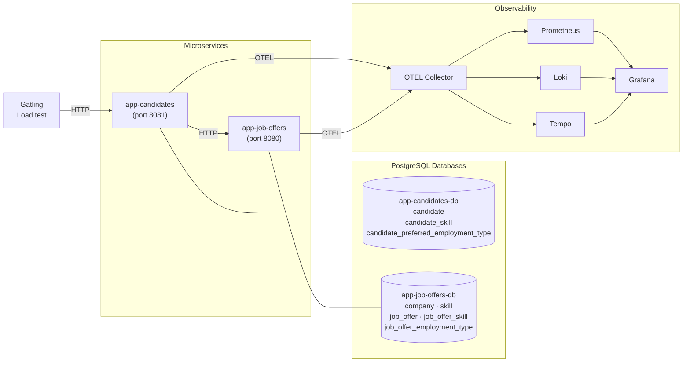
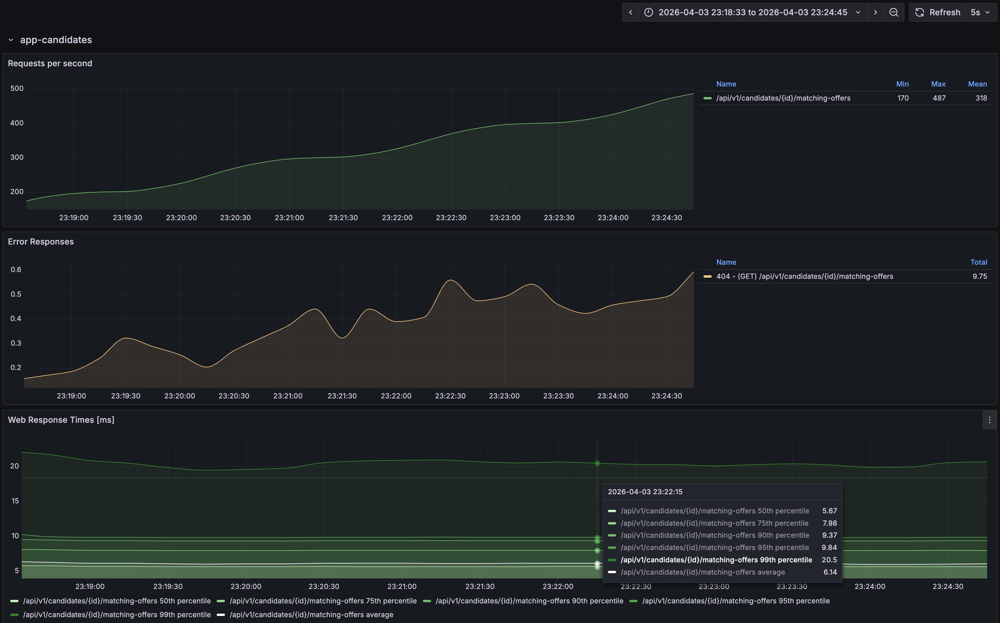
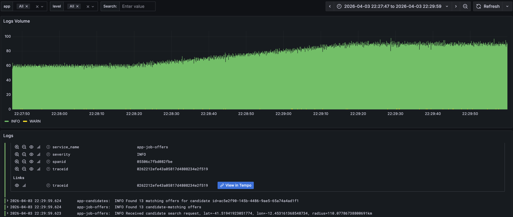
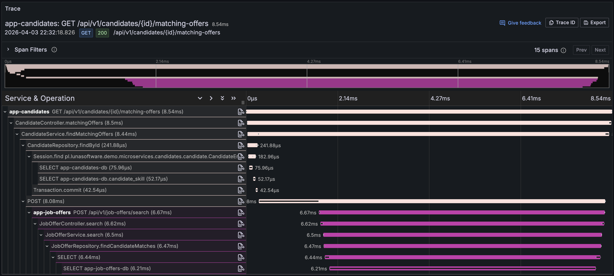

# Work In Progress
App to analyze distributed microservices system and DB performance using Gatling and OpenTelemetry.

## Modules:
* **app-job-offers** - a microservice managing job offers. Data model consists of five tables: company, skill, job_offer, job_offer_skill, and job_offer_employment_type.
  A job offer belongs to one company and may require multiple skills at specific seniority levels.
* **app-candidates** - a microservice managing candidates, acting as a client for app-job-offers to find matching offers.
  Data model consists of three tables: candidate, candidate_skill, and candidate_preferred_employment_type.
* **data-generator** - a utility tool to generate SQL file(s) to populate job-offers and candidates databases with significant amounts of data.
  This code does not use collections and streams for performance reasons.
* **load-test** - a module running pre-defined load tests using Gatling. UUIDs for requests are randomly picked from `01-candidates.sql` file generated by the **data-generator** module.
* **observability** - dashboards showing app performance and logs in Grafana. OTEL agent exports data to OTEL collector.
  It pushes data to proper backends. Prometheus gathers metrics from Spring Boot Actuator and Micrometer.
  Loki is used for aggregating logs. Tempo gathers traces about methods time execution.


```mermaid
flowchart LR
    gatling["Gatling\nLoad test"]

    subgraph microservices["Microservices"]
        candidates["app-candidates\n(port 8081)"]
        joboffers["app-job-offers\n(port 8080)"]
    end

    subgraph databases["PostgreSQL Databases"]
        candidatesdb[("app-candidates-db\ncandidate\ncandidate_skill\ncandidate_preferred_employment_type")]
        joboffersdb[("app-job-offers-db\ncompany · skill\njob_offer · job_offer_skill\njob_offer_employment_type")]
    end

    subgraph observability["Observability"]
        otel["OTEL Collector"]
        prometheus["Prometheus"]
        loki["Loki"]
        tempo["Tempo"]
        grafana["Grafana"]
    end

    gatling -->|HTTP| candidates
    candidates -->|HTTP| joboffers
    candidates --- candidatesdb
    joboffers --- joboffersdb
    candidates -->|OTEL| otel
    joboffers -->|OTEL| otel
    otel --> prometheus
    otel --> loki
    otel --> tempo
    prometheus --> grafana
    loki --> grafana
    tempo --> grafana
```

# Running locally
Requires JDK21+, Docker (with Compose) installed on your machine.

## Generating test data
Run following command:
```shell
./gradlew clean :data-generator:build && java -jar data-generator/build/libs/data-generator-1.0.0.jar [candidates] [jobOffers] [companies]
```
All arguments are optional. Defaults:
- `candidates` — 100 000
- `jobOffers` — 50 000
- `companies` — 10 000

Example generating 200 000 candidates, 100 000 job offers and 20 000 companies:
```shell
./gradlew clean :data-generator:build &&  java -jar data-generator/build/libs/data-generator-1.0.0.jar 200000 100000 20000
```

This generates SQL scripts that insert companies, skills (52 predefined technology names), job offers with their required skills, employment types and offered salaries, and candidates with their preferred skills, employment types and expected salaries. Both Job offers and candidates have unique geographical locations (latitude and longitude).

Generated files are placed in the `data-generator/output` directory, split by service. File names are prefixed with a number to indicate the correct import order (respecting foreign key constraints):
```
data-generator/output/
  job-offers/
    01-companies.sql
    02-skills.sql
    03-job-offers.sql
    04-job-offer-employment-types.sql
    05-job-offer-skills.sql
  candidates/
    01-candidates.sql
    02-candidate-preferred-employment-types.sql
    03-candidate-skills.sql
```
Import them into the respective application databases (check [compose.yml](compose.yml) for credentials).

`01-candidates.sql` is also used during load tests to generate random requests.

These files may be extremely large (several GB), thus they are not tracked in Git.

## Starting microservices locally
Run following command:
```shell
make start
```
or full command:
```shell
./gradlew clean :app-job-offers:build :app-candidates:build && docker compose up --build
```
Please note that the new v2 of Docker Compose is used. If you are using older Docker version, use `docker-compose` instead of `docker compose`.

## Sample HTTP requests
Check `http/requests.http` file.

## Performance testing
Gatling gradle plugin is used. Run the following command:
```shell
make candidateSimulation
```
or full command:
```shell
./gradlew :load-test:gatlingRun --simulation pl.lunasoftware.demo.microservices.loadtest.CandidateSimulation
```
Load tests the endpoint that finds matching job offers for a given candidate (`GET /api/v1/candidates/{id}/matching-offers`).
Load tests use files generated by `data-generator`. It is necessary to make Gatling aware of actual UUIDs present in the database.
Alternatively, you can specify other file with `dataFile` param. E.g.
```shell
make candidateSimulation dataFile=/path/to/01-candidates.sql
```
or full command:
```shell
./gradlew :load-test:gatlingRun --simulation pl.lunasoftware.demo.microservices.loadtest.CandidateSimulation -DdataFile=/path/to/01-candidates.sql
```
Default host under load test is `localhost:8081`. You can override it using `host` param:
```shell
make candidateSimulation host=localhost:8081
```
or full command:
```shell
./gradlew :load-test:gatlingRun --simulation pl.lunasoftware.demo.microservices.loadtest.CandidateSimulation -Dhost=localhost:8081
```

## Observability
Apps use OTEL agent to export metrics, traces and logs to OTEL collector. It pushes all data to designated backends. Spring Boot Actuator and Micrometer are enabled.

### Performance dashboard
The dashboard is available under [http://localhost:3000/d/e1f890c5-2799-411b-b267-f344670afe6c](http://localhost:3000/d/e1f890c5-2799-411b-b267-f344670afe6c).
It shows response times, and errors count.


### Logs dashboard
The dashboard is available under [http://localhost:3000/d/ea015f6f-9746-431d-9113-a2e247c2207b](http://localhost:3000/d/ea015f6f-9746-431d-9113-a2e247c2207b).
It allows viewing and searching logs.


### Traces
Above dashboard has links to traces in Tempo. This allows to view detailed information about application performance when handling a particular HTTP request.


## Hints
Adjust CPU limits in `docker-compose.yml` to avoid Gatling starvation by the load-tested apps. Default configuration limits each app to 2 cores.

# Known issues
* Spring percentile metrics do not work with OTEL Agent.

# Future plans
* Prepare local setup using Minikube.
* Deploy it on some remote servers and orchestrate cloud using K8S, consider using Terraform.
* Prepare CI/CD for above.
* Implement backpressure or circuit breaker.
