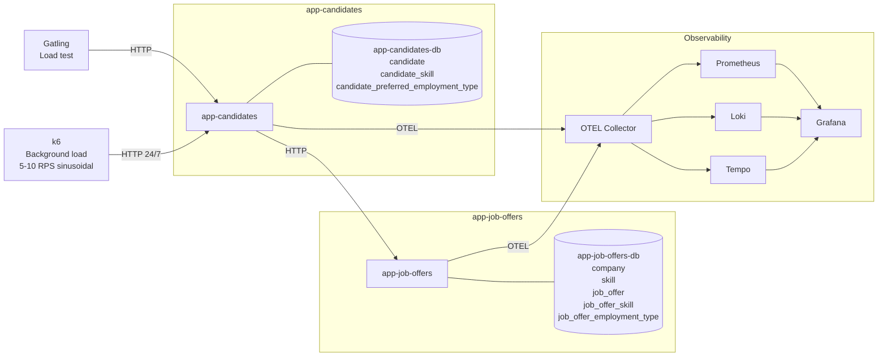
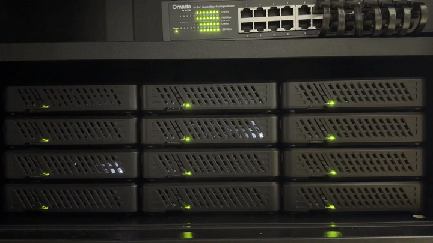
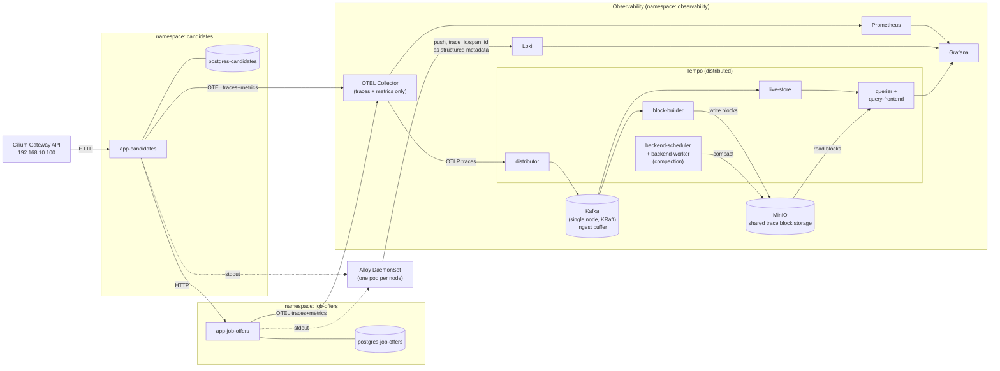

App to analyze distributed microservices system and DB performance using Gatling and OpenTelemetry.

# Modules:

* **app-job-offers** - a microservice managing job offers. Data model consists of five tables: company, skill,
  job_offer, job_offer_skill, and job_offer_employment_type.
  A job offer belongs to one company and may require multiple skills at specific seniority levels. Job offers include remote/hybrid work requirements and required years of experience
* **app-candidates** - a microservice managing candidates, acting as a client for app-job-offers to find matching
  offers.
  Data model consists of three tables: candidate, candidate_skill, and candidate_preferred_employment_type. Candidates include remote work preferences.
* **data-generator** - a utility tool to generate SQL file(s) to populate job-offers and candidates databases with
  significant amounts of data.
  This code does not use collections and streams for performance reasons.
* **load-test** - a module running pre-defined load tests using Gatling. UUIDs for requests are randomly picked from
  `01-candidates.sql` file generated by the **data-generator** module.
* **load-background** - a module sending continuous 24/7 background load using k6. Runs as a Docker Compose service.
  Sends requests to `app-candidates` at 5–10 RPS following a sinusoidal curve with a 5-minute period. Starts only after
  the Spring Boot apps are healthy. UUIDs for requests are randomly picked from `01-candidates.sql` file generated by
  the **data-generator** module.
* **observability** - dashboards showing app performance and logs in Grafana. OTEL agent exports data to OTEL collector.
  It pushes data to proper backends. Prometheus gathers metrics from Spring Boot Actuator and Micrometer.
  Loki is used for aggregating logs. Tempo gathers traces about methods time execution.


```mermaid
flowchart LR
    gatling["Gatling\nLoad test"]
    k6["k6\nBackground load\n5-10 RPS sinusoidal"]

    subgraph candidates_svc["app-candidates"]
        candidates["app-candidates"]
        candidatesdb[("app-candidates-db\ncandidate\ncandidate_skill\ncandidate_preferred_employment_type")]
    end

    subgraph joboffers_svc["app-job-offers"]
        joboffers["app-job-offers"]
        joboffersdb[("app-job-offers-db\ncompany\nskill\njob_offer\njob_offer_skill\njob_offer_employment_type")]
    end

    subgraph observability["Observability"]
        otel["OTEL Collector"]
        prometheus["Prometheus"]
        loki["Loki"]
        tempo["Tempo"]
        grafana["Grafana"]
    end

    gatling -->|HTTP| candidates
    k6 -->|HTTP 24/7| candidates
    candidates -->|HTTP| joboffers
    candidates --- candidatesdb
    joboffers --- joboffersdb
    candidates -->|OTEL| otel
    joboffers -->|OTEL| otel
    otel --> prometheus
    otel --> loki
    otel --> tempo
    prometheus --> grafana
    loki --> grafana
    tempo --> grafana
```

# Running locally

Requires JDK25+, Docker (with Compose), and `make` installed on your machine.

`make` is required to run the predefined commands below — targets are defined in [Makefile](Makefile).

| Command | What it does |
|---|---|
| `make start` | Start everything: apps, observability stack, ambient traffic |
| `make generate-data` | Generate SQL files with test data (see [Parameters](#parameters)) |
| `make load-data` | Generate + import real data into Postgres (`make reload-data` to force a reload) |

## Generating test data

Run following command:

```shell
make generate-data
```

### Parameters

| Parameter    | Default   | Description                |
|--------------|-----------|-----------------------------|
| `candidates` | `100 000` | Number of candidates to generate |
| `jobOffers`  | `50 000`  | Number of job offers to generate |
| `companies`  | `10 000`  | Number of companies to generate  |

Parameters are positional (same as the underlying jar's `args`), so to override one you must also set every
parameter before it.

Example generating 200 000 candidates, 100 000 job offers and 20 000 companies:

```shell
make generate-data candidates=200000 jobOffers=100000 companies=20000
```

This generates SQL scripts that insert companies, skills (52 predefined technology names), job offers with their
required skills, employment types and offered salaries, and candidates with their preferred skills, employment types and
expected salaries. Both Job offers and candidates have unique geographical locations (latitude and longitude).

Generated files are placed in the `data-generator/output` directory, split by service. File names are prefixed with a
number to indicate the correct import order (respecting foreign key constraints):

```
data-generator/output/
  job-offers/
    01-companies.sql
    02-skills.sql
    03-job-offers.sql
    04-job-offer-employment-types.sql
    05-job-offer-skills.sql
  candidates/
    01-candidates.sql
    02-candidate-preferred-employment-types.sql
    03-candidate-skills.sql
```

`make load-data` generates these and imports them into the respective application databases in one step (skips a
database that already has more than a handful of rows — pass `make reload-data` to truncate and reload
unconditionally). To do it by hand instead, run `make generate-data` and import the files yourself (check
[compose.yml](compose.yml) for credentials).

`01-candidates.sql` is used by **load-test** and **load-background** modules to generate requests with random candidates UUID.

These files may be extremely large (several GB), thus they are not tracked in Git.

## Starting microservices locally

Run following command:

```shell
make start
```

This also starts **load-background** (continuous ambient traffic, see [Background load](#background-load-grafana-k6))
alongside the apps — there's no separate "with/without ambient load" mode.

Please note that the new v2 of Docker Compose is used. If you are using older Docker version, use `docker-compose`
instead of `docker compose`.

## CPU limits when load testing

Adjust CPU limits in [compose.yml](compose.yml) to avoid Gatling starving the load-tested apps. Default configuration
limits each app to 2 cores.

# Matching score

`app-job-offers` scores each candidate–offer pair as a weighted sum of five sub-scores, all in `[0.0, 1.0]`:

| Sub-score  | Weight | Description                                                                                                                                                              |
|------------|--------|------------------------------------------------------------------------------------------------------------------------------------------------------------------------|
| Skills     | 45%    | Weighted coverage of offer skills adjusted for seniority gap and missing mandatory skills.                                                                               |
| Salary     | 20%    | `1.0` when the offer ceiling meets or exceeds candidate expectations. Exponential decay when the offer ceiling falls below — score drops sharply as the gap grows.        |
| Experience | 10%    | Exponential decay based on the gap between candidate years and the minimum expected for the required seniority.                                                          |
| Remote     | 10%    | Cosine decay on office mismatch — score=1.0 when candidate willingness meets or exceeds office requirement, non-linear drop as the gap grows.                            |
| Distance   | 15%    | Haversine cosine decay blended with remote allowance — fully remote offers always score 1.0; in-office offers use pure cosine decay; hybrid offers blend proportionally. |

SQL bounding box pre-filters offers cheaply; Haversine and the full scoring run only on the reduced set.

# Sample HTTP requests

Check [http/requests.http](http/requests.http) file.

# Background load (Grafana k6)

The `load-background` module sends continuous ambient traffic to `app-candidates` 24/7.
It runs as a Docker Compose service and starts only after both Spring Boot apps report healthy on `/actuator/health`.

Candidate UUIDs are read from the SQL data file into a `SharedArray` at startup. In k6, a `SharedArray` is populated
once and shared, read-only, across all VUs — a plain array declared in the init scope would instead be copied into
each VU's own memory, which gets expensive fast with large data files.

A VU (Virtual User) is k6's unit of concurrency — a virtual "user" running the exported default function in a loop
(here: `GET /api/v1/candidates/{id}/matching-offers` against a random candidate UUID). Several VUs run in parallel, so
the actual RPS depends on VU count and response time. This module uses the `ramping-arrival-rate` executor, which lets
k6 control the request arrival rate directly (`MIN_RPS`–`MAX_RPS`) rather than deriving it from a fixed VU count; `VUS`
below is just the number of VUs pre-allocated to sustain that rate with latency headroom.

## Parameters

Overridable via `make` / environment variables:

| Parameter            | Default                                              | Description                                    |
|-----------------------|------------------------------------------------------|-------------------------------------------------|
| `targetHost`          | `http://app-candidates:8080`                         | Base URL of `app-candidates` (Docker network by default) |
| `candidatesDataFile`  | `data-generator/output/candidates/01-candidates.sql` | SQL file with candidate UUIDs                    |

Load profile constants, defined at the top of [candidate-search.js](load-background/src/candidate-search.js) (not
overridable via `make`):

| Parameter   | Default        | Description                                              |
|-------------|----------------|------------------------------------------------------------|
| `MIN_RPS`   | `5`            | Minimum RPS (sine trough)                                   |
| `MAX_RPS`   | `10`           | Maximum RPS (sine peak)                                     |
| `PERIOD_S`  | `300` (5 min)  | Sine period                                                  |
| `VUS`       | `5`            | Pre-allocated VUs — enough for peak RPS with latency headroom |

## RPS profile

Load oscillates sinusoidally between **5 and 10 RPS** with a 5-minute period:

```
RPS
 10 |     *         *         *
  9 |    * *       * *       * *
  8 |   *   *     *   *     *   *
  7 |  *     *   *     *   *     *
  6 | *       * *       * *       *
  5 +*---------*---------*---------*-> t
     0    1    2    3    4    5    6
```

## Starting

Starts automatically as part of `make start` (see [Starting microservices locally](#starting-microservices-locally)) —
no separate command. By default, k6 targets `http://app-candidates:8080` via Docker network; override `targetHost`
and/or `candidatesDataFile` (see [Parameters](#parameters)) the same way as `make start`:

```shell
make start targetHost=http://192.168.0.140:8080 candidatesDataFile=/path/to/01-candidates.sql
```

## Candidates data file

It is generated by the **data-generator** module. Path (relative to project root): `data-generator/output/candidates/01-candidates.sql`
If the file is absent the service still starts — all requests will return 404.

# Performance testing

Gatling gradle plugin is used. Run the following command:

```shell
make candidateSimulation
```

Load tests the endpoint that finds matching job offers for a given candidate (`GET /api/v1/candidates/{id}/matching-offers`).
0.1% of requests intentionally are supposed to return HTTP 404 (Not Found) response.

## Parameters

| Parameter           | Default                                              | Description                              |
|---------------------|------------------------------------------------------|-------------------------------------------|
| `targetHost`        | `http://localhost:8080`                              | Base URL of `app-candidates`             |
| `candidatesDataFile`| `data-generator/output/candidates/01-candidates.sql` | SQL file with candidate UUIDs            |
| `maxRps`            | `100`                                                | Peak RPS (global maximum, reached at the top of the last ramp) |
| `stepDuration`      | `3m`                                                 | Base time unit for each phase (`30s`, `5m`, `1h`) |
| `ramps`             | `5`                                                  | Number of ramp-up steps                  |

## RPS profile (defaults: maxRps=100, stepDuration=3m, ramps=5)

```
 RPS
 100 |                                           /-----\
  80 |                                     /-----       |
  60 |                               /-----             |
  40 |                         /-----                   |
  20 |                   /-----                         |
   0 +-------------------                                \-> t (min)
     0     1     3     4     6     7     9    10    12    13    15  16
     |<--------------------- ramp-up: 15 min --------------------->|cool|
                                                                     1min
```

5 steps of 20 RPS each. Each step's ramp-up portion is a fixed **1-minute warmup** to
the next RPS level, followed by however long is left in `stepDuration` held steady at
that level — 1 min ramping + 2 min held, since `stepDuration=3m`. The warmup length does
not scale with `stepDuration`; only the held portion does.
Cooldown: linear ramp from 100 to 0 RPS, also capped at 1 minute (here, shorter than
`stepDuration` itself).
Total: `ramps × stepDuration + min(1 min, stepDuration)` = 5×3m + 1m = 16 min.
Load tests use files generated by `data-generator`. UUIDs for requests are randomly picked from the candidates SQL file.

A `stepDuration` at or below 1 minute has no held portion at all — the whole step is
spent ramping, chaining straight into the next one (no staircase, just a continuous
ramp). See the smoke test example below.

Override `targetHost`, `candidatesDataFile`, or load profile parameters:

```shell
make candidateSimulation targetHost=http://192.168.0.140:8080 candidatesDataFile=/path/to/01-candidates.sql
```

Quick smoke test (peak 20 RPS, 1.5 min total, `stepDuration=30s` is below the 1-minute
cap so it's a continuous ramp with no held peak):

```shell
make candidateSimulation maxRps=20 stepDuration=30s ramps=2
```

## Quiet terminal during a run

`load-test/src/gatling/resources/gatling.conf` sets `data.writers = [file]` — no periodic stats block is printed to
the console while the test runs; results still land in `simulation.log` and the HTML report as usual, you just don't
see them scroll by live. `load-test/src/gatling/resources/logback.xml` sets the root logger to `WARN` (`io.gatling`
itself at `INFO`) — without it, Logback falls back to its default `BasicConfigurator` (root level `DEBUG`), which logs
every Netty/AsyncHttpClient internal at debug level and floods the terminal on its own, independently of the Gatling
stats writer above. Both are needed together for a quiet run; either alone still spams.

# Observability

Apps use OTEL agent to export metrics, traces and logs to OTEL collector. It pushes all data to designated backends.
Spring Boot Actuator and Micrometer are enabled.

## Performance dashboard

The dashboard is available
under [http://localhost:3000/d/e1f890c5-2799-411b-b267-f344670afe6c](http://localhost:3000/d/e1f890c5-2799-411b-b267-f344670afe6c).
It shows response times, and errors count.


## Logs dashboard

The dashboard is available
under [http://localhost:3000/d/ea015f6f-9746-431d-9113-a2e247c2207b](http://localhost:3000/d/ea015f6f-9746-431d-9113-a2e247c2207b).
It allows viewing and searching logs.


## Traces

Above dashboard has links to traces in Tempo. This allows to view detailed information about application performance
when handling a particular HTTP request.


# Home Kubernetes cluster

Alongside Docker Compose, this project is being deployed to a home Kubernetes cluster running on 12× Raspberry Pi 5
(8GB RAM, NVMe boot). Built with `kubeadm` rather than k3s — a deliberate choice to learn the full stack by picking
and wiring up each piece by hand (CNI, storage, load-balancing, ingress) instead of relying on a batteries-included
distribution.

Current state:

* **Cilium** as CNI, with Hubble for network observability, and as the ingress controller via Cilium Gateway API
  (kube-proxy replaced by `kubeProxyReplacement`, required by Cilium's Gateway API support).
* **MetalLB** (L2 mode) providing `LoadBalancer` services on the home LAN, IP pool `192.168.10.100`–`192.168.10.199`.
* **`local-path-provisioner`** for node-local persistent storage.
* The full observability stack from this README — Prometheus, Loki, Tempo, OTEL Collector, Grafana — running on the
  cluster via Helm, plus two k8s-only pieces (Alloy for logs, Kafka + MinIO for `tempo-distributed`) that Compose
  doesn't need — see [Differences from Docker Compose](#differences-from-docker-compose) for why.
* `app-candidates` and `app-job-offers` deployed (plain Kubernetes manifests, one namespace per service, each with its
  own Postgres), publicly reachable through the Gateway at `http://192.168.10.100/api/v1/...`.
* Dedicated, tainted nodes for databases, observability, and platform/ingress services, plus generic worker nodes for
  the Java apps.

### Services running in the cluster

| Service | Category | What it does |
|---|---|---|
| Cilium | Networking | CNI (pod networking), replaces `kube-proxy` (`kubeProxyReplacement`), implements Gateway API |
| Cilium Envoy | Networking | Proxy embedded in Cilium, handles the actual L7 traffic for the Gateway |
| MetalLB | Networking | Assigns real LAN IPs to `LoadBalancer` Services (L2/ARP mode) |
| Hubble (Relay + UI) | Networking | Visualizes and debugs live network flows / policy drops |
| `local-path-provisioner` | Storage | Turns node-local disk into `PersistentVolume`s |
| Prometheus | Observability | Scrapes and stores metrics |
| Grafana | Observability | Dashboards — views metrics (Prometheus), logs (Loki), traces (Tempo) |
| Loki | Observability | Stores and indexes logs |
| Alloy | Observability | DaemonSet, reads container stdout on every node and ships it to Loki (k8s-only, see below) |
| Tempo (`tempo-distributed`) | Observability | Trace storage/search, split into `distributor`/`querier`/`query-frontend`/`live-store`/`block-builder`/`backend-scheduler`/`backend-worker` |
| OTEL Collector | Observability | Receives OTLP traces/metrics from the apps, forwards to Prometheus/Tempo |
| Kafka (Strimzi operator) | Observability | Buffers trace spans between Tempo's ingestion and storage stages (k8s-only, see below) |
| MinIO | Observability | S3-compatible object storage — holds Tempo's trace blocks (k8s-only, see below) |
| `kube-state-metrics` | Observability | Exposes Kubernetes object state (pods, nodes, deployments...) as metrics |
| `prometheus-node-exporter` | Observability | Exposes per-node OS/hardware metrics (CPU, RAM, disk, network) |
| `metrics-server` | Observability | Lightweight CPU/RAM metrics powering `kubectl top` and Headlamp's resource view |
| Headlamp | Cluster UI | Web UI to browse and manage the cluster (pods, deployments, logs...) |
| Image registry | Platform | Self-hosted Docker Distribution — holds `app-candidates`/`app-job-offers`/`load-background` images, replaces `ghcr.io` (k8s-only, see below) |
| `app-candidates` / `app-job-offers` | App | The two Java microservices this whole project is about |
| `postgres-candidates` / `postgres-job-offers` | App | One Postgres instance per service |
| `load-background` | App | k6 ambient traffic generator (k8s-only version of the module described above) |

### IP addressing (`192.168.10.0/24`, the "Cloud" VLAN)

| Range | Purpose |
|---|---|
| `.1`–`.99` | Static reservations for node IPs |
| `.100`–`.199` | MetalLB pool — `LoadBalancer` IPs for k8s Services (`.100` Gateway, `.101` postgres-candidates, `.102` postgres-job-offers, `.190` image registry, `.197` Hubble UI, `.198` Headlamp, `.199` Grafana) |
| `.200`–`.252` | Dynamic DHCP (Omada) |
| `.253` | Managed switch (ES224G), static |
| `.254` | Router (ER7406) interface for this network |

### Node taints — what runs where

| Node(s) | Taint | What runs there |
|---|---|---|
| `master` | `node-role.kubernetes.io/control-plane` | Control plane (apiserver, etcd, scheduler, controller-manager) |
| `db-1`/`db-2` | `role=database` | Postgres instances (`db-3` repurposed to `worker-4` 2026-09-20 — only 2 Postgres instances ever run here) |
| `observability-1`/`observability-2`/`observability-3` | `role=observability` | Prometheus, Grafana, Loki, OTEL Collector, Tempo, Kafka, MinIO, Hubble Relay/UI. `-3` added 2026-09-20 to split Kafka/Tempo's write path from the rest — see [RPS scaling journey](k8s-cluster/RPS-SCALING.md) |
| `platform-1`/`platform-2` | `role=platform` | Gateway ingress, MetalLB controller, `local-path-provisioner`, image registry. `platform-2` planned to move to a dedicated `sso-1` node for Keycloak (not yet executed — MetalLB's L2 mode is active-passive per IP, so `platform-2` measured near-idle even under load; see [k8s-cluster handoff](.claude/handoff-k8s-rpi-cluster.md)) |
| `worker-1`–`worker-4` | none | `app-candidates`, `app-job-offers`, one dedicated node per replica (hard `podAntiAffinity` since 2026-09-20 — see [RPS scaling journey](k8s-cluster/RPS-SCALING.md)) |

DaemonSets that must run everywhere (Cilium, Alloy, node-exporter, the MetalLB speaker) tolerate all of the above and
run on every node regardless of taint.

Cluster provisioning lives under [k8s-cluster/](k8s-cluster) — `ansible/` for node setup, `manifests/` for Helm
values and Kubernetes manifests.

| Command | What it does |
|---|---|
| `make k8s-rebuild-all` | Bare metal → running cluster |
| `make k8s-deploy` | Day-to-day: redeploy the apps after a code/manifest change |
| `make k8s-load-data` | Load real generated data (`make k8s-reload-data` to force a reload) |
| `make k8s-deploy-load-background` | Rare: rebuild+redeploy `load-background` after changing its own source (JS script, entrypoint, Dockerfile) |



### Measured capacity

Sustained-load ceiling of the physical cluster, measured with `load-test` against the Gateway
(`http://192.168.10.100`), client wired directly into the `192.168.10.0/24` VLAN (a Wi-Fi/inter-VLAN client
introduces its own packet loss unrelated to the cluster — see [Known issues](#known-issues)).

**Current state (2026-09-20): 1500 RPS sustained, 0% KO** (`maxRps=1500 stepDuration=3m ramps=1`, 202,500 requests,
p50=9ms/p95=25ms/p99=78ms/mean=12ms/max=608ms, ~2 min held near peak — 1s buckets touched 1600 during the hold).
This clears the previous 1500rps blocker (the Cilium Gateway's unconfigured Envoy circuit breaker, ~1024 max
pending requests, tripping once `app-job-offers` latency degraded under CPU pressure) with no new config beyond
what was already in place for 1200rps: CPU limit `3` on both apps and one dedicated worker node per replica (hard
`podAntiAffinity`, see [Node taints](#node-taints--what-runs-where)) — see
[RPS-SCALING.md](k8s-cluster/RPS-SCALING.md#9-hard-pod-anti-affinity-one-app-replica-per-node-guaranteed-2026-09-20)
for why that fix matters beyond just fixing the 87/13 CPU split it was built for. 1200 RPS remains separately
confirmed clean over a full 5-minute sustained hold (`maxRps=1200 stepDuration=5m ramps=1`, 360,000 requests, 0% KO,
p99=41ms/mean=10ms) on top of the earlier `stepDuration=60s` result (90,000 requests, p99=359ms/mean=20ms). Full
history — including a same-day regression to 5-40% KO from a node-topology change, root-caused and fixed the same
session — is in [`k8s-cluster/RPS-SCALING.md`](k8s-cluster/RPS-SCALING.md).

### Row counts on the home k8s cluster

Actual row counts in each database, as loaded on the physical Raspberry Pi cluster. Slightly above the generator's
`100 000`/`50 000` defaults because each app's Flyway baseline migration (`V1_1__demo-data.sql`) seeds a handful of
fixed demo rows on top of the bulk-generated data. Rounded to the nearest 50,000.

**`app-candidates-db`:**

| Table | Rows |
|---|---|
| `candidate` | ~100,000 |
| `candidate_skill` | ~300,000 |
| `candidate_preferred_employment_type` | ~200,000 |

**`app-job-offers-db`:**

| Table | Rows |
|---|---|
| `job_offer` | ~100,000 |
| `job_offer_skill` | ~300,000 |
| `job_offer_employment_type` | ~200,000 |
| `company` | ~50,000 |
| `skill` | 58 |

### Local testing without the physical cluster

Same shape as the RPi cluster above, on a disposable local `minikube` cluster — to test k8s-specific changes before
pushing to the RPi cluster:

| Command | What it does |
|---|---|
| `make minikube-rebuild-all` | Bare → running cluster: Cilium/Gateway/MetalLB, full observability stack, apps+Postgres+load-background, Flyway's own demo data (no data-generator load) |
| `make minikube-image` | Rebuild app-candidates/app-job-offers/load-background and load them straight into minikube's image cache (no registry, not even ghcr.io — see [`k8s-cluster/manifests/overlays/minikube/README.md`](k8s-cluster/manifests/overlays/minikube/README.md)). Chained into `minikube-rebuild-all`; run standalone after changing app source, then `minikube-deploy` |
| `make minikube-deploy` | Day-to-day: redeploy the apps after a manifest change |
| `make minikube-load-data` | Load real generated data (`make minikube-reload-data` to force a reload) — skipped by the two above since it's slow |
| `make minikube-tunnel` | Real Gateway/MetalLB IP on the host instead of forwarded ports (needs sudo) |
| `make minikube-stop` | Stop the cluster — data stays |
| `make minikube-delete` | Delete the cluster — data goes too |

`minikube-rebuild-all` and `minikube-deploy` both end by port-forwarding everything to the Mac **in the background**
and returning immediately — the terminal stays free, no second command needed to get access:

* `http://localhost:8080` — `app-candidates`
* `http://localhost:3000` — Grafana (anonymous admin)
* `http://localhost:4466` — Headlamp (no login)
* `http://localhost:4040` — Hubble UI (live network traffic/flows)

`minikube-stop`/`minikube-delete` stop the forwards too, along with the cluster. See
[`k8s-cluster/manifests/overlays/minikube/README.md`](k8s-cluster/manifests/overlays/minikube/README.md) for what's
overridden (node pinning, IP ranges, a couple of real minikube-only behavioral differences) and why.

## Differences from Docker Compose

The cluster diverges from Compose on purpose in two places — deployed to the physical cluster and verified
end-to-end; tracked in detail in [`.claude/handoff-k8s-rpi-cluster.md`](.claude/handoff-k8s-rpi-cluster.md):

* **Logs: Grafana Alloy (DaemonSet) instead of the OTEL Collector, in k8s only.** In Compose, the OTEL Java agent
  pushes logs over OTLP through the OTEL Collector to Loki — the same path as traces and metrics. In k8s, apps set
  `OTEL_LOGS_EXPORTER=none` instead, and an Alloy DaemonSet (one pod per node, the standard Kubernetes logging
  pattern) reads container stdout directly and ships it to Loki, bypassing the Collector entirely for logs. This
  decouples log delivery from the Collector's own health — a Collector crash (as happened during a 200rps Gatling
  burst on 2026-09-03, see the handoff) no longer also stops logging. **Docker Compose keeps the OTEL Collector log
  path unchanged** — the DaemonSet model only pays off when there are multiple nodes to collect from.
* **Traces: `tempo-distributed` instead of single-binary Tempo, in k8s only.** This isn't just "the same Tempo split
  into more pods" — it's a genuine change of *deployment mode*, and that mode is what pulls in two new dependencies
  Compose never needed. Per Tempo 3.0's own release notes: *"In monolithic mode, Tempo runs all components in-process
  without Kafka"* vs *"In microservices mode, a Kafka-compatible system provides durable buffering between ingestion
  and downstream components."* Compose runs Tempo monolithically (`target: all`, one process) — that's why it could
  already move to Tempo 3.0.3 with zero extra infrastructure. k8s crosses into microservices mode specifically to get
  per-component memory isolation (single-binary Tempo's single hard memory ceiling caused the 2026-09-03 OOM cascade
  during that same load test) — and once distributor and live-store/block-builder are separate pods instead of one
  process, Tempo 3.x requires Kafka as the transport between them. Separately, `storage.trace.backend: local` turned
  out to mount an **emptyDir per pod** (verified via `helm template`, not assumed) — block-builder's blocks would be
  invisible to querier on another pod — so trace storage also moved to MinIO (self-hosted S3-compatible object
  storage), the one piece every component can reach over the network regardless of which pod it's on. **Docker
  Compose keeps single-binary Tempo permanently** — one process never needs Kafka or shared object storage to talk to
  itself.
* **Image registry: self-hosted, in k8s only.** Compose builds images straight into the local Docker daemon that runs
  the containers — no registry involved. k8s nodes pull images independently over the network, so something has to
  serve them; `app-candidates`/`app-job-offers`/`load-background` were pushed to `ghcr.io` for a few weeks (each
  freshly-pushed package defaulting to *private*, even from a public repo, needing a manual visibility change per
  package — see the handoff's 2026-08-27 entry) before landing on a plain `registry:3.1.1` pod
  ([`k8s-cluster/manifests/registry/`](k8s-cluster/manifests/registry)) on the platform nodes instead. **Docker
  Compose needs no registry at all** — there's nothing to push to or pull from on a single Docker daemon.


```mermaid
flowchart LR
    gw["Cilium Gateway API\n192.168.10.100"]

    subgraph candidates_ns["namespace: candidates"]
        candidates["app-candidates"]
        candidatesdb[("postgres-candidates")]
    end

    subgraph joboffers_ns["namespace: job-offers"]
        joboffers["app-job-offers"]
        joboffersdb[("postgres-job-offers")]
    end

    alloy["Alloy DaemonSet\n(one pod per node)"]

    subgraph observability["Observability (namespace: observability)"]
        otel["OTEL Collector\n(traces + metrics only)"]
        prometheus["Prometheus"]
        loki["Loki"]
        kafka[("Kafka\n(single node, KRaft)\ningest buffer")]
        minio[("MinIO\nshared trace block storage")]
        subgraph tempo_dist["Tempo (distributed)"]
            distributor["distributor"]
            livestore["live-store"]
            blockbuilder["block-builder"]
            backend["backend-scheduler\n+ backend-worker\n(compaction)"]
            querier["querier +\nquery-frontend"]
        end
        grafana["Grafana"]
    end

    gw -->|HTTP| candidates
    candidates -->|HTTP| joboffers
    candidates --- candidatesdb
    joboffers --- joboffersdb

    candidates -->|OTEL traces+metrics| otel
    joboffers -->|OTEL traces+metrics| otel
    otel --> prometheus
    otel -->|OTLP traces| distributor
    distributor --> kafka
    kafka --> livestore
    kafka --> blockbuilder
    blockbuilder -->|write blocks| minio
    backend -->|compact| minio
    livestore --> querier
    minio -->|read blocks| querier

    candidates -.->|stdout| alloy
    joboffers -.->|stdout| alloy
    alloy -->|push, trace_id/span_id\nas structured metadata| loki

    prometheus --> grafana
    loki --> grafana
    querier --> grafana
```

Manifests for both: [`k8s-cluster/manifests/alloy/`](k8s-cluster/manifests/alloy), Tempo's
[`values-tempo-distributed.yaml`](k8s-cluster/manifests/observability/values-tempo-distributed.yaml), and their two
new dependencies at [`k8s-cluster/manifests/kafka/`](k8s-cluster/manifests/kafka) and
[`k8s-cluster/manifests/minio/`](k8s-cluster/manifests/minio).

# Known issues

* Spring percentile metrics do not work with OTEL Agent.
* Running `load-test` against the Gateway from a client on Wi-Fi, or on a different VLAN than the cluster, produces
  `ConnectTimeoutException`/dropped SYNs unrelated to cluster capacity — packet capture traced it to the client↔cluster
  route itself (Wi-Fi instability and/or inter-VLAN routing), not Cilium/Envoy/the apps. Wire the client directly into
  the cluster's VLAN for load tests that need clean results.
* **A load test much shorter than the dashboard's visible time range will not show a real CPU bottleneck.** All
  `rate()` queries on these dashboards use `$__rate_interval` (Grafana's self-adjusting window based on the visible
  time range and scrape interval) rather than a hardcoded one — the correct general-purpose choice, since a fixed
  window is either too coarse when zoomed in or wastefully fine-grained/noisy when zoomed out. It does **not**,
  however, fix a short *test* viewed against a much longer *time range*: with a wide window open, a 1-2 minute burst
  still gets averaged down and can look like comfortable headroom when the node was actually saturated the whole
  time. Found live 2026-09-20: the "CPU Usage by Pod"/"CPU Usage by Node" panels showed ~65% usage during a
  genuinely 100%-saturated node, confirmed instead via the JVM's own near-instantaneous
  `jvm_cpu_recent_utilization_ratio` and `kubectl top`/Headlamp's live view. Both panels have "Max" enabled in their
  legend (`calcs: [..., "max"]`, Grafana's closest equivalent to CloudWatch's Max statistic) to surface a short spike
  at a glance — narrow the dashboard's time range to roughly the test's own duration so that spike is actually in
  the queried window, and cross-check short bursts against a near-instantaneous metric rather than trusting the
  graph alone.

# Future plans

* Prepare CI/CD for the home Kubernetes cluster.
* Raise/tune the Cilium Gateway's Envoy circuit breaker for the `app-candidates` cluster (currently on Envoy's
  unconfigured defaults, the ceiling hit at 1500rps — see [Measured capacity](#measured-capacity)) — no supported
  Cilium 1.19 extension point found for this yet, would need a newer Cilium version or an unsupported direct
  `CiliumEnvoyConfig` edit.
* ~~Third observability node~~ — done 2026-09-20 (`observability-3`, see [Node taints](#node-taints--what-runs-where)).
  Tail-based trace sampling (100% of errors, a small percentage of everything else) remains a possible follow-up if
  sustained high-RPS load tests ever threaten `observability-1`/`-3` again.
* Keycloak/SSO: real introspection-based auth (not local JWT validation) between `app-candidates` and
  `app-job-offers`, on a dedicated `sso-1` node (planned repurpose of `platform-2`). Low priority, no timeline yet —
  see [k8s-cluster handoff](.claude/handoff-k8s-rpi-cluster.md) for the architecture notes and the capacity risk
  (a single Keycloak instance handling introspection at ~1500rps needs to be measured in isolation first).
* Bigger Postgres dataset (currently 100k candidates / 50k job offers via `data-generator`) — no target scale decided
  yet.
