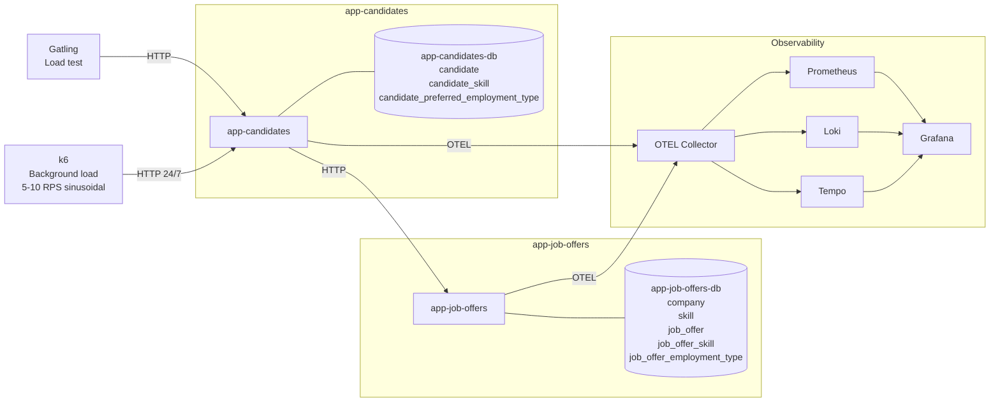
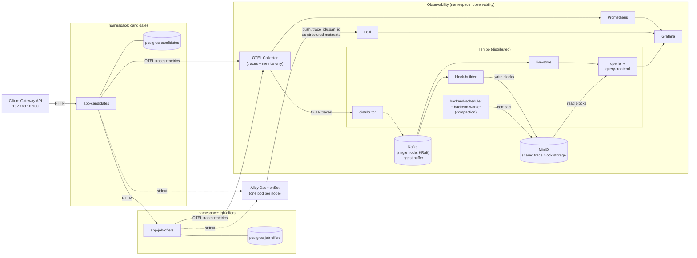

App to analyze distributed microservices system and DB performance using Gatling and OpenTelemetry.

# Modules:

* **app-job-offers** - a microservice managing job offers. Data model consists of five tables: company, skill,
  job_offer, job_offer_skill, and job_offer_employment_type.
  A job offer belongs to one company and may require multiple skills at specific seniority levels. Job offers include remote/hybrid work requirements and required years of experience
* **app-candidates** - a microservice managing candidates, acting as a client for app-job-offers to find matching
  offers.
  Data model consists of three tables: candidate, candidate_skill, and candidate_preferred_employment_type. Candidates include remote work preferences.
* **data-generator** - a utility tool to generate SQL file(s) to populate job-offers and candidates databases with
  significant amounts of data.
  This code does not use collections and streams for performance reasons.
* **load-test** - a module running pre-defined load tests using Gatling. UUIDs for requests are randomly picked from
  `01-candidates.sql` file generated by the **data-generator** module.
* **load-background** - a module sending continuous 24/7 background load using k6. Runs as a Docker Compose service.
  Sends requests to `app-candidates` at 5–10 RPS following a sinusoidal curve with a 5-minute period. Starts only after
  the Spring Boot apps are healthy. UUIDs for requests are randomly picked from `01-candidates.sql` file generated by
  the **data-generator** module.
* **observability** - dashboards showing app performance and logs in Grafana. OTEL agent exports data to OTEL collector.
  It pushes data to proper backends. Prometheus gathers metrics from Spring Boot Actuator and Micrometer.
  Loki is used for aggregating logs. Tempo gathers traces about methods time execution.


```mermaid
flowchart LR
    gatling["Gatling\nLoad test"]
    k6["k6\nBackground load\n5-10 RPS sinusoidal"]

    subgraph candidates_svc["app-candidates"]
        candidates["app-candidates"]
        candidatesdb[("app-candidates-db\ncandidate\ncandidate_skill\ncandidate_preferred_employment_type")]
    end

    subgraph joboffers_svc["app-job-offers"]
        joboffers["app-job-offers"]
        joboffersdb[("app-job-offers-db\ncompany\nskill\njob_offer\njob_offer_skill\njob_offer_employment_type")]
    end

    subgraph observability["Observability"]
        otel["OTEL Collector"]
        prometheus["Prometheus"]
        loki["Loki"]
        tempo["Tempo"]
        grafana["Grafana"]
    end

    gatling -->|HTTP| candidates
    k6 -->|HTTP 24/7| candidates
    candidates -->|HTTP| joboffers
    candidates --- candidatesdb
    joboffers --- joboffersdb
    candidates -->|OTEL| otel
    joboffers -->|OTEL| otel
    otel --> prometheus
    otel --> loki
    otel --> tempo
    prometheus --> grafana
    loki --> grafana
    tempo --> grafana
```

# Running locally

Requires JDK25+, Docker (with Compose), and `make` installed on your machine.

`make` is required to run the predefined commands below — targets are defined in [Makefile](Makefile).

## Generating test data

Run following command:

```shell
make generate-data
```

### Parameters

| Parameter    | Default   | Description                |
|--------------|-----------|-----------------------------|
| `candidates` | `100 000` | Number of candidates to generate |
| `jobOffers`  | `50 000`  | Number of job offers to generate |
| `companies`  | `10 000`  | Number of companies to generate  |

Parameters are positional (same as the underlying jar's `args`), so to override one you must also set every
parameter before it.

Example generating 200 000 candidates, 100 000 job offers and 20 000 companies:

```shell
make generate-data candidates=200000 jobOffers=100000 companies=20000
```

This generates SQL scripts that insert companies, skills (52 predefined technology names), job offers with their
required skills, employment types and offered salaries, and candidates with their preferred skills, employment types and
expected salaries. Both Job offers and candidates have unique geographical locations (latitude and longitude).

Generated files are placed in the `data-generator/output` directory, split by service. File names are prefixed with a
number to indicate the correct import order (respecting foreign key constraints):

```
data-generator/output/
  job-offers/
    01-companies.sql
    02-skills.sql
    03-job-offers.sql
    04-job-offer-employment-types.sql
    05-job-offer-skills.sql
  candidates/
    01-candidates.sql
    02-candidate-preferred-employment-types.sql
    03-candidate-skills.sql
```

Import them into the respective application databases (check [compose.yml](compose.yml) for credentials).

`01-candidates.sql` is used by **load-test** and **load-ambient** modules to generate requests with random candidates UUID.

These files may be extremely large (several GB), thus they are not tracked in Git.

## Starting microservices locally

Run following command:

```shell
make start
```

Please note that the new v2 of Docker Compose is used. If you are using older Docker version, use `docker-compose`
instead of `docker compose`.

## CPU limits when load testing

Adjust CPU limits in [compose.yml](compose.yml) to avoid Gatling starving the load-tested apps. Default configuration
limits each app to 2 cores.

# Matching score

`app-job-offers` scores each candidate–offer pair as a weighted sum of five sub-scores, all in `[0.0, 1.0]`:

| Sub-score  | Weight | Description                                                                                                                                                              |
|------------|--------|------------------------------------------------------------------------------------------------------------------------------------------------------------------------|
| Skills     | 45%    | Weighted coverage of offer skills adjusted for seniority gap and missing mandatory skills.                                                                               |
| Salary     | 20%    | `1.0` when the offer ceiling meets or exceeds candidate expectations. Exponential decay when the offer ceiling falls below — score drops sharply as the gap grows.        |
| Experience | 10%    | Exponential decay based on the gap between candidate years and the minimum expected for the required seniority.                                                          |
| Remote     | 10%    | Cosine decay on office mismatch — score=1.0 when candidate willingness meets or exceeds office requirement, non-linear drop as the gap grows.                            |
| Distance   | 15%    | Haversine cosine decay blended with remote allowance — fully remote offers always score 1.0; in-office offers use pure cosine decay; hybrid offers blend proportionally. |

SQL bounding box pre-filters offers cheaply; Haversine and the full scoring run only on the reduced set.

# Sample HTTP requests

Check [http/requests.http](http/requests.http) file.

# Background load (Grafana k6)

The `load-background` module sends continuous ambient traffic to `app-candidates` 24/7.
It runs as a Docker Compose service and starts only after both Spring Boot apps report healthy on `/actuator/health`.

Candidate UUIDs are read from the SQL data file into a `SharedArray` at startup. In k6, a `SharedArray` is populated
once and shared, read-only, across all VUs — a plain array declared in the init scope would instead be copied into
each VU's own memory, which gets expensive fast with large data files.

A VU (Virtual User) is k6's unit of concurrency — a virtual "user" running the exported default function in a loop
(here: `GET /api/v1/candidates/{id}/matching-offers` against a random candidate UUID). Several VUs run in parallel, so
the actual RPS depends on VU count and response time. This module uses the `ramping-arrival-rate` executor, which lets
k6 control the request arrival rate directly (`MIN_RPS`–`MAX_RPS`) rather than deriving it from a fixed VU count; `VUS`
below is just the number of VUs pre-allocated to sustain that rate with latency headroom.

## Parameters

Overridable via `make` / environment variables:

| Parameter            | Default                                              | Description                                    |
|-----------------------|------------------------------------------------------|-------------------------------------------------|
| `targetHost`          | `http://app-candidates:8080`                         | Base URL of `app-candidates` (Docker network by default) |
| `candidatesDataFile`  | `data-generator/output/candidates/01-candidates.sql` | SQL file with candidate UUIDs                    |

Load profile constants, defined at the top of [candidate-search.js](load-background/src/candidate-search.js) (not
overridable via `make`):

| Parameter   | Default        | Description                                              |
|-------------|----------------|------------------------------------------------------------|
| `MIN_RPS`   | `5`            | Minimum RPS (sine trough)                                   |
| `MAX_RPS`   | `10`           | Maximum RPS (sine peak)                                     |
| `PERIOD_S`  | `300` (5 min)  | Sine period                                                  |
| `VUS`       | `5`            | Pre-allocated VUs — enough for peak RPS with latency headroom |

## RPS profile

Load oscillates sinusoidally between **5 and 10 RPS** with a 5-minute period:

```
RPS
 10 |     *         *         *
  9 |    * *       * *       * *
  8 |   *   *     *   *     *   *
  7 |  *     *   *     *   *     *
  6 | *       * *       * *       *
  5 +*---------*---------*---------*-> t
     0    1    2    3    4    5    6
```

## Starting together with services

```shell
make start-ambient
```

By default, k6 targets `http://app-candidates:8080` via Docker network.

## Starting separately (services already running)

`ambient-load` always recreates the k6 container so env vars take effect immediately.

```shell
make ambient-load
```

Override `targetHost` and/or `candidatesDataFile` (see [Parameters](#parameters)) the same way:

```shell
make ambient-load targetHost=http://192.168.0.140:8080 candidatesDataFile=/path/to/01-candidates.sql
```

## Candidates data file

It is generated by the **data-generator** module. Path (relative to project root): `data-generator/output/candidates/01-candidates.sql`
If the file is absent the service still starts — all requests will return 404.

# Performance testing

Gatling gradle plugin is used. Run the following command:

```shell
make candidateSimulation
```

Load tests the endpoint that finds matching job offers for a given candidate (`GET /api/v1/candidates/{id}/matching-offers`).
0.1% of requests intentionally are supposed to return HTTP 404 (Not Found) response.

## Parameters

| Parameter           | Default                                              | Description                              |
|---------------------|------------------------------------------------------|-------------------------------------------|
| `targetHost`        | `http://localhost:8080`                              | Base URL of `app-candidates`             |
| `candidatesDataFile`| `data-generator/output/candidates/01-candidates.sql` | SQL file with candidate UUIDs            |
| `maxRps`            | `100`                                                | Peak RPS (global maximum, reached at the top of the last ramp) |
| `stepDuration`      | `60s`                                                | Base time unit for each phase (`30s`, `5m`, `1h`) |
| `ramps`             | `5`                                                  | Number of ramp-up steps                  |

## RPS profile (defaults: maxRps=100, stepDuration=60s, ramps=5)

```
 RPS
 100 |                             /-----\
  80 |                       /-----       \
  60 |                 /-----              \
  40 |           /-----                     \
  20 |     /-----                            \
   0 +-----                                   \-> t (min)
     0  0.5 1  1.5 2  2.5 3  3.5 4  4.5 5    6
     |<---------- ramp-up 5 min --------->|-cool-|
                                            1 min
```

5 steps of 20 RPS each. Each step takes exactly `stepDuration`: 30s linear ramp to the
next level + 30s steady at that level. The last step's steady half doubles as the peak
hold (100 RPS, 30s) — no separate peak-steady phase.
Cooldown: linear ramp from 100 to 0 RPS over `stepDuration` (1 min).
Total: `(ramps + 1) × stepDuration` = 6 min.
Load tests use files generated by `data-generator`. UUIDs for requests are randomly picked from the candidates SQL file.

Override `targetHost`, `candidatesDataFile`, or load profile parameters:

```shell
make candidateSimulation targetHost=http://192.168.0.140:8080 candidatesDataFile=/path/to/01-candidates.sql
```

Quick smoke test (peak 20 RPS, 1.5 min total):

```shell
make candidateSimulation maxRps=20 stepDuration=30s ramps=2
```

# Observability

Apps use OTEL agent to export metrics, traces and logs to OTEL collector. It pushes all data to designated backends.
Spring Boot Actuator and Micrometer are enabled.

## Performance dashboard

The dashboard is available
under [http://localhost:3000/d/e1f890c5-2799-411b-b267-f344670afe6c](http://localhost:3000/d/e1f890c5-2799-411b-b267-f344670afe6c).
It shows response times, and errors count.


## Logs dashboard

The dashboard is available
under [http://localhost:3000/d/ea015f6f-9746-431d-9113-a2e247c2207b](http://localhost:3000/d/ea015f6f-9746-431d-9113-a2e247c2207b).
It allows viewing and searching logs.


## Traces

Above dashboard has links to traces in Tempo. This allows to view detailed information about application performance
when handling a particular HTTP request.


# Home Kubernetes cluster

Alongside Docker Compose, this project is being deployed to a home Kubernetes cluster running on 12× Raspberry Pi 5
(8GB RAM, NVMe boot). Built with `kubeadm` rather than k3s — a deliberate choice to learn the full stack by picking
and wiring up each piece by hand (CNI, storage, load-balancing, ingress) instead of relying on a batteries-included
distribution.

Current state:

* **Cilium** as CNI, with Hubble for network observability, and as the ingress controller via Cilium Gateway API
  (kube-proxy replaced by `kubeProxyReplacement`, required by Cilium's Gateway API support).
* **MetalLB** (L2 mode) providing `LoadBalancer` services on the home LAN, IP pool `192.168.10.100`–`192.168.10.199`.
* **`local-path-provisioner`** for node-local persistent storage.
* The full observability stack from this README — Prometheus, Loki, Tempo, OTEL Collector, Grafana — running on the
  cluster via Helm, plus two k8s-only pieces (Alloy for logs, Kafka + MinIO for `tempo-distributed`) that Compose
  doesn't need — see [Differences from Docker Compose](#differences-from-docker-compose) for why.
* `app-candidates` and `app-job-offers` deployed (plain Kubernetes manifests, one namespace per service, each with its
  own Postgres), publicly reachable through the Gateway at `http://192.168.10.100/api/v1/...`.
* Dedicated, tainted nodes for databases, observability, and platform/ingress services, plus generic worker nodes for
  the Java apps.

### Services running in the cluster

| Service | Category | What it does |
|---|---|---|
| Cilium | Networking | CNI (pod networking), replaces `kube-proxy` (`kubeProxyReplacement`), implements Gateway API |
| Cilium Envoy | Networking | Proxy embedded in Cilium, handles the actual L7 traffic for the Gateway |
| MetalLB | Networking | Assigns real LAN IPs to `LoadBalancer` Services (L2/ARP mode) |
| Hubble (Relay + UI) | Networking | Visualizes and debugs live network flows / policy drops |
| `local-path-provisioner` | Storage | Turns node-local disk into `PersistentVolume`s |
| Prometheus | Observability | Scrapes and stores metrics |
| Grafana | Observability | Dashboards — views metrics (Prometheus), logs (Loki), traces (Tempo) |
| Loki | Observability | Stores and indexes logs |
| Alloy | Observability | DaemonSet, reads container stdout on every node and ships it to Loki (k8s-only, see below) |
| Tempo (`tempo-distributed`) | Observability | Trace storage/search, split into `distributor`/`querier`/`query-frontend`/`live-store`/`block-builder`/`backend-scheduler`/`backend-worker` |
| OTEL Collector | Observability | Receives OTLP traces/metrics from the apps, forwards to Prometheus/Tempo |
| Kafka (Strimzi operator) | Observability | Buffers trace spans between Tempo's ingestion and storage stages (k8s-only, see below) |
| MinIO | Observability | S3-compatible object storage — holds Tempo's trace blocks (k8s-only, see below) |
| `kube-state-metrics` | Observability | Exposes Kubernetes object state (pods, nodes, deployments...) as metrics |
| `prometheus-node-exporter` | Observability | Exposes per-node OS/hardware metrics (CPU, RAM, disk, network) |
| `metrics-server` | Observability | Lightweight CPU/RAM metrics powering `kubectl top` and Headlamp's resource view |
| Headlamp | Cluster UI | Web UI to browse and manage the cluster (pods, deployments, logs...) |
| `app-candidates` / `app-job-offers` | App | The two Java microservices this whole project is about |
| `postgres-candidates` / `postgres-job-offers` | App | One Postgres instance per service |
| `load-background` | App | k6 ambient traffic generator (k8s-only version of the module described above) |

### IP addressing (`192.168.10.0/24`, the "Cloud" VLAN)

| Range | Purpose |
|---|---|
| `.1`–`.99` | Static reservations for node IPs |
| `.100`–`.199` | MetalLB pool — `LoadBalancer` IPs for k8s Services (`.100` Gateway, `.198` Headlamp, `.199` Grafana) |
| `.200`–`.252` | Dynamic DHCP (Omada) |
| `.253` | Managed switch (ES224G), static |
| `.254` | Router (ER7406) interface for this network |

### Node taints — what runs where

| Node(s) | Taint | What runs there |
|---|---|---|
| `master` | `node-role.kubernetes.io/control-plane` | Control plane (apiserver, etcd, scheduler, controller-manager) |
| `db-1`/`db-2`/`db-3` | `role=database` | Postgres instances |
| `observability-1`/`observability-2` | `role=observability` | Prometheus, Grafana, Loki, OTEL Collector, Tempo, Kafka, MinIO, Hubble Relay/UI |
| `platform-1`/`platform-2` | `role=platform` | Gateway ingress, MetalLB controller, `local-path-provisioner`, future Keycloak/SSO |
| `worker-1`–`worker-4` | none | `app-candidates`, `app-job-offers`, future autoscaled replicas |

DaemonSets that must run everywhere (Cilium, Alloy, node-exporter, the MetalLB speaker) tolerate all of the above and
run on every node regardless of taint.

Cluster provisioning lives under [k8s-cluster/](k8s-cluster) — `ansible/` for node setup, `manifests/` for Helm
values and Kubernetes manifests.

Photo of the physical cluster coming soon.

### Measured capacity

Sustained-load ceiling of the physical cluster, measured with `load-test` (`stepDuration=2m ramps=2`, i.e. a ramp to
the target RPS followed by a 1-minute hold) against the Gateway (`http://192.168.10.100`), client run from a Mac wired
directly into the `192.168.10.0/24` VLAN (a Wi-Fi/inter-VLAN client introduces its own packet loss unrelated to the
cluster — see [Known issues](#known-issues)):

| Peak RPS | KO rate | p99 latency | Verdict |
|---|---|---|---|
| 500 | 0% | 93ms | clean |
| 600 | 0% | 254ms | clean, latency visibly rising |
| 700 | 1.76% | 3.9s | fails |
| 800 | 7.43% | 4.0s | fails |

**Ceiling: ~600 RPS sustained.** Above that, both `app-candidates` and `app-job-offers` keep running without
restarting or saturating CPU — the failure isn't the apps or the databases. It's the Cilium Gateway's Envoy proxy
tripping its default circuit breaker (`envoy_cluster_circuit_breakers_default_cx_open`, `envoy_cluster_upstream_rq_pending_overflow`)
once the request queue to `app-candidates` grows faster than the app can drain it, returning `503` instead of
queueing further — confirmed by the overflow counter's increase (+12,496) matching the Gatling KO count (12,490)
almost exactly during the 800 RPS run. `hikaricp_connections_pending` on `app-candidates` also climbed to 14 in the
same window, suggesting the Postgres connection pool is a contributing factor feeding that queue, not just the
circuit breaker's default thresholds. Not yet root-caused to a single tunable — a candidate for a future session.

#### Update 2026-09-11 — root cause found: synchronous console logging, not Hikari or Envoy

Bumping `app-candidates`'s Hikari pool (10 → 30, `maximum-pool-size`/`minimum-idle`) to chase the theory above made
things *worse*, not better: 600 RPS still ran 0% KO but p99 jumped to 2.25s (vs. 254ms before). A live thread dump
(`jcmd <pid> Thread.print`) taken mid-peak of a 700 RPS run found the real cause: **171 of 200 Tomcat worker threads
(85.5% of the pool) were parked on a single `ReentrantLock` inside `ch.qos.logback.core.OutputStreamAppender.writeBytes`**.
Spring Boot's default `ConsoleAppender` writes synchronously, and the request handler logs one line per request
(`CandidateController.matchingOffers`, same pattern in `JobOfferController` on `app-job-offers`) — every concurrent
request serializes on that one lock just to write its log line. Postgres CPU, Hikari `pending`, and Envoy's circuit
breaker were all idle at that moment; the apps and databases had headroom, but requests queued behind a logging lock.

**Fix 1 — async logging:** both services now ship a `logback-spring.xml` that wraps the console appender in a
`ch.qos.logback.classic.AsyncAppender` (`queueSize=1024`, `discardingThreshold=0` so business-relevant logs are never
dropped under load). Re-running 700 RPS immediately after deploying this made things *catastrophically* worse (85.74%
KO, including new `500`s) — `app-candidates` started crash-looping. Freed from the logging lock, worker threads did
real work (blocking on the Feign call to `app-job-offers`) for much longer, saturating the full 200-thread Tomcat
pool for real. The liveness probe shares that same pool and port, so it timed out too, and kubelet killed the pod —
turning a slowdown into a multi-minute outage.

**Fix 2 — separate port for actuator:** `management.server.port: 8081` on both services gives the actuator endpoints
their own embedded Tomcat connector (own acceptor/poller/executor, confirmed live via thread names —
`http-nio-8081-exec-*` vs. `http-nio-8080-exec-*`, 10 threads vs. 200), completely independent of the request-handling
pool. `compose.yml` healthchecks and the k8s `livenessProbe`/`readinessProbe` were repointed at 8081. With both fixes
deployed, 700 RPS no longer crash-loops the pod (0 restarts) — the system now degrades safely through Envoy's `503`s
instead of dying, though it's still overloaded at that level (72% KO). **600 RPS is now clean and net better than the
original baseline: 0% KO, p99=112ms** (vs. 254ms before any of this session's changes).

The next candidate bottleneck, not yet fixed: at 600 RPS peak, `app-job-offers` and its Postgres both run at
~75-80% of their 2-core CPU limit, while `app-candidates`/its Postgres have plenty of headroom — consistent with the
already-known cartesian-product `JOIN FETCH` in `JobOfferRepository.findCandidateMatches` (see
[Known issues](#known-issues)). `server.tomcat.threads.max` (default 200) was deliberately left untouched — Little's
Law suggests it isn't the real constraint, and raising it without fixing `app-job-offers`'s CPU cost would likely just
move the queueing rather than raise real throughput.

#### Update 2026-09-11 (continued) — disk I/O ruled out, Postgres parallel query found to be the real amplifier

Checked disk I/O on both database nodes (`node_disk_io_time_seconds_total`, `node_disk_read/written_bytes_total` via
node-exporter) during a 600 RPS run: both sit at 0.1-0.7% busy, tens of KB/s, sub-5ms latency. The 100k-row dataset
fits comfortably in Postgres's cache on an 8GB RPi5 — disk was never a candidate.

**Attempted fix — splitting the cartesian `JOIN FETCH` into two queries (`findCandidateMatches` + a new
`fetchSkills`): made things much worse, reverted.** Implemented, tested with Spock (green), deployed, and measured
live: 600 RPS went from clean to 43.87% KO. `hikaricp_connections_pending` on `app-job-offers` hit 188 — every search
now needed two sequential DB round trips instead of one, and the default Hikari pool (still 10, never touched) choked
immediately. Raising it to 30 made it *worse* (53.35% KO) — the bottleneck wasn't pool size, it was that two queries
per request is more expensive than one at this concurrency, cartesian product or not. **Fully reverted** — `findCandidateMatches`
is back to the original single-query `@NamedEntityGraph("JobOffer.withAllRelations")`.

**Real fix — disabling Postgres parallel query workers, tested in isolation: 700 RPS KO dropped from 72% to 1.77%.**
`nproc` inside the `postgres-job-offers` container reports **4** (the physical RPi5's core count — a k8s `cpu: "2"`
limit is a CFS quota, not a cpuset, so the container still sees all host cores) while `max_parallel_workers_per_gather`
defaults to 2. Every query that qualifies for a parallel plan (this one does) forks a leader + 2 workers, each
competing for the same 2-core quota — up to 3x the CPU footprint per query. `EXPLAIN (ANALYZE, BUFFERS)` on an
isolated, otherwise-idle connection confirmed parallel *is* faster for a single query in isolation (35.6ms vs 52.9ms
serial) — the cost only shows up as aggregate CPU-time under concurrency, which single-query EXPLAIN ANALYZE cannot
see. Tested with `args: ["-c", "max_parallel_workers_per_gather=0"]` on the `postgres-job-offers` container, isolated
from every other change (original single-query fetch, no Hikari changes):

| Peak RPS | Parallel workers ON (this session's baseline) | Parallel workers OFF |
|---|---|---|
| 600 | 0% KO, p99=387ms | 0% KO, p99=1051ms (worse latency, still clean) |
| 700 | 72% KO | **1.77% KO**, p99=3.9s |
| 800 | — | 6.34% KO |

Net win at the load levels that actually matter (700-800 RPS, where the system was failing) despite a real latency
cost at 600 RPS from losing the single-query parallel speedup. Zero app code changes — a one-line Postgres container
arg. `app-candidates`'s Postgres wasn't touched (it has CPU headroom to spare, per the numbers above, and its own
queries are simple enough that parallel plans are unlikely to even trigger).

The `JobOfferRepository.findCandidateMatches` cartesian `JOIN FETCH` (see [Known issues](#known-issues)) remains
unfixed — this session's attempt at it made things worse, not better, for reasons specific to this workload's
concurrency profile. Worth revisiting with a different approach (e.g. batch-fetching instead of a second full query),
but not the two-query split tried here.

#### Update 2026-09-11 (continued) — horizontal scaling + Postgres CPU bump, 750 RPS clean

With logging/probe fixes and parallel-workers-off in place (see above), pushing further exposed CPU as the limiter
again: at 750 RPS on a single replica each, `app-candidates` hit 100% JVM CPU and `app-job-offers` ~90%, both pinned
against their 2-core limit.

**Fix 1 — horizontal: `replicas: 1 → 2` for both `app-candidates` and `app-job-offers`.** Both are stateless
(`ClusterIP`-backed, no local state), so this is a trivial change — no code, no data-consistency concerns. The
scheduler spread the four pods across four different generic workers (`worker-3`/`worker-6` for candidates,
`worker-4`/`worker-5` for job-offers) without any anti-affinity rule needed. App CPU saturation dropped as expected —
but the bottleneck moved, not disappeared: `postgres-job-offers` climbed to a flat 2.0 cores (its full limit,
confirmed via Prometheus `container_cpu_usage_seconds_total`), while `postgres-candidates` still had headroom
(~0.32/2 cores).

**Fix 2 — vertical: `postgres-job-offers` CPU limit `2 → 3`.** Unlike the stateless apps, Postgres can't just get more
replicas — the Deployment's single `PersistentVolumeClaim` is `ReadWriteOnce` (one pod can mount it at a time), and
even with separate volumes, independent Postgres replicas behind one `Service` would diverge into inconsistent
copies rather than share state. Real horizontal Postgres scaling needs actual streaming replication (a primary + read
replicas, e.g. via an operator like CloudNativePG) — a bigger architectural change, not attempted here. Checked
`db-2`'s node-level allocation first (`kubectl describe node`): only `postgres-job-offers` plus the standard per-node
DaemonSets were scheduled there, with the node at ~2% actual CPU usage outside test windows, so there was real
physical headroom to raise the limit into — even though it pushes the node's `limits` overcommit to 105% (`requests`
stay at 10%, so this doesn't block scheduling; it's a soft ceiling, not a reservation).

**Result — 750 RPS after both changes: 202,500 requests, 0% KO, p99=43ms, mean=11ms, max=318ms.** Clean at a load
level no earlier session in this project reached.

#### Update 2026-09-11 (continued) — 1000 RPS: still 0% KO, but tail latency shows the next ceiling

Pushed straight to 1000 RPS on the same setup: **525,000 requests, 0% KO, p99=876ms, mean=69ms, max=2278ms.** No
errors, but a sharp jump from 750 RPS's p99=43ms — the system is absorbing load by queueing, not by keeping up.

Root cause, confirmed via Prometheus mid-window: `postgres-job-offers` was back at its (raised) ceiling — **2.98 of
its 3-core limit**, essentially saturated again — while `hikaricp_connections_pending` climbed to **191 on both**
`app-job-offers` replicas simultaneously (its Hikari pool is still the Spring Boot default, 10 connections, never
tuned — unlike `app-candidates`'s 30/30). App and `postgres-candidates` CPU stayed comfortable (~1.2-1.3/2 cores and
0.84/2 cores respectively) — the queueing is entirely on the job-offers side, consistent with every prior session's
finding that its Postgres, not the JVMs, is the recurring limiter. Requests aren't failing (Hikari's
`connection-timeout: 3000` hasn't been breached — max response time 2278ms is under that), they're just waiting in
line for a DB connection that Postgres CPU can't service fast enough.

Next candidates for pushing the ceiling further: raise `postgres-job-offers`'s CPU limit again (headroom is thinner
now — `db-2` already sits at 105% `limits` overcommit after the last bump, so this needs checking node capacity
first, same as before); revisit the `JobOfferRepository.findCandidateMatches` cartesian `JOIN FETCH` cost itself
(the two-query split already tried made things worse — a batch-fetch approach is still unexplored, see
[Known issues](#known-issues)); or move `app-job-offers` to real primary/read-replica Postgres so read traffic isn't
serialized on one instance's CPU. Not attempted in this session.

### Row counts on the home k8s cluster

Actual row counts in each database, as loaded on the physical Raspberry Pi cluster. Slightly above the generator's
`100 000`/`50 000` defaults because each app's Flyway baseline migration (`V1_1__demo-data.sql`) seeds a handful of
fixed demo rows on top of the bulk-generated data. Rounded to the nearest 50,000.

**`app-candidates-db`:**

| Table | Rows |
|---|---|
| `candidate` | ~100,000 |
| `candidate_skill` | ~300,000 |
| `candidate_preferred_employment_type` | ~200,000 |

**`app-job-offers-db`:**

| Table | Rows |
|---|---|
| `job_offer` | ~100,000 |
| `job_offer_skill` | ~300,000 |
| `job_offer_employment_type` | ~200,000 |
| `company` | ~50,000 |
| `skill` | 58 |

## Differences from Docker Compose

The cluster diverges from Compose on purpose in two places — deployed to the physical cluster and verified
end-to-end; tracked in detail in [`.claude/handoff-k8s-rpi-cluster.md`](.claude/handoff-k8s-rpi-cluster.md):

* **Logs: Grafana Alloy (DaemonSet) instead of the OTEL Collector, in k8s only.** In Compose, the OTEL Java agent
  pushes logs over OTLP through the OTEL Collector to Loki — the same path as traces and metrics. In k8s, apps set
  `OTEL_LOGS_EXPORTER=none` instead, and an Alloy DaemonSet (one pod per node, the standard Kubernetes logging
  pattern) reads container stdout directly and ships it to Loki, bypassing the Collector entirely for logs. This
  decouples log delivery from the Collector's own health — a Collector crash (as happened during a 200rps Gatling
  burst on 2026-09-03, see the handoff) no longer also stops logging. **Docker Compose keeps the OTEL Collector log
  path unchanged** — the DaemonSet model only pays off when there are multiple nodes to collect from.
* **Traces: `tempo-distributed` instead of single-binary Tempo, in k8s only.** This isn't just "the same Tempo split
  into more pods" — it's a genuine change of *deployment mode*, and that mode is what pulls in two new dependencies
  Compose never needed. Per Tempo 3.0's own release notes: *"In monolithic mode, Tempo runs all components in-process
  without Kafka"* vs *"In microservices mode, a Kafka-compatible system provides durable buffering between ingestion
  and downstream components."* Compose runs Tempo monolithically (`target: all`, one process) — that's why it could
  already move to Tempo 3.0.3 with zero extra infrastructure. k8s crosses into microservices mode specifically to get
  per-component memory isolation (single-binary Tempo's single hard memory ceiling caused the 2026-09-03 OOM cascade
  during that same load test) — and once distributor and live-store/block-builder are separate pods instead of one
  process, Tempo 3.x requires Kafka as the transport between them. Separately, `storage.trace.backend: local` turned
  out to mount an **emptyDir per pod** (verified via `helm template`, not assumed) — block-builder's blocks would be
  invisible to querier on another pod — so trace storage also moved to MinIO (self-hosted S3-compatible object
  storage), the one piece every component can reach over the network regardless of which pod it's on. **Docker
  Compose keeps single-binary Tempo permanently** — one process never needs Kafka or shared object storage to talk to
  itself.


```mermaid
flowchart LR
    gw["Cilium Gateway API\n192.168.10.100"]

    subgraph candidates_ns["namespace: candidates"]
        candidates["app-candidates"]
        candidatesdb[("postgres-candidates")]
    end

    subgraph joboffers_ns["namespace: job-offers"]
        joboffers["app-job-offers"]
        joboffersdb[("postgres-job-offers")]
    end

    alloy["Alloy DaemonSet\n(one pod per node)"]

    subgraph observability["Observability (namespace: observability)"]
        otel["OTEL Collector\n(traces + metrics only)"]
        prometheus["Prometheus"]
        loki["Loki"]
        kafka[("Kafka\n(single node, KRaft)\ningest buffer")]
        minio[("MinIO\nshared trace block storage")]
        subgraph tempo_dist["Tempo (distributed)"]
            distributor["distributor"]
            livestore["live-store"]
            blockbuilder["block-builder"]
            backend["backend-scheduler\n+ backend-worker\n(compaction)"]
            querier["querier +\nquery-frontend"]
        end
        grafana["Grafana"]
    end

    gw -->|HTTP| candidates
    candidates -->|HTTP| joboffers
    candidates --- candidatesdb
    joboffers --- joboffersdb

    candidates -->|OTEL traces+metrics| otel
    joboffers -->|OTEL traces+metrics| otel
    otel --> prometheus
    otel -->|OTLP traces| distributor
    distributor --> kafka
    kafka --> livestore
    kafka --> blockbuilder
    blockbuilder -->|write blocks| minio
    backend -->|compact| minio
    livestore --> querier
    minio -->|read blocks| querier

    candidates -.->|stdout| alloy
    joboffers -.->|stdout| alloy
    alloy -->|push, trace_id/span_id\nas structured metadata| loki

    prometheus --> grafana
    loki --> grafana
    querier --> grafana
```

Manifests for both: [`k8s-cluster/manifests/alloy/`](k8s-cluster/manifests/alloy), Tempo's
[`values-tempo-distributed.yaml`](k8s-cluster/manifests/observability/values-tempo-distributed.yaml), and their two
new dependencies at [`k8s-cluster/manifests/kafka/`](k8s-cluster/manifests/kafka) and
[`k8s-cluster/manifests/minio/`](k8s-cluster/manifests/minio).

# Known issues

* Spring percentile metrics do not work with OTEL Agent.
* Running `load-test` against the Gateway from a client on Wi-Fi, or on a different VLAN than the cluster, produces
  `ConnectTimeoutException`/dropped SYNs unrelated to cluster capacity — packet capture traced it to the client↔cluster
  route itself (Wi-Fi instability and/or inter-VLAN routing), not Cilium/Envoy/the apps. Wire the client directly into
  the cluster's VLAN for load tests that need clean results.
* `JobOfferRepository.findCandidateMatches` fetches two collections at once via `@NamedEntityGraph`
  (`offeredEmploymentTypes`, an element collection, and `skills`, a one-to-many with a `skill` subgraph). Hibernate
  does this as a double `JOIN FETCH` in one statement, which produces a cartesian product (an offer with M employment
  types × N skills returns M×N rows), deduplicated back down in Java via `SELECT DISTINCT`. **Tried splitting this into
  two queries (2026-09-11, see [Measured capacity](#measured-capacity)) — made things much worse under load** (600
  RPS went from clean to 43.87% KO), because two sequential DB round trips per request cost more at this concurrency
  than the cartesian product ever did. Reverted. The actual dominant cost at high load turned out to be Postgres
  parallel query workers, not this — see the same section. Left as-is; a fix here would need a different approach
  (e.g. batch-fetching the second collection for many offers in one extra query, not a second per-offer round trip).

# Future plans

* Local Kubernetes (Minikube or kind) running the same manifests as the physical cluster, purely to test k8s-specific
  changes (Alloy, `tempo-distributed`, Kafka, MinIO) before pushing to the RPi cluster — not a replacement for Compose,
  which stays the fast day-to-day dev loop for application code.
* Prepare CI/CD for the home Kubernetes cluster.
* Implement backpressure or circuit breaker.
