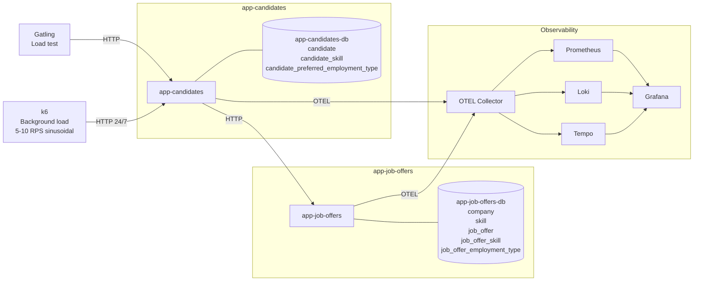
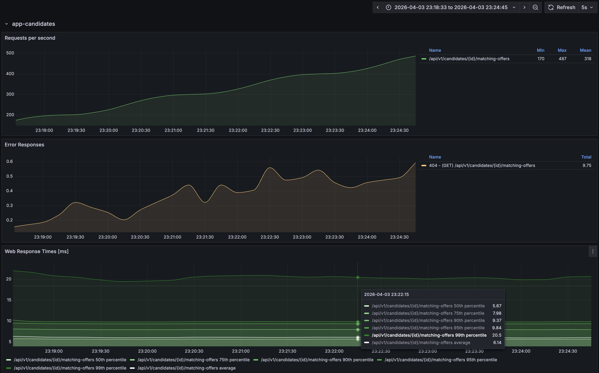
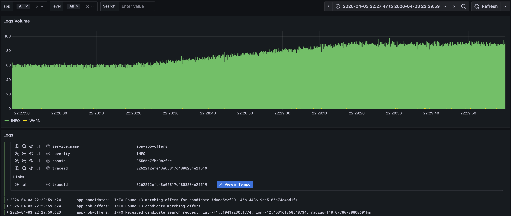
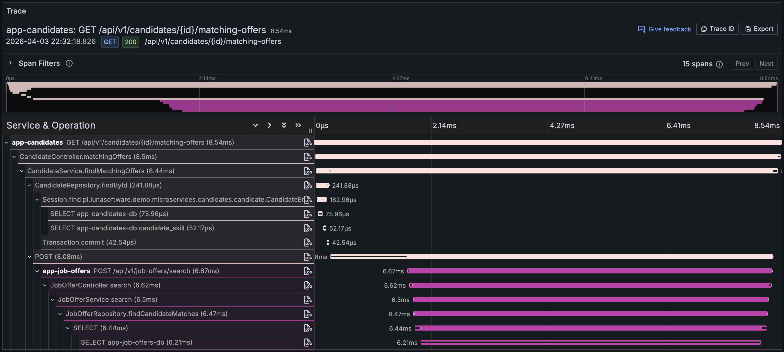
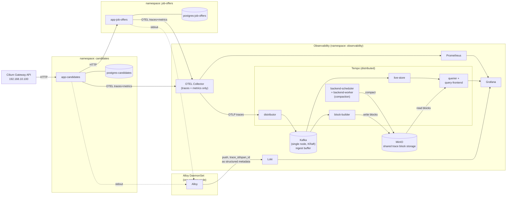

App to analyze distributed microservices system and DB performance using Gatling and OpenTelemetry.

# Modules:

* **app-job-offers** - a microservice managing job offers. Data model consists of five tables: company, skill,
  job_offer, job_offer_skill, and job_offer_employment_type.
  A job offer belongs to one company and may require multiple skills at specific seniority levels. Job offers include remote/hybrid work requirements and required years of experience
* **app-candidates** - a microservice managing candidates, acting as a client for app-job-offers to find matching
  offers.
  Data model consists of three tables: candidate, candidate_skill, and candidate_preferred_employment_type. Candidates include remote work preferences.
* **data-generator** - a utility tool to generate SQL file(s) to populate job-offers and candidates databases with
  significant amounts of data.
  This code does not use collections and streams for performance reasons.
* **load-test** - a module running pre-defined load tests using Gatling. UUIDs for requests are randomly picked from
  `01-candidates.sql` file generated by the **data-generator** module.
* **load-background** - a module sending continuous 24/7 background load using k6. Runs as a Docker Compose service.
  Sends requests to `app-candidates` at 5–10 RPS following a sinusoidal curve with a 5-minute period. Starts only after
  the Spring Boot apps are healthy. UUIDs for requests are randomly picked from `01-candidates.sql` file generated by
  the **data-generator** module.
* **observability** - dashboards showing app performance and logs in Grafana. OTEL agent exports data to OTEL collector.
  It pushes data to proper backends. Prometheus gathers metrics from Spring Boot Actuator and Micrometer.
  Loki is used for aggregating logs. Tempo gathers traces about methods time execution.


```mermaid
flowchart LR
    gatling["Gatling\nLoad test"]
    k6["k6\nBackground load\n5-10 RPS sinusoidal"]

    subgraph candidates_svc["app-candidates"]
        candidates["app-candidates"]
        candidatesdb[("app-candidates-db\ncandidate\ncandidate_skill\ncandidate_preferred_employment_type")]
    end

    subgraph joboffers_svc["app-job-offers"]
        joboffers["app-job-offers"]
        joboffersdb[("app-job-offers-db\ncompany\nskill\njob_offer\njob_offer_skill\njob_offer_employment_type")]
    end

    subgraph observability["Observability"]
        otel["OTEL Collector"]
        prometheus["Prometheus"]
        loki["Loki"]
        tempo["Tempo"]
        grafana["Grafana"]
    end

    gatling -->|HTTP| candidates
    k6 -->|HTTP 24/7| candidates
    candidates -->|HTTP| joboffers
    candidates --- candidatesdb
    joboffers --- joboffersdb
    candidates -->|OTEL| otel
    joboffers -->|OTEL| otel
    otel --> prometheus
    otel --> loki
    otel --> tempo
    prometheus --> grafana
    loki --> grafana
    tempo --> grafana
```

# Running locally

Requires JDK25+, Docker (with Compose), and `make` installed on your machine.

`make` is required to run the predefined commands below — targets are defined in [Makefile](Makefile).

## Generating test data

Run following command:

```shell
make generate-data
```

### Parameters

| Parameter    | Default   | Description                |
|--------------|-----------|-----------------------------|
| `candidates` | `100 000` | Number of candidates to generate |
| `jobOffers`  | `50 000`  | Number of job offers to generate |
| `companies`  | `10 000`  | Number of companies to generate  |

Parameters are positional (same as the underlying jar's `args`), so to override one you must also set every
parameter before it.

Example generating 200 000 candidates, 100 000 job offers and 20 000 companies:

```shell
make generate-data candidates=200000 jobOffers=100000 companies=20000
```

This generates SQL scripts that insert companies, skills (52 predefined technology names), job offers with their
required skills, employment types and offered salaries, and candidates with their preferred skills, employment types and
expected salaries. Both Job offers and candidates have unique geographical locations (latitude and longitude).

Generated files are placed in the `data-generator/output` directory, split by service. File names are prefixed with a
number to indicate the correct import order (respecting foreign key constraints):

```
data-generator/output/
  job-offers/
    01-companies.sql
    02-skills.sql
    03-job-offers.sql
    04-job-offer-employment-types.sql
    05-job-offer-skills.sql
  candidates/
    01-candidates.sql
    02-candidate-preferred-employment-types.sql
    03-candidate-skills.sql
```

Import them into the respective application databases (check [compose.yml](compose.yml) for credentials).

`01-candidates.sql` is used by **load-test** and **load-ambient** modules to generate requests with random candidates UUID.

These files may be extremely large (several GB), thus they are not tracked in Git.

## Starting microservices locally

Run following command:

```shell
make start
```

Please note that the new v2 of Docker Compose is used. If you are using older Docker version, use `docker-compose`
instead of `docker compose`.

## CPU limits when load testing

Adjust CPU limits in [compose.yml](compose.yml) to avoid Gatling starving the load-tested apps. Default configuration
limits each app to 2 cores.

# Matching score

`app-job-offers` scores each candidate–offer pair as a weighted sum of five sub-scores, all in `[0.0, 1.0]`:

| Sub-score  | Weight | Description                                                                                                                                                              |
|------------|--------|------------------------------------------------------------------------------------------------------------------------------------------------------------------------|
| Skills     | 45%    | Weighted coverage of offer skills adjusted for seniority gap and missing mandatory skills.                                                                               |
| Salary     | 20%    | `1.0` when the offer ceiling meets or exceeds candidate expectations. Exponential decay when the offer ceiling falls below — score drops sharply as the gap grows.        |
| Experience | 10%    | Exponential decay based on the gap between candidate years and the minimum expected for the required seniority.                                                          |
| Remote     | 10%    | Cosine decay on office mismatch — score=1.0 when candidate willingness meets or exceeds office requirement, non-linear drop as the gap grows.                            |
| Distance   | 15%    | Haversine cosine decay blended with remote allowance — fully remote offers always score 1.0; in-office offers use pure cosine decay; hybrid offers blend proportionally. |

SQL bounding box pre-filters offers cheaply; Haversine and the full scoring run only on the reduced set.

# Sample HTTP requests

Check [http/requests.http](http/requests.http) file.

# Background load (Grafana k6)

The `load-background` module sends continuous ambient traffic to `app-candidates` 24/7.
It runs as a Docker Compose service and starts only after both Spring Boot apps report healthy on `/actuator/health`.

Candidate UUIDs are read from the SQL data file into a `SharedArray` at startup. In k6, a `SharedArray` is populated
once and shared, read-only, across all VUs — a plain array declared in the init scope would instead be copied into
each VU's own memory, which gets expensive fast with large data files.

A VU (Virtual User) is k6's unit of concurrency — a virtual "user" running the exported default function in a loop
(here: `GET /api/v1/candidates/{id}/matching-offers` against a random candidate UUID). Several VUs run in parallel, so
the actual RPS depends on VU count and response time. This module uses the `ramping-arrival-rate` executor, which lets
k6 control the request arrival rate directly (`MIN_RPS`–`MAX_RPS`) rather than deriving it from a fixed VU count; `VUS`
below is just the number of VUs pre-allocated to sustain that rate with latency headroom.

## Parameters

Overridable via `make` / environment variables:

| Parameter            | Default                                              | Description                                    |
|-----------------------|------------------------------------------------------|-------------------------------------------------|
| `targetHost`          | `http://app-candidates:8080`                         | Base URL of `app-candidates` (Docker network by default) |
| `candidatesDataFile`  | `data-generator/output/candidates/01-candidates.sql` | SQL file with candidate UUIDs                    |

Load profile constants, defined at the top of [candidate-search.js](load-background/src/candidate-search.js) (not
overridable via `make`):

| Parameter   | Default        | Description                                              |
|-------------|----------------|------------------------------------------------------------|
| `MIN_RPS`   | `5`            | Minimum RPS (sine trough)                                   |
| `MAX_RPS`   | `10`           | Maximum RPS (sine peak)                                     |
| `PERIOD_S`  | `300` (5 min)  | Sine period                                                  |
| `VUS`       | `5`            | Pre-allocated VUs — enough for peak RPS with latency headroom |

## RPS profile

Load oscillates sinusoidally between **5 and 10 RPS** with a 5-minute period:

```
RPS
 10 |     *         *         *
  9 |    * *       * *       * *
  8 |   *   *     *   *     *   *
  7 |  *     *   *     *   *     *
  6 | *       * *       * *       *
  5 +*---------*---------*---------*-> t
     0    1    2    3    4    5    6
```

## Starting together with services

```shell
make start-ambient
```

By default, k6 targets `http://app-candidates:8080` via Docker network.

## Starting separately (services already running)

`ambient-load` always recreates the k6 container so env vars take effect immediately.

```shell
make ambient-load
```

Override `targetHost` and/or `candidatesDataFile` (see [Parameters](#parameters)) the same way:

```shell
make ambient-load targetHost=http://192.168.0.140:8080 candidatesDataFile=/path/to/01-candidates.sql
```

## Candidates data file

It is generated by the **data-generator** module. Path (relative to project root): `data-generator/output/candidates/01-candidates.sql`
If the file is absent the service still starts — all requests will return 404.

# Performance testing

Gatling gradle plugin is used. Run the following command:

```shell
make candidateSimulation
```

Load tests the endpoint that finds matching job offers for a given candidate (`GET /api/v1/candidates/{id}/matching-offers`).
0.1% of requests intentionally are supposed to return HTTP 404 (Not Found) response.

## Parameters

| Parameter           | Default                                              | Description                              |
|---------------------|------------------------------------------------------|-------------------------------------------|
| `targetHost`        | `http://localhost:8080`                              | Base URL of `app-candidates`             |
| `candidatesDataFile`| `data-generator/output/candidates/01-candidates.sql` | SQL file with candidate UUIDs            |
| `maxRps`            | `500`                                                | Peak RPS (global maximum, reached at the top of the last ramp) |
| `stepDuration`      | `60s`                                                | Base time unit for each phase (`30s`, `5m`, `1h`) |
| `ramps`             | `5`                                                  | Number of ramp-up steps                  |

## RPS profile (defaults: maxRps=500, stepDuration=60s, ramps=5)

```
 RPS
 500 |                             /-----\
 400 |                       /-----      \
 300 |                 /-----            \
 200 |           /-----                  \
 100 |     /-----                        \
   0 +-----                              \-> t (min)
     0  0.5 1  1.5 2  2.5 3  3.5 4  4.5 5  6
     |<---------- ramp-up 5 min --------->|cool|
                                            1 min
```

5 steps of 100 RPS each. Each step takes exactly `stepDuration`: 30s linear ramp to the
next level + 30s steady at that level. The last step's steady half doubles as the peak
hold (500 RPS, 30s) — no separate peak-steady phase.
Cooldown: linear ramp from 500 to 0 RPS over `stepDuration` (1 min).
Total: `(ramps + 1) × stepDuration` = 6 min.
Load tests use files generated by `data-generator`. UUIDs for requests are randomly picked from the candidates SQL file.

Override `targetHost`, `candidatesDataFile`, or load profile parameters:

```shell
make candidateSimulation targetHost=http://192.168.0.140:8080 candidatesDataFile=/path/to/01-candidates.sql
```

Quick smoke test (peak 20 RPS, 1.5 min total):

```shell
make candidateSimulation maxRps=20 stepDuration=30s ramps=2
```

# Observability

Apps use OTEL agent to export metrics, traces and logs to OTEL collector. It pushes all data to designated backends.
Spring Boot Actuator and Micrometer are enabled.

## Performance dashboard

The dashboard is available
under [http://localhost:3000/d/e1f890c5-2799-411b-b267-f344670afe6c](http://localhost:3000/d/e1f890c5-2799-411b-b267-f344670afe6c).
It shows response times, and errors count.


## Logs dashboard

The dashboard is available
under [http://localhost:3000/d/ea015f6f-9746-431d-9113-a2e247c2207b](http://localhost:3000/d/ea015f6f-9746-431d-9113-a2e247c2207b).
It allows viewing and searching logs.


## Traces

Above dashboard has links to traces in Tempo. This allows to view detailed information about application performance
when handling a particular HTTP request.


# Home Kubernetes cluster

Alongside Docker Compose, this project is being deployed to a home Kubernetes cluster running on 12× Raspberry Pi 5
(8GB RAM, NVMe boot). Built with `kubeadm` rather than k3s — a deliberate choice to learn the full stack by picking
and wiring up each piece by hand (CNI, storage, load-balancing, ingress) instead of relying on a batteries-included
distribution.

Current state:

* **Cilium** as CNI, with Hubble for network observability, and as the ingress controller via Cilium Gateway API
  (kube-proxy replaced by `kubeProxyReplacement`, required by Cilium's Gateway API support).
* **MetalLB** (L2 mode) providing `LoadBalancer` services on the home LAN, IP pool `192.168.10.100`–`192.168.10.199`.
* **`local-path-provisioner`** for node-local persistent storage.
* The full observability stack from this README — Prometheus, Loki, Tempo, OTEL Collector, Grafana — running on the
  cluster via Helm, plus two k8s-only pieces (Alloy for logs, Kafka + MinIO for `tempo-distributed`) that Compose
  doesn't need — see [Differences from Docker Compose](#differences-from-docker-compose) for why.
* `app-candidates` and `app-job-offers` deployed (plain Kubernetes manifests, one namespace per service, each with its
  own Postgres), publicly reachable through the Gateway at `http://192.168.10.100/api/v1/...`.
* Dedicated, tainted nodes for databases and observability, plus generic worker nodes for everything else.

Cluster provisioning lives under [k8s-cluster/](k8s-cluster) — `ansible/` for node setup, `manifests/` for Helm
values and Kubernetes manifests.

Photo of the physical cluster coming soon.

## Differences from Docker Compose

The cluster diverges from Compose on purpose in two places — implemented, pending deployment/verification on the
physical cluster; tracked in detail in [`.claude/handoff-k8s-rpi-cluster.md`](.claude/handoff-k8s-rpi-cluster.md):

* **Logs: Grafana Alloy (DaemonSet) instead of the OTEL Collector, in k8s only.** In Compose, the OTEL Java agent
  pushes logs over OTLP through the OTEL Collector to Loki — the same path as traces and metrics. In k8s, apps set
  `OTEL_LOGS_EXPORTER=none` instead, and an Alloy DaemonSet (one pod per node, the standard Kubernetes logging
  pattern) reads container stdout directly and ships it to Loki, bypassing the Collector entirely for logs. This
  decouples log delivery from the Collector's own health — a Collector crash (as happened during a 200rps Gatling
  burst on 2026-09-03, see the handoff) no longer also stops logging. **Docker Compose keeps the OTEL Collector log
  path unchanged** — the DaemonSet model only pays off when there are multiple nodes to collect from.
* **Traces: `tempo-distributed` instead of single-binary Tempo, in k8s only.** This isn't just "the same Tempo split
  into more pods" — it's a genuine change of *deployment mode*, and that mode is what pulls in two new dependencies
  Compose never needed. Per Tempo 3.0's own release notes: *"In monolithic mode, Tempo runs all components in-process
  without Kafka"* vs *"In microservices mode, a Kafka-compatible system provides durable buffering between ingestion
  and downstream components."* Compose runs Tempo monolithically (`target: all`, one process) — that's why it could
  already move to Tempo 3.0.3 with zero extra infrastructure. k8s crosses into microservices mode specifically to get
  per-component memory isolation (single-binary Tempo's single hard memory ceiling caused the 2026-09-03 OOM cascade
  during that same load test) — and once distributor and live-store/block-builder are separate pods instead of one
  process, Tempo 3.x requires Kafka as the transport between them. Separately, `storage.trace.backend: local` turned
  out to mount an **emptyDir per pod** (verified via `helm template`, not assumed) — block-builder's blocks would be
  invisible to querier on another pod — so trace storage also moved to MinIO (self-hosted S3-compatible object
  storage), the one piece every component can reach over the network regardless of which pod it's on. **Docker
  Compose keeps single-binary Tempo permanently** — one process never needs Kafka or shared object storage to talk to
  itself.


```mermaid
flowchart LR
    gw["Cilium Gateway API\n192.168.10.100"]

    subgraph candidates_ns["namespace: candidates"]
        candidates["app-candidates"]
        candidatesdb[("postgres-candidates")]
    end

    subgraph joboffers_ns["namespace: job-offers"]
        joboffers["app-job-offers"]
        joboffersdb[("postgres-job-offers")]
    end

    subgraph daemonset["Alloy DaemonSet\n(one pod per node)"]
        alloy["Alloy"]
    end

    subgraph observability["Observability (namespace: observability)"]
        otel["OTEL Collector\n(traces + metrics only)"]
        prometheus["Prometheus"]
        loki["Loki"]
        kafka[("Kafka\n(single node, KRaft)\ningest buffer")]
        minio[("MinIO\nshared trace block storage")]
        subgraph tempo_dist["Tempo (distributed)"]
            distributor["distributor"]
            livestore["live-store"]
            blockbuilder["block-builder"]
            backend["backend-scheduler\n+ backend-worker\n(compaction)"]
            querier["querier +\nquery-frontend"]
        end
        grafana["Grafana"]
    end

    gw -->|HTTP| candidates
    candidates -->|HTTP| joboffers
    candidates --- candidatesdb
    joboffers --- joboffersdb

    candidates -->|OTEL traces+metrics| otel
    joboffers -->|OTEL traces+metrics| otel
    otel --> prometheus
    otel -->|OTLP traces| distributor
    distributor --> kafka
    kafka --> livestore
    kafka --> blockbuilder
    blockbuilder -->|write blocks| minio
    backend -->|compact| minio
    livestore --> querier
    minio -->|read blocks| querier

    candidates -.->|stdout| alloy
    joboffers -.->|stdout| alloy
    alloy -->|push, trace_id/span_id\nas structured metadata| loki

    prometheus --> grafana
    loki --> grafana
    querier --> grafana
```

Manifests for both: [`k8s-cluster/manifests/alloy/`](k8s-cluster/manifests/alloy), Tempo's
[`values-tempo-distributed.yaml`](k8s-cluster/manifests/observability/values-tempo-distributed.yaml), and their two
new dependencies at [`k8s-cluster/manifests/kafka/`](k8s-cluster/manifests/kafka) and
[`k8s-cluster/manifests/minio/`](k8s-cluster/manifests/minio).

# Known issues

* Spring percentile metrics do not work with OTEL Agent.

# Future plans

* Prepare local setup using Minikube.
* Deploy Alloy, Kafka, MinIO and `tempo-distributed` to the physical cluster and verify end-to-end (manifests written,
  not yet applied — see [Differences from Docker Compose](#differences-from-docker-compose)).
* Prepare CI/CD for the home Kubernetes cluster.
* Implement backpressure or circuit breaker.
