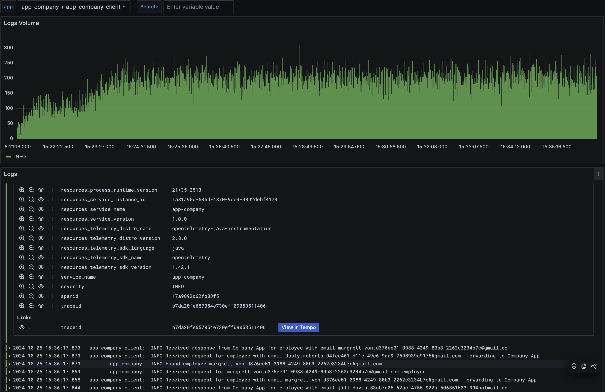

# Work In Progress
App to analyze distributed microservices app and DB performance using Gatling and OpenTelemetry.

## Modules:
* **app-company** - a simple CRUD microservice. Data model consists of two tables: department and employee.
They are in many-to-many relationship (an employee can work in multiple departments, while a department may have multiple employees).
* **data-generator** - an utility tool to generate SQL file(s) to populate test database with significant amount of data.
This code does not use collections and streams for performance reasons.
* **load-test** - a module running pre-defined load tests using Gatling.
* **observability** - dashboards showing the company app performance and logs in Grafana. OTEL agent exports data to OTEL collector.
It pushes data to proper backends. Prometheus gathers metrics from Spring Boot Actuator and Micrometer.
Loki is used for aggregating logs. Tempo gathers traces about methods time execution.

# Running locally
Requires JDK21+, Docker, and Docker Compose installed on your machine.

## Generating test data
Run following commands:
```shell
./gradlew clean :data-generator:build && java -jar data-generator/build/libs/data-generator-1.0.0.jar 100000
```
This generates SQL scripts that inserts 10 000 departments (fixed value), 100 000 employees (configurable), and generates random relations between them.
Generated files are put in `data-generator` module under `output` directory. Import them into application database (check [docker-compose.yml](docker-compose.yml) for credentials).

These files are also used during load tests to generate random requests.

These files may be extremely large (several GB), thus they are not tracked in Git.

## Running company app locally
Run following command:
```shell
./gradlew clean :app-company:build && docker-compose up --build
```

## Sample HTTP requests
Check `http/requests.http` file.

## Performance testing
Gatling gradle plugin is used. Run following commands:
```shell
./gradlew :load-test:gatlingRun --simulation pl.lunasoftware.demo.microservices.loadtest.EmployeeSimulation
./gradlew :load-test:gatlingRun --simulation pl.lunasoftware.demo.microservices.loadtest.DepartmentSimulation
```
First one load tests endpoint that finds the given employee. Second one load tests endpoint that finds the given department and calculates its cost (computationally expensive).
Load tests use files generated by `data-generator`. It is necessary to make Gatling aware of actual UUIDs and emails present in the database.
Alternatively, you can specify other file with `dataFile` param. E.g.
```shell
./gradlew :load-test:gatlingRun --simulation pl.lunasoftware.demo.microservices.loadtest.EmployeeSimulation -DdataFile=/path/to/file.sql
```
Default host under loaf test is `localhost:8080`. You can override it using `host` param, e.g.
```shell
./gradlew :load-test:gatlingRun --simulation pl.lunasoftware.demo.microservices.loadtest.EmployeeSimulation -Dhost=192.168.1.100:8080
```

## Observability
Company app uses OTEL agent to export metrics, traces and logs to OTEL collector. It pushes all data to designated backends. Spring Boot Actuator and Micrometer are enabled.

### Performance dashboard
The dashboard is available under [http://localhost:3000/d/e1f890c5-2799-411b-b267-f344670afe6c](http://localhost:3000/d/e1f890c5-2799-411b-b267-f344670afe6c).
It shows response times, and errors count.


### Logs dashboard
The dashboard is available under [http://localhost:3000/d/ea015f6f-9746-431d-9113-a2e247c2207b](http://localhost:3000/d/ea015f6f-9746-431d-9113-a2e247c2207b).
It allows viewing and searching logs.


### Traces
Above dashboard has links to traces in Tempo. This allows to view detailed information about application performance when handling a particular HTTP request.


## Hints
Adjust CPU limits in `docker-compose.yml` to avoid Gatling starvation by the load-tested Company App. Default configuration limits app to 6 cores + another 2 cores for its DB.

# Known issues
* There are occasional 404s during load tests that should not happen as SQL file imported into DB is used to generate random requests.
* Prometheus looses data when app is unresponsive.
* Spring percentile metrics do not work with OTEL Agent.

# Future plans
* Prepare local setup using Minikube
* Deploy it on some remote servers and orchestrate cloud using K8S, consider using Terraform
* Prepare CI/CD for above
* Add another microservice to demo backpressure / circuit breaker and distributed tracing.

