# RPS scaling — replaying past states on today's cluster and data

Starts from the untuned baseline and adds one change at a time, in the order the current bottleneck called for. Each
result is cumulative over everything above it.

## Fixed assumptions (same for every state)

- **Dataset:** 100k candidates / 150k job offers / 10k companies.
  <sub>Join and collection tables: `candidate_skill` 300k, `candidate_preferred_employment_type` 200k,
  `job_offer_skill` 450k, `job_offer_employment_type` 300k; `skill` 58 rows.</sub>
- **Trace sampling in the apps, 1%** (plus every request that failed with 4xx/5xx or took >= 500 ms) — `LocalTailSamplingSpanExporter` from
  `otel-metrics-filter`, added to every state's image; app code otherwise untouched.
- **Cluster topology:** 12 nodes, 3 observability nodes, local NTP. `worker-2` (the only node on Ubuntu 25.10 /
  kernel 6.17) is cordoned until the last step, the only one that needs all 5 workers.
- **Hard `podAntiAffinity`, one app replica per node,** in every state.
- **Heap pinned: `-Xms384m -Xmx384m`** on both apps (the default 384 MB ceiling). Without `-Xms`, Serial GC grows the
  heap lazily through full GCs — ~0.7 s pauses mid-test that made p99 swing between runs.
- **Test hygiene:** Mac running Gatling on AC power, wired into the cluster VLAN; candidate IDs in `candidatesDataFile`
  checked against the live database; warm-up run after every rollout; a forced full GC in every app replica 10 s
  before each run (`make candidateSimulation` does it against the cluster), so an old-generation collection doesn't
  land mid-test.

## Known issue: not every Pi 5 is equally fast

The fleet mixes two BCM2712 steppings. The 4 Rev 1.1 boards carry the cost-reduced **D0** stepping, and it writes
memory 2-3× slower than **C1** on the Rev 1.0 boards as soon as the data no longer fits in L2: through L3 and into
DRAM. Reads, L2 and pure CPU are the same. Neither the kernel (6.8 vs 6.17) nor the bootloader (`worker-1` flashed to
2026-09-25, no change) makes a difference, and nothing is throttled — it's the silicon (measured 2026-10-03).

Node names below are the roles **before the 2026-10-03 reshuffle**, when this was measured; the board → role mapping
after it (by MAC) is in [`ansible/inventory.ini`](ansible/inventory.ini).

| Node | Board | SoC | Bootloader | Kernel | L3 write (1.5 MB) GB/s | DRAM write GB/s | |
|---|---|---|---|---|---|---|---|
| `master` | Rev 1.0 | C1 | 2024-09-23 | 6.8 | 17.7 | 11.0 | fast |
| `platform-1` | Rev 1.0 | C1 | 2024-09-23 | 6.8 | 19.0 | 8.8 | fast |
| `worker-1` | **Rev 1.1** | **D0** | 2026-09-25 | 6.8 | 7.8 | 6.6 | **slow** |
| `worker-2` | **Rev 1.1** | **D0** | 2025-06-13 | 6.17 | 10.3 | 6.8 | **slow** |
| `worker-3` | Rev 1.0 | C1 | 2024-09-23 | 6.8 | 22.8 | 11.4 | fast |
| `worker-4` | Rev 1.0 | C1 | 2024-09-23 | 6.8 | 29.6 | 12.4 | fast |
| `worker-5` | **Rev 1.1** | **D0** | 2025-06-13 | 6.8 | 8.1 | 6.8 | **slow** |
| `db-1` | Rev 1.0 | C1 | 2024-09-23 | 6.8 | 31.0 | 12.2 | fast |
| `db-2` | Rev 1.0 | C1 | 2024-09-23 | 6.8 | 28.2 | 13.1 | fast |
| `observability-1` | Rev 1.0 | C1 | 2024-09-23 | 6.8 | 25.8 | 10.1 | fast |
| `observability-2` | Rev 1.0 | C1 | 2024-09-23 | 6.8 | 21.0 | 11.2 | fast |
| `observability-3` | **Rev 1.1** | **D0** | 2025-08-28 | 6.8 | 14.5 | 8.1 | **slow** |

<sub>Measured on the live cluster (pods running, ambient load), one core pinned, glibc `memset` in a loop, best of 3 —
the spread within each group is mostly load (`platform-1` re-measured on an idle moment: 11.5-13.4 GB/s DRAM write on
every core, like the other C1 boards). Board: `Revision` in `/proc/cpuinfo` (`d04170` = Rev 1.0, `d04171` =
Rev 1.1). Stepping: `sudo strings /sys/firmware/fdt | grep -o 'bcm2712[a-z0-9]*-pinctrl'` (`bcm2712d0-…` = D0).</sub>

**Why it matters for RPS:** a JVM writes a lot of memory (zeroing new allocations, copying in GC), so an app replica on
D0 burns ~10-23% more CPU per request — e.g. the two `app-job-offers` replicas in the
[search split step](#2026-09-20--search-split-into-two-queries): 2.4 vs 2.95 ms, the slower one on `worker-1`. Traffic is split
evenly, so the slowest replica caps the whole service. In the replayed states the bottleneck sat on C1 nodes
(`postgres-job-offers` on `db-*`, `app-job-offers` on `worker-3`/`-4`), while all three `app-candidates` replicas ran
on D0 with headroom to spare — but only by chance, nothing enforced it. Since 2026-10-03 all workers, both database
nodes and `platform-1` are C1, and the D0 boards run only the master and observability (~8-15% CPU at ~2350 rps).

## How a state is built

A local `replay/…` branch off the baseline, own worktree under `.claude/worktrees/`: app code from the change's
commit, Kubernetes manifests from `main` with only the knobs changed (replicas, CPU limits, heap flags, Hikari pool,
probe port, Postgres args). Deployed with `make k8s-deploy` from the worktree plus `kubectl apply` of the changed
`postgres.yaml`.

## Changes

Each result is the best ~10-minute run at a constant rate with 0% KO.

| Date | Change (cumulative, top to bottom) | Best 10-min run, 0% KO | Bottleneck |
|---|---|---|---|
| [2026-09-04](#2026-09-04--baseline) | Baseline: app code `201f918`, before any tuning | **400 rps** | `postgres-job-offers` CPU |
| [2026-09-11](#2026-09-11--postgres-shared_buffers-1gb) | `postgres-job-offers` `shared_buffers` 128MB → 1GB (`deb916e`) | **500 rps** (+25%) | `postgres-job-offers` CPU |
| [2026-09-11](#2026-09-11--async-logging--actuator-port) | Async console logging; actuator on port 8081, `app-candidates` Hikari 10 → 30 (`05c7ce2`, `07ece12`) | **500 rps** (+0%) | `postgres-job-offers` CPU |
| [2026-09-11](#2026-09-11--postgres-cpu-2--3) | `postgres-job-offers` CPU limit 2 → 3 (`204cfd9`) | **650 rps** (+30%) | `app-candidates` CPU |
| [2026-09-19](#2026-09-19--2-replicas-of-each-app) | 2 replicas of each app (`204cfd9`) | **800 rps** (+23%) | `postgres-job-offers` CPU |
| [2026-09-20](#2026-09-20--search-split-into-two-queries) | Search split into two queries, no cartesian `JOIN FETCH` (`69206da`) | **1200 rps** (+50%) | `app-job-offers` CPU |
| [2026-09-20](#2026-09-20--cpu-3-on-the-apps) | CPU 3 on both apps and `postgres-candidates` (`bbdffbf`) | **1700 rps** (+42%) | `app-job-offers` CPU |
| [2026-09-24](#2026-09-24--native-search-query) | Native `findCandidateMatchIds` (`e38736f`) | **1800 rps** (+6%) | `app-candidates` CPU |
| [2026-09-28](#2026-09-28--candidate-loaded-with-join-fetch) | Candidate loaded with `JOIN FETCH` (`bf8b998`) | **2000 rps** (+11%) | `app-job-offers` Hikari pool + `postgres-job-offers` CPU |
| [2026-09-28](#2026-09-28--app-candidates--3) | `app-candidates` × 3, Hikari 40, `postgres-candidates` `max_connections=150` (`feff7ee`, `cd83f92`, `92979c4`) | **2100 rps** (+5%) | `postgres-job-offers` CPU |

## Results

### 2026-09-04 — baseline

**400 rps** — 10 min, 264,000 requests, 0% KO · bottleneck: `postgres-job-offers` CPU

<details>
<summary>Details</summary>

| p50 | p95 | p99 | max |
|---|---|---|---|
| 12 ms | 297 ms | 1,325 ms | 2,016 ms |

**Change:** starting point — app code `201f918`, 1 replica of each app, CPU limit 2 on both apps and both Postgres
instances, Hikari 10, health probes on the business port 8080, Postgres defaults (`shared_buffers=128MB`,
`max_parallel_workers_per_gather=2`, `max_connections=100`).

**Bottleneck:** `postgres-job-offers` CPU — ~1.6 of 2 cores, throttled ~45%. Each touch of the limit fills the
`app-job-offers` Hikari pool (up to 190 waiting), which is where the 1-2 s tail comes from. At 500 rps: pinned at
2.0/2, server caps at ~445 rps, 11% KO. Apps ~1.2 of 2 cores.

<details>
<summary>Key code changes</summary>

`JobOfferRepository` — the search: one JPQL query, two collections fetched through an entity graph

```java
@EntityGraph("JobOffer.withAllRelations")   // offeredEmploymentTypes + company + skills
@Query("""
        SELECT DISTINCT o FROM JobOffer o
        JOIN o.offeredEmploymentTypes t
        JOIN o.company c
        WHERE o.status = 'ACTIVE'
        AND c.geoLat BETWEEN :latMin AND :latMax
        AND c.geoLon BETWEEN :lonMin AND :lonMax
        AND o.salaryTo >= :expectedSalary
        AND t IN :employmentTypes
        AND EXISTS (SELECT jos FROM JobOfferSkill jos
                    WHERE jos.jobOffer = o AND jos.skill.name IN :skillNames)
        """)
List<JobOfferEntity> findCandidateMatches(...);
```

`CandidateRepository` — the candidate, loaded through an entity graph

```java
@EntityGraph("Candidate.withSkillsAndEmploymentTypes")
Optional<CandidateEntity> findById(UUID id);
```

</details>

<details>
<summary>Screenshots</summary>

| Gatling — responses per second | Gatling — response time distribution |
|---|---|
| 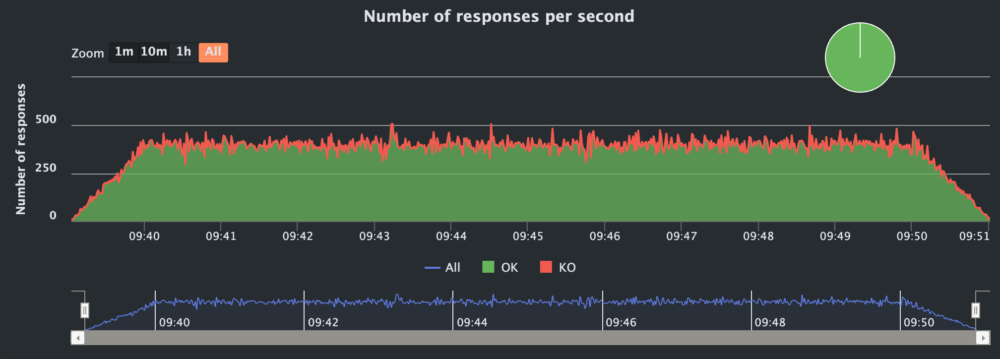 | 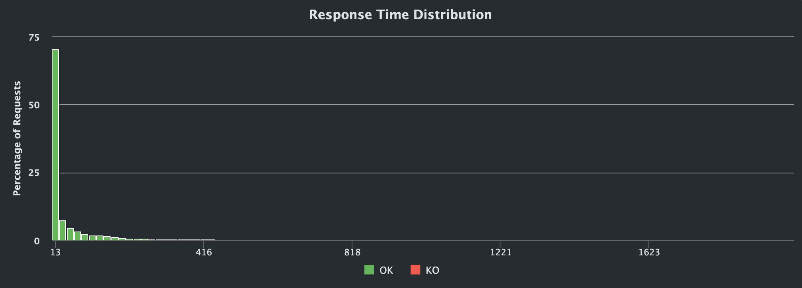 |

| `postgres-candidates` CPU | `postgres-job-offers` CPU |
|---|---|
| 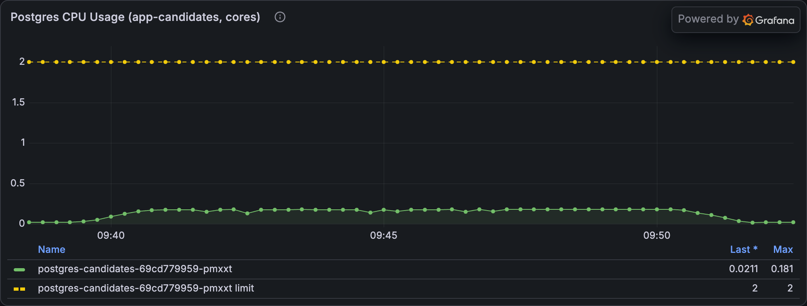 | 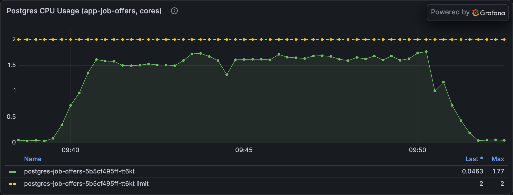 |

| Hikari pending `app-candidates` | Hikari pending `app-job-offers` |
|---|---|
| 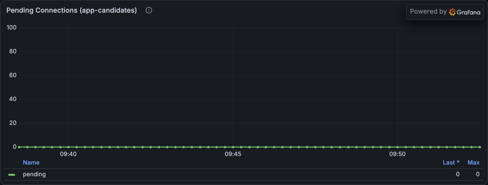 | 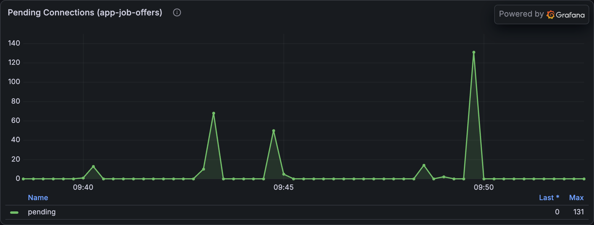 |

| JVM CPU `app-candidates` | JVM CPU `app-job-offers` |
|---|---|
| 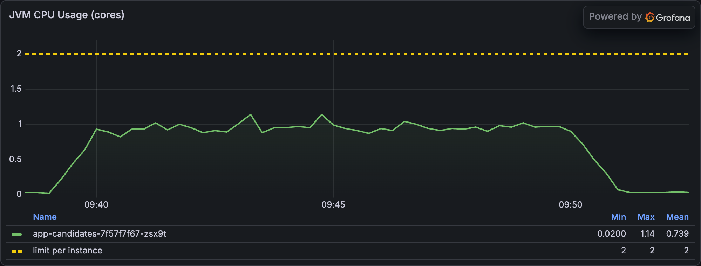 | 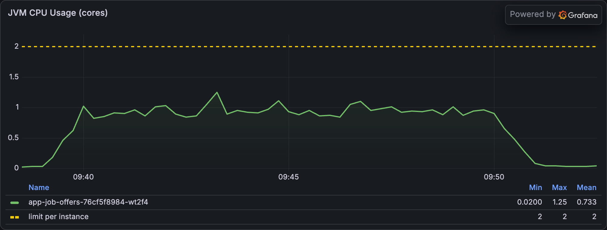 |

| Heap `app-candidates` | Heap `app-job-offers` |
|---|---|
| 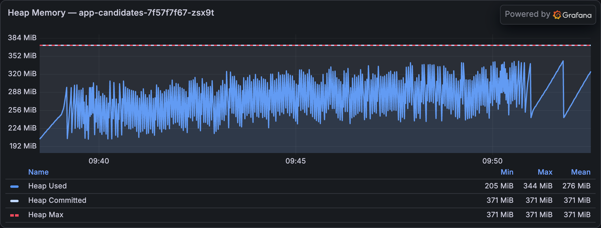 | 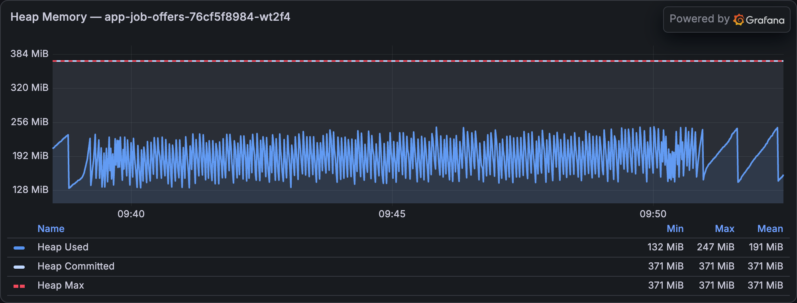 |

</details>

</details>

### 2026-09-11 — Postgres `shared_buffers` 1GB

**500 rps** — 10 min, 330,000 requests, 0% KO · bottleneck: `postgres-job-offers` CPU

<details>
<summary>Details</summary>

| p50 | p95 | p99 | max |
|---|---|---|---|
| 11 ms | 358 ms | 1,787 ms | 2,664 ms |

**Change:** `shared_buffers=1GB` on `postgres-job-offers`. The 217 MB database didn't fit in the default 128MB, so
part of every search read pages via a syscall copy from the OS page cache. Postgres CPU per request ~4.0 → ~3.3 ms
(−17%).

**Bottleneck:** `postgres-job-offers` CPU, still — 1.63 of 2 cores, throttled 37%, `app-job-offers` Hikari queue up
to 59 waiting, non-empty 15% of the time. At 600 rps: 97% throttled, server caps at ~535 rps, 10% KO. Most of the
tail is one ~15 s stall in `app-candidates` (12:50 on the charts): 188 of ~210 Tomcat threads parked at once, no CPU
throttling, no GC — the signature of synchronous console logging blocking on the shared stdout lock.

<details>
<summary>Key code changes</summary>

`k8s-cluster/manifests/job-offers/postgres.yaml`

<table>
<tr><th>Before</th><th>After</th></tr>
<tr>
<td>

```yaml
containers:
  - name: postgres
    image: postgres:18.3
    ports:
```

</td>
<td>

```yaml
containers:
  - name: postgres
    image: postgres:18.3
    args: ["-c", "shared_buffers=1GB"]
    ports:
```

</td>
</tr>
</table>

</details>

<details>
<summary>Screenshots</summary>

| Gatling — responses per second | Gatling — response time distribution |
|---|---|
| 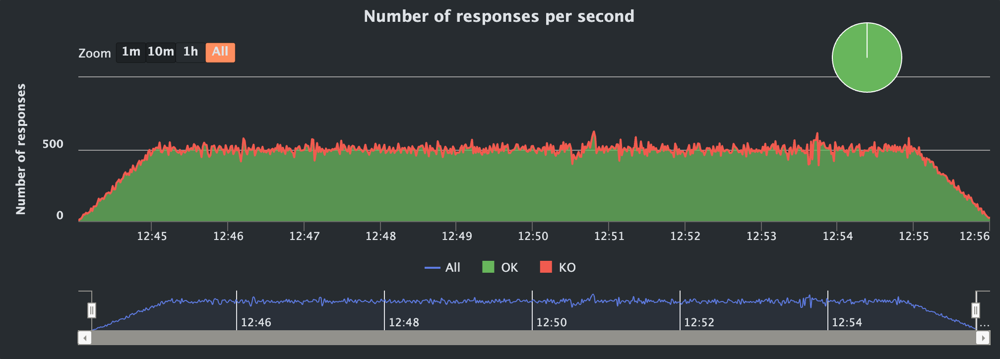 | 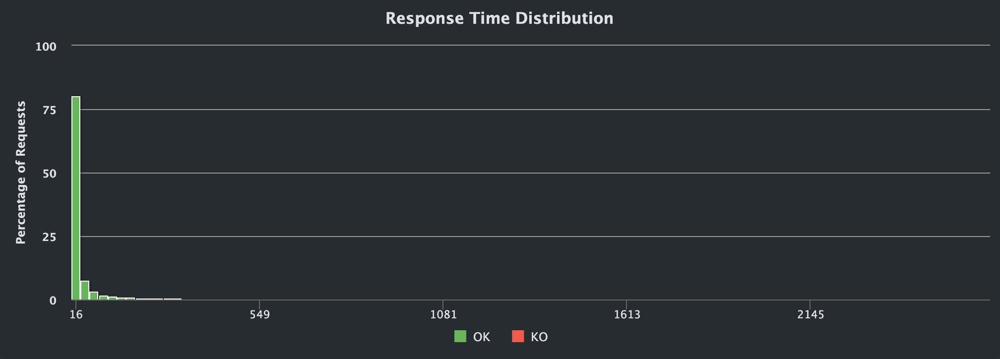 |

| `postgres-candidates` CPU | `postgres-job-offers` CPU |
|---|---|
| 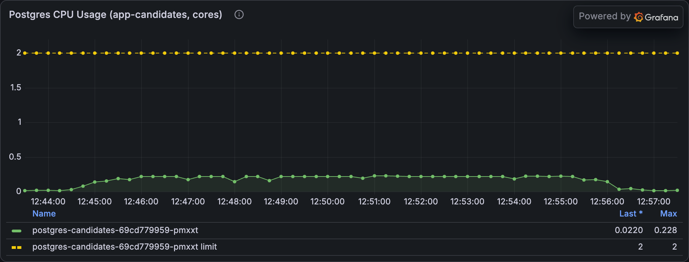 | 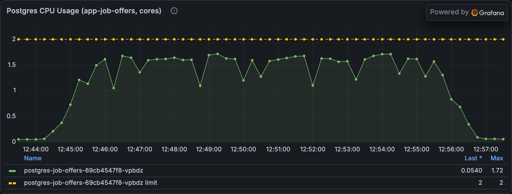 |

| Hikari pending `app-candidates` | Hikari pending `app-job-offers` |
|---|---|
|  | 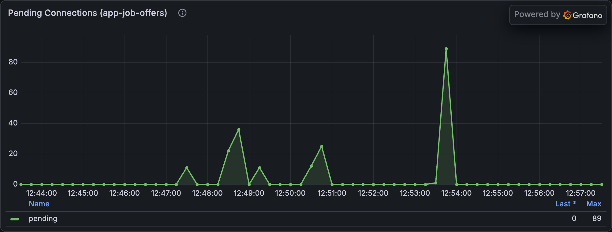 |

| JVM CPU `app-candidates` | JVM CPU `app-job-offers` |
|---|---|
| 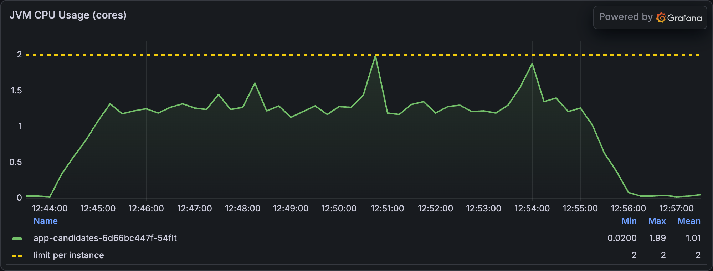 | 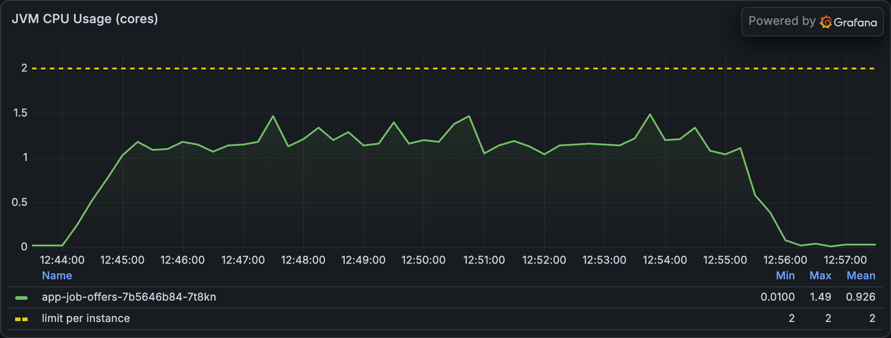 |

| Heap `app-candidates` | Heap `app-job-offers` |
|---|---|
| 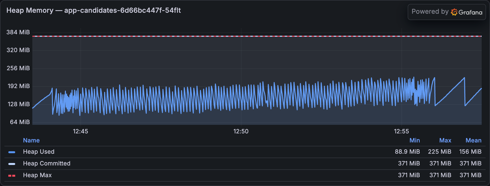 | 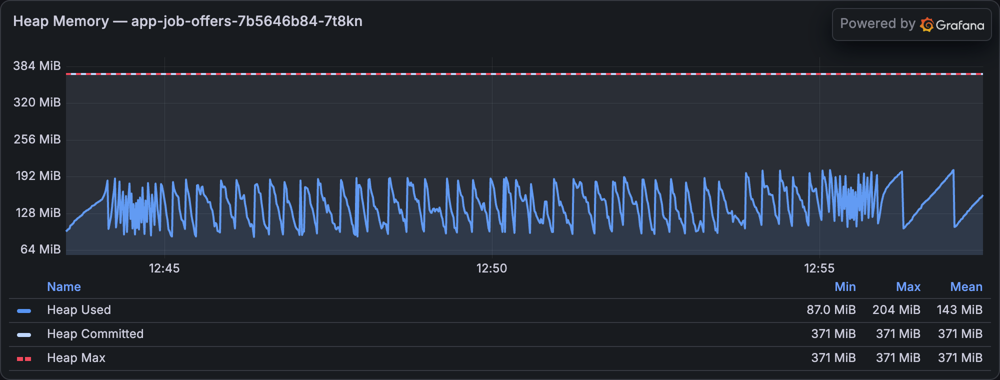 |

</details>

</details>

### 2026-09-11 — async logging + actuator port

**500 rps** — 10 min, 330,000 requests, 0% KO · bottleneck: `postgres-job-offers` CPU

<details>
<summary>Details</summary>

| p50 | p95 | p99 | max |
|---|---|---|---|
| 11 ms | 114 ms | 256 ms | 1,081 ms |

**Change:** console logging wrapped in Logback's `AsyncAppender` (queue 1024, never discards) instead of every
`log.info` writing to stdout under one shared lock; actuator on its own port 8081, so health probes get a separate
Tomcat thread pool and a saturated business pool can't fail liveness; `app-candidates` Hikari 10 → 30. Same RPS as
before — the gain is the tail: no thread-parking stalls, p99 1,787 → 256 ms, responses over 500 ms 1.5% → 0.07%.

**Bottleneck:** `postgres-job-offers` CPU, unchanged — 1.64 of 2 cores, throttled 38%, `app-job-offers` Hikari queue
up to 77 waiting. Apps ~1.2 of 2 cores. (Grafana's p99 panel reads ~0.4 s here: the OTel histogram has no bucket
between 250 and 500 ms, so a real p99 just above 250 ms gets interpolated upwards.)

<details>
<summary>Key code changes</summary>

`src/main/resources/logback-spring.xml (both apps)`

<table>
<tr><th>Before</th><th>After</th></tr>
<tr>
<td>

```xml
<!-- no file: Spring Boot's default
     synchronous ConsoleAppender -->
```

</td>
<td>

```xml
<appender name="ASYNC_CONSOLE"
          class="ch.qos.logback.classic.AsyncAppender">
    <appender-ref ref="CONSOLE"/>
    <queueSize>1024</queueSize>
    <discardingThreshold>0</discardingThreshold>
    <includeCallerData>false</includeCallerData>
</appender>
<root level="INFO">
    <appender-ref ref="ASYNC_CONSOLE"/>
</root>
```

</td>
</tr>
</table>

`src/main/resources/application.yml`

<table>
<tr><th>Before</th><th>After</th></tr>
<tr>
<td>

```yaml
spring:
  datasource:
    hikari:
      connection-timeout: 3000
management:
  observations: ...
```

</td>
<td>

```yaml
spring:
  datasource:
    hikari:
      connection-timeout: 3000
      maximum-pool-size: 30   # app-candidates
      minimum-idle: 30
management:
  server:
    port: 8081
  observations: ...
```

</td>
</tr>
</table>

`k8s-cluster/manifests/*/app.yaml`

<table>
<tr><th>Before</th><th>After</th></tr>
<tr>
<td>

```yaml
ports:
  - containerPort: 8080
readinessProbe:
  httpGet:
    path: /actuator/health
    port: 8080
```

</td>
<td>

```yaml
ports:
  - containerPort: 8080
  - containerPort: 8081
readinessProbe:
  httpGet:
    path: /actuator/health
    port: 8081
```

</td>
</tr>
</table>

</details>

<details>
<summary>Screenshots</summary>

| Gatling — responses per second | Gatling — response time distribution |
|---|---|
| 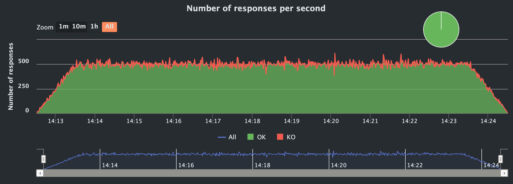 | 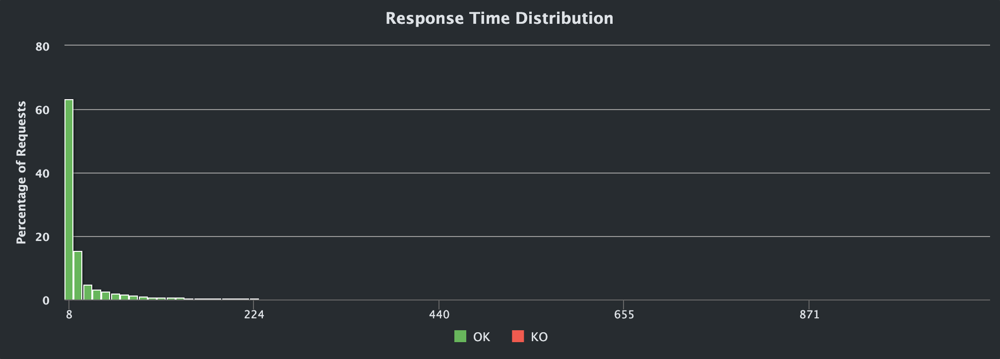 |

| `postgres-candidates` CPU | `postgres-job-offers` CPU |
|---|---|
| 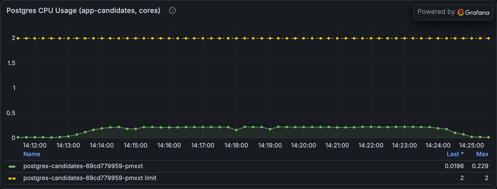 | 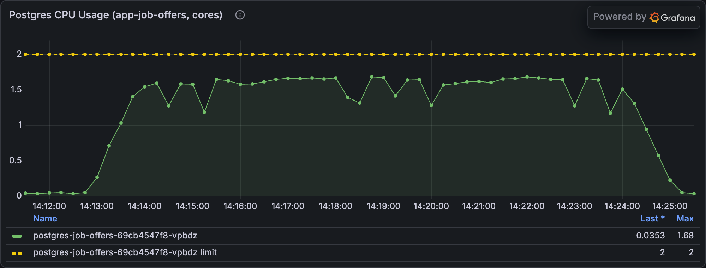 |

| Hikari pending `app-candidates` | Hikari pending `app-job-offers` |
|---|---|
| 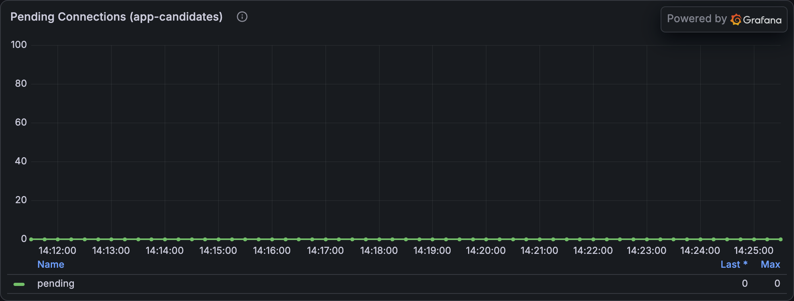 | 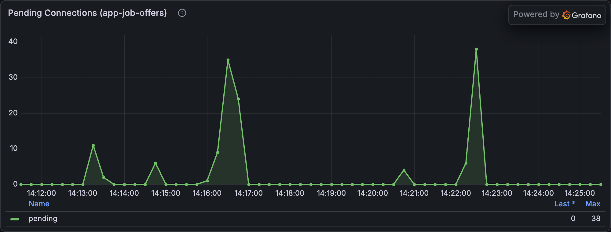 |

| JVM CPU `app-candidates` | JVM CPU `app-job-offers` |
|---|---|
| 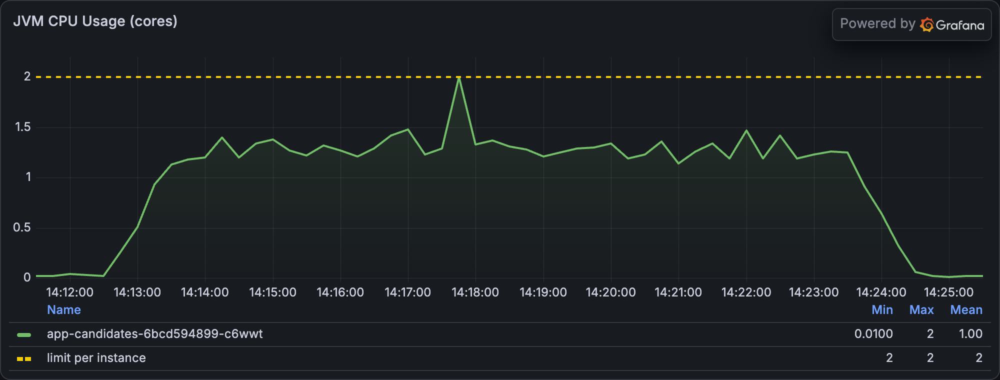 | 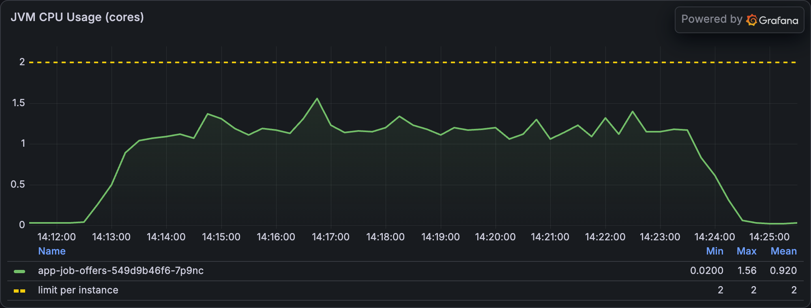 |

| Heap `app-candidates` | Heap `app-job-offers` |
|---|---|
| 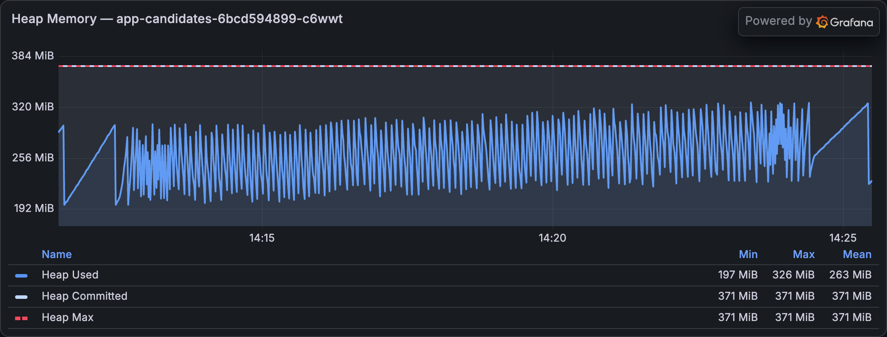 | 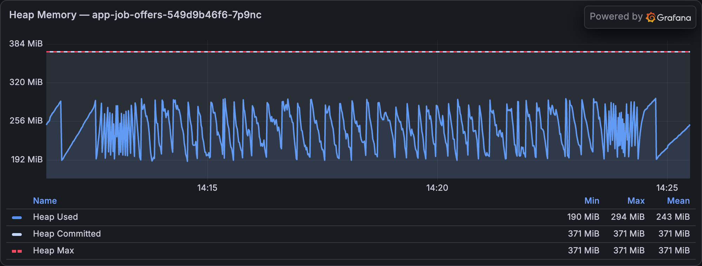 |

</details>

</details>

### 2026-09-11 — Postgres CPU 2 → 3

**650 rps** — 10 min, 429,000 requests, 0% KO · bottleneck: `app-candidates` CPU

<details>
<summary>Details</summary>

| p50 | p95 | p99 | max |
|---|---|---|---|
| 11 ms | 40 ms | 106 ms | 563 ms |

**Change:** CPU limit 3 on `postgres-job-offers` (`db-2` limits now ~4.2 of 4 cores, same as `main`).

**Bottleneck:** `app-candidates` CPU — 1.64 of 2 cores at 650 rps, throttled 9%; at ~690 rps 2.0/2, throttled ~99%,
and the server caps there (700 rps: p95 2.2 s, 0.2% KO). Postgres no longer limits: 2.0 of 3 cores, throttled ~8%,
`app-job-offers` Hikari queue max 6.

<details>
<summary>Key code changes</summary>

`k8s-cluster/manifests/job-offers/postgres.yaml`

<table>
<tr><th>Before</th><th>After</th></tr>
<tr>
<td>

```yaml
limits:
  cpu: "2"
  memory: 2Gi
```

</td>
<td>

```yaml
limits:
  cpu: "3"
  memory: 2Gi
```

</td>
</tr>
</table>

</details>

<details>
<summary>Screenshots</summary>

| Gatling — responses per second | Gatling — response time distribution |
|---|---|
| 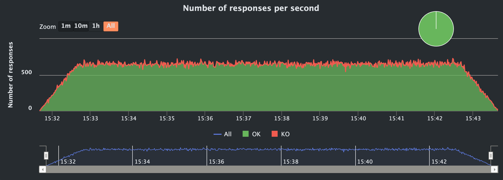 | 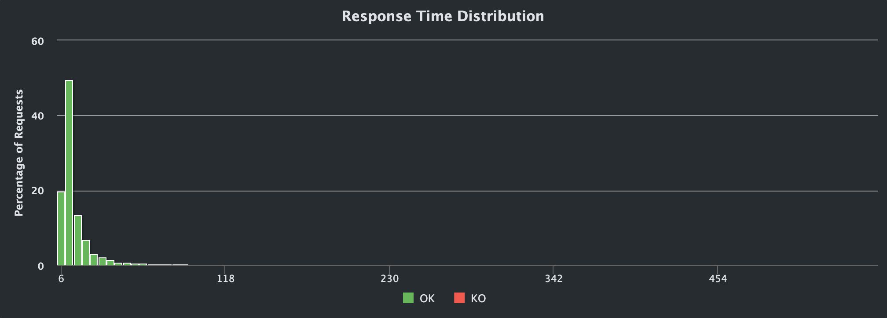 |

| `postgres-candidates` CPU | `postgres-job-offers` CPU |
|---|---|
| 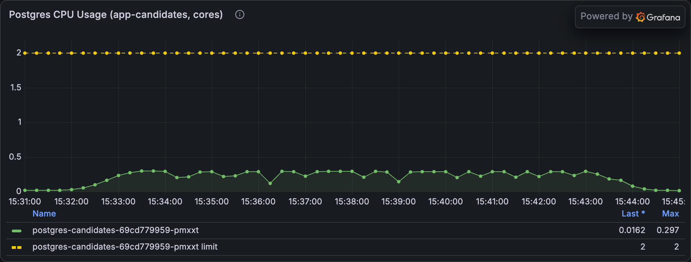 | 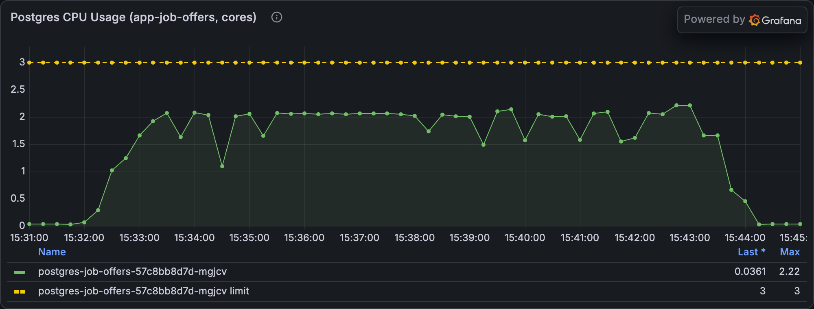 |

| Hikari pending `app-candidates` | Hikari pending `app-job-offers` |
|---|---|
| 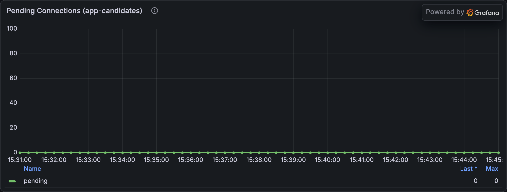 | 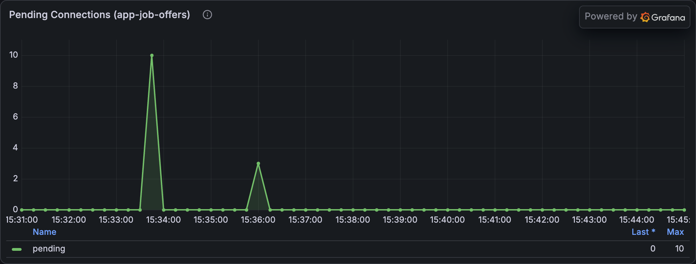 |

| JVM CPU `app-candidates` | JVM CPU `app-job-offers` |
|---|---|
| 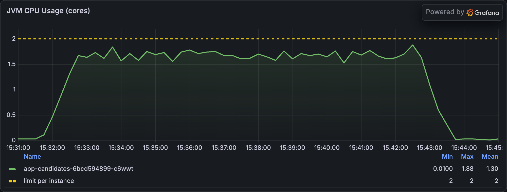 | 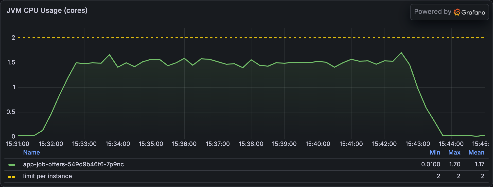 |

| Heap `app-candidates` | Heap `app-job-offers` |
|---|---|
| 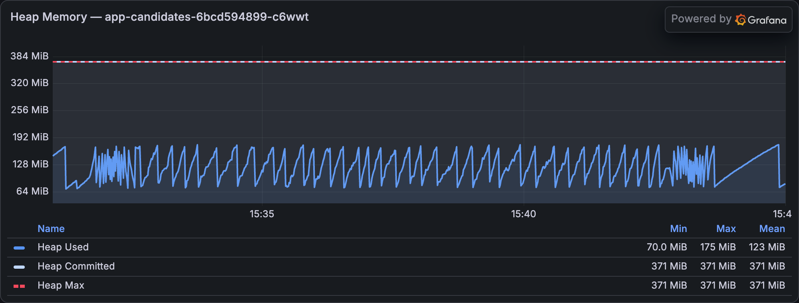 | 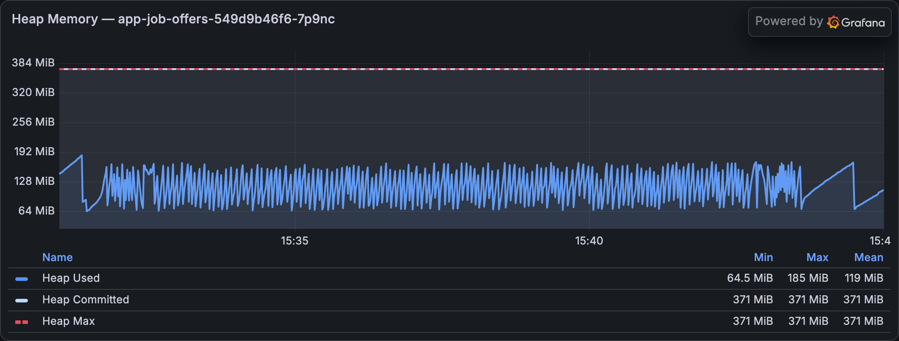 |

</details>

</details>

### 2026-09-19 — 2 replicas of each app

**800 rps** — 10 min, 528,000 requests, 0% KO · bottleneck: `postgres-job-offers` CPU

<details>
<summary>Details</summary>

| p50 | p95 | p99 | max |
|---|---|---|---|
| 14 ms | 369 ms | 832 ms | 2,951 ms |

**Change:** `app-candidates` and `app-job-offers` 1 → 2 replicas, one per node; CPU 2 and Hikari per replica as
before, so `postgres-job-offers` now sees 20 connections. Load splits evenly (~400 rps per replica).

**Bottleneck:** `postgres-job-offers` CPU, again — 2.72 of 3 cores, throttled 59%; both `app-job-offers` pools queue
(up to 191 waiting, non-empty 39% of the time), which is the tail. At 900 rps: throttled 91%, server caps at
~850 rps, 5.5% KO. Apps ~1 of 2 cores. Postgres CPU per request is still ~3.4 ms — only cheaper queries move this
further; `db-2` has no cores left to give.

<details>
<summary>Key code changes</summary>

`k8s-cluster/manifests/candidates/hpa.yaml`

<table>
<tr><th>Before</th><th>After</th></tr>
<tr>
<td>

```yaml
minReplicas: 1
maxReplicas: 1
```

</td>
<td>

```yaml
minReplicas: 2
maxReplicas: 2
```

</td>
</tr>
</table>

`k8s-cluster/manifests/job-offers/app.yaml`

<table>
<tr><th>Before</th><th>After</th></tr>
<tr>
<td>

```yaml
replicas: 1
```

</td>
<td>

```yaml
replicas: 2
```

</td>
</tr>
</table>

</details>

<details>
<summary>Screenshots</summary>

| Gatling — responses per second | Gatling — response time distribution |
|---|---|
| 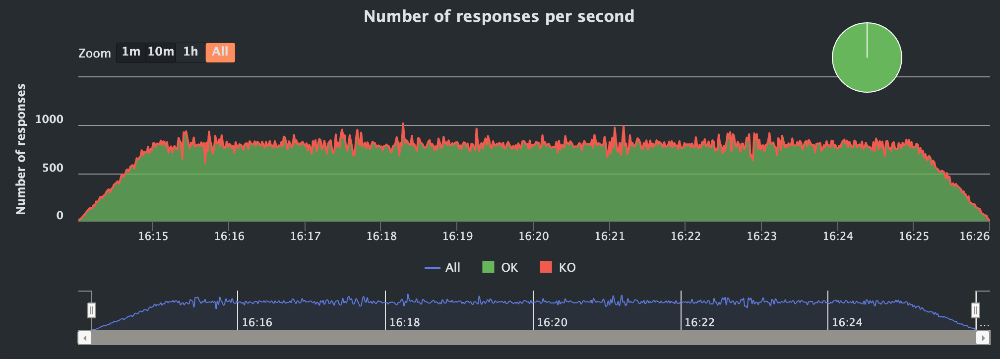 | 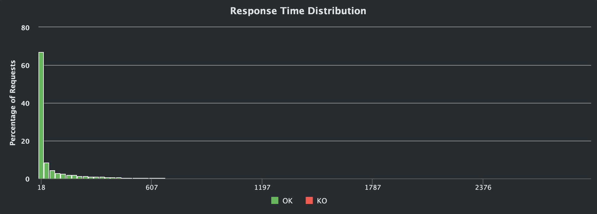 |

| `postgres-candidates` CPU | `postgres-job-offers` CPU |
|---|---|
| 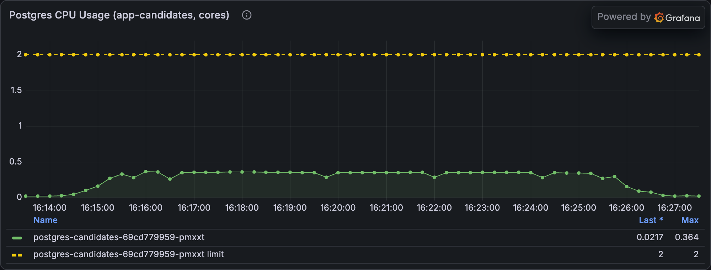 | 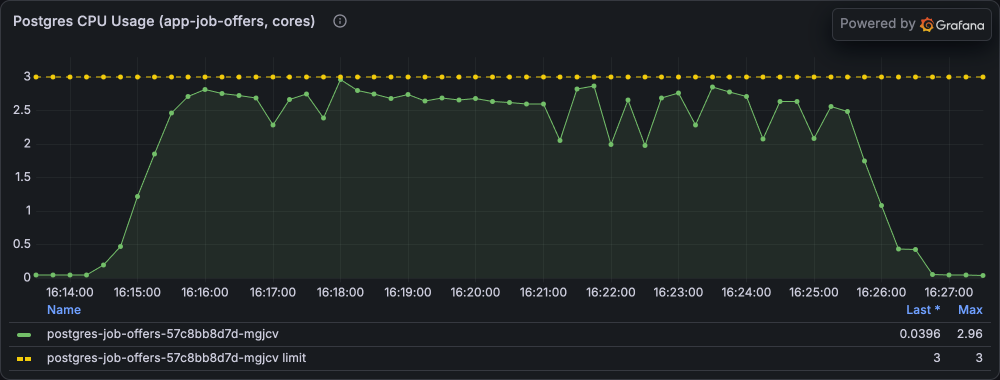 |

| Hikari pending `app-candidates` | Hikari pending `app-job-offers` |
|---|---|
| 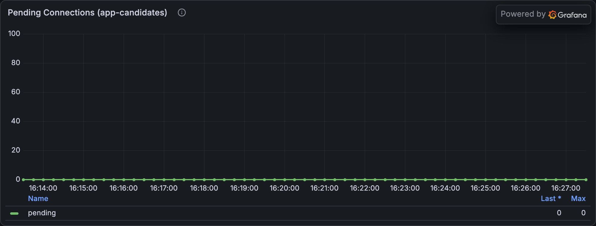 | 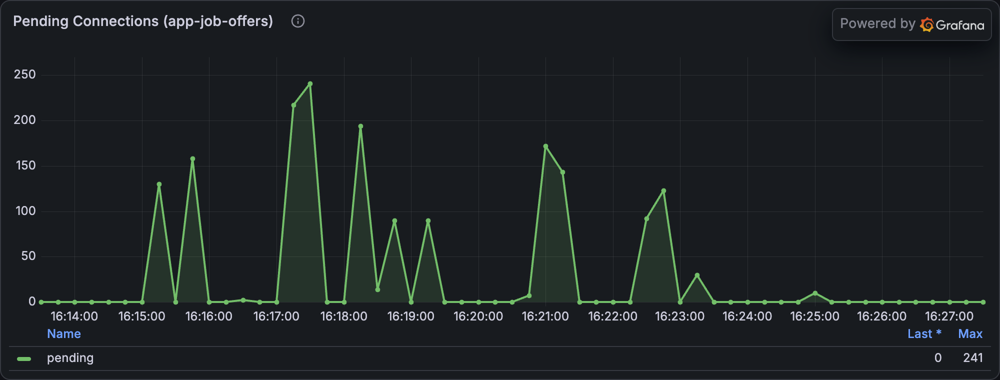 |

| JVM CPU `app-candidates` | JVM CPU `app-job-offers` |
|---|---|
| 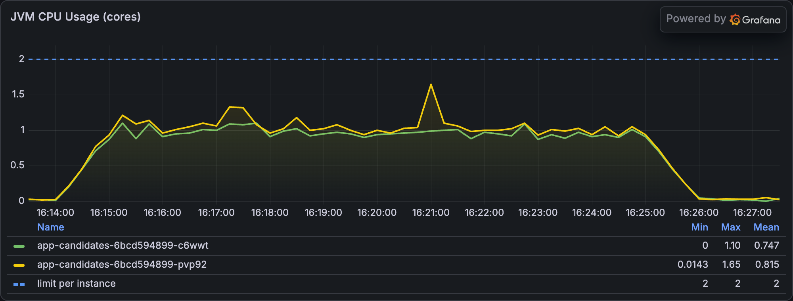 | 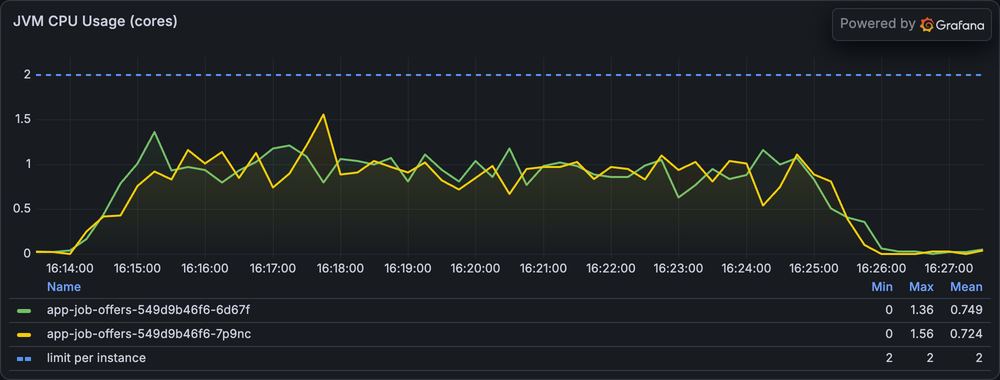 |

| Heap `app-candidates` (one replica) | Heap `app-job-offers` (one replica) |
|---|---|
| 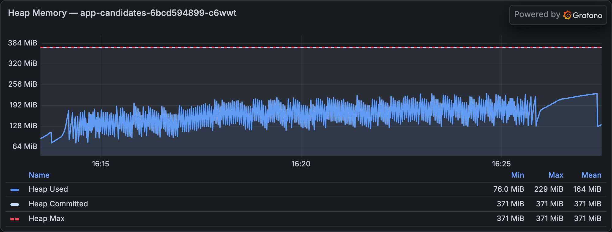 | 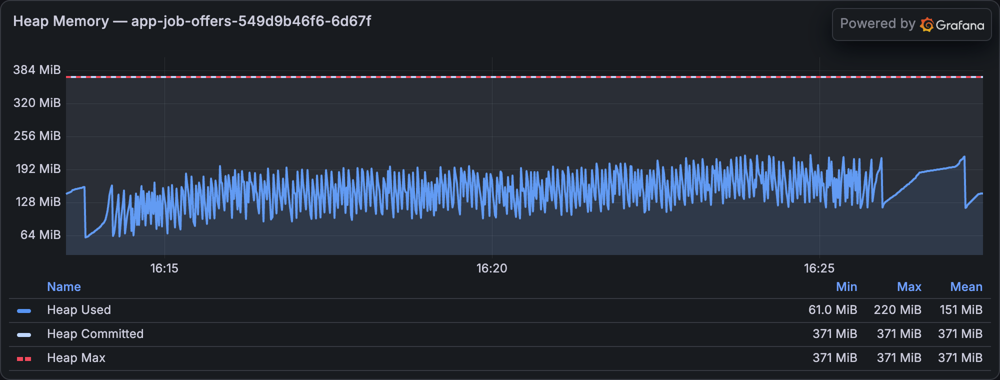 |

</details>

</details>

### 2026-09-20 — search split into two queries

**1200 rps** — 10 min, 792,000 requests, 0% KO · bottleneck: `app-job-offers` CPU

<details>
<summary>Details</summary>

| p50 | p95 | p99 | max |
|---|---|---|---|
| 11 ms | 62 ms | 159 ms | 767 ms |

**Change:** `app-job-offers` code only — the search returns just the matching IDs, then loads those offers with
skills and company in one query; employment types come in one batched `IN (...)` query (`@BatchSize(100)`). The old
single query returned one row per (skill × employment type) of every offer. **Postgres CPU per request ~3.4 → ~1.2 ms
(−65%).** The same commit also raised `app-job-offers` CPU to 3 — left out here, it's a separate step.

**Bottleneck:** `app-job-offers` CPU — 1.4 and 1.65 of 2 cores per replica, throttled 10% and 43%, Hikari queue
non-empty 30% of the time (max 58). At 1300 rps the slower replica is pinned at 2.0/2 (99% throttled), the server
caps at ~1280 rps, 1.1% KO. `app-candidates` ~1.4 of 2; Postgres 1.35 of 3. The two `app-job-offers` replicas didn't
cost the same: ~2.4 vs ~2.95 ms CPU per request at the same load. The slower one ran on `worker-1`, which also hosted
the busier replica in most later steps; the first 1200 run after the rollout failed on it (0.7% KO).

<details>
<summary>Key code changes</summary>

`JobOfferRepository`

<table>
<tr><th>Before</th><th>After</th></tr>
<tr>
<td>

```java
@EntityGraph("JobOffer.withAllRelations")
@Query("""
        SELECT DISTINCT o FROM JobOffer o
        JOIN o.offeredEmploymentTypes t
        JOIN o.company c
        WHERE ...
        """)
List<JobOfferEntity> findCandidateMatches(...);
```

</td>
<td>

```java
@Query("""
        SELECT DISTINCT o.id FROM JobOffer o
        JOIN o.offeredEmploymentTypes t
        JOIN o.company c
        WHERE ...
        """)
List<UUID> findCandidateMatchIds(...);

@EntityGraph("JobOffer.withSkillsAndCompany")
List<JobOfferEntity> findByIdIn(Collection<UUID> ids);
```

</td>
</tr>
</table>

`JobOfferEntity`

<table>
<tr><th>Before</th><th>After</th></tr>
<tr>
<td>

```java
@NamedEntityGraph(name = "JobOffer.withAllRelations",
    attributeNodes = {
        @NamedAttributeNode("offeredEmploymentTypes"),
        @NamedAttributeNode("company"),
        @NamedAttributeNode(value = "skills", ...)})
...
@Enumerated(EnumType.STRING)
private Set<EmploymentType> offeredEmploymentTypes;
```

</td>
<td>

```java
@NamedEntityGraph(name = "JobOffer.withSkillsAndCompany",
    attributeNodes = {
        @NamedAttributeNode("company"),
        @NamedAttributeNode(value = "skills", ...)})
...
@Enumerated(EnumType.STRING)
@BatchSize(size = 100)
private Set<EmploymentType> offeredEmploymentTypes;
```

</td>
</tr>
</table>

`JobOfferService.search`

<table>
<tr><th>Before</th><th>After</th></tr>
<tr>
<td>

```java
@WithSpan
public List<JobOfferMatchDto> search(...) {
    List<JobOfferEntity> offers =
        jobOfferRepository.findCandidateMatches(...);
    ...
        e.getOfferedEmploymentTypes(),
```

</td>
<td>

```java
@Transactional(readOnly = true)
@WithSpan
public List<JobOfferMatchDto> search(...) {
    List<UUID> matchedIds =
        jobOfferRepository.findCandidateMatchIds(...);
    if (matchedIds.isEmpty()) {
        return List.of();
    }
    List<JobOfferEntity> offers =
        jobOfferRepository.findByIdIn(matchedIds);
    ...
        Set.copyOf(e.getOfferedEmploymentTypes()),
```

</td>
</tr>
</table>

</details>

<details>
<summary>Screenshots</summary>

| Gatling — responses per second | Gatling — response time distribution |
|---|---|
| 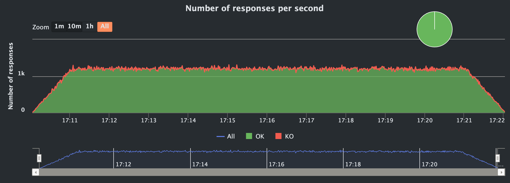 | 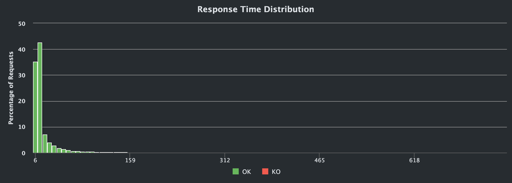 |

| `postgres-candidates` CPU | `postgres-job-offers` CPU |
|---|---|
| 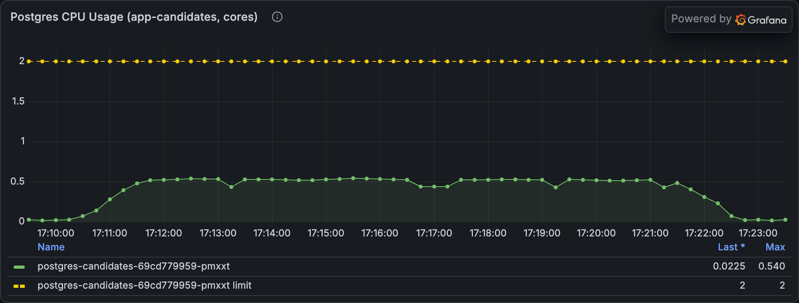 | 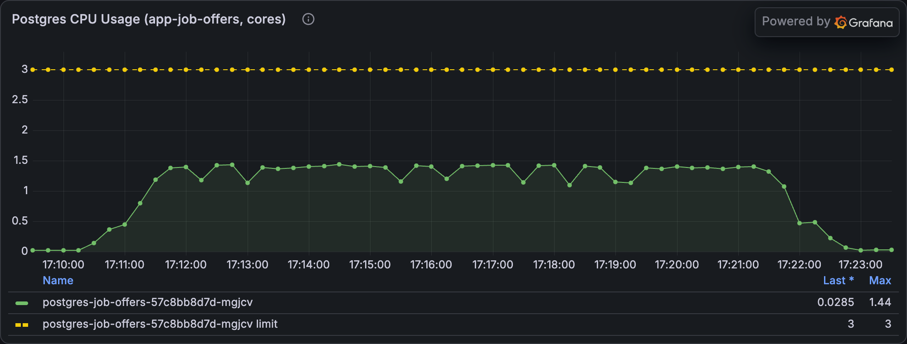 |

| Hikari pending `app-candidates` | Hikari pending `app-job-offers` |
|---|---|
| 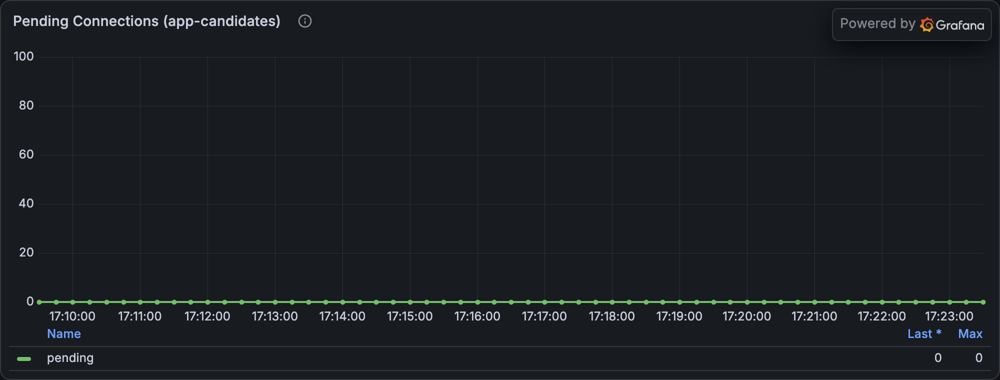 | 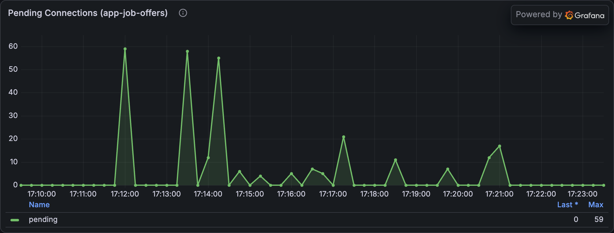 |

| JVM CPU `app-candidates` | JVM CPU `app-job-offers` |
|---|---|
| 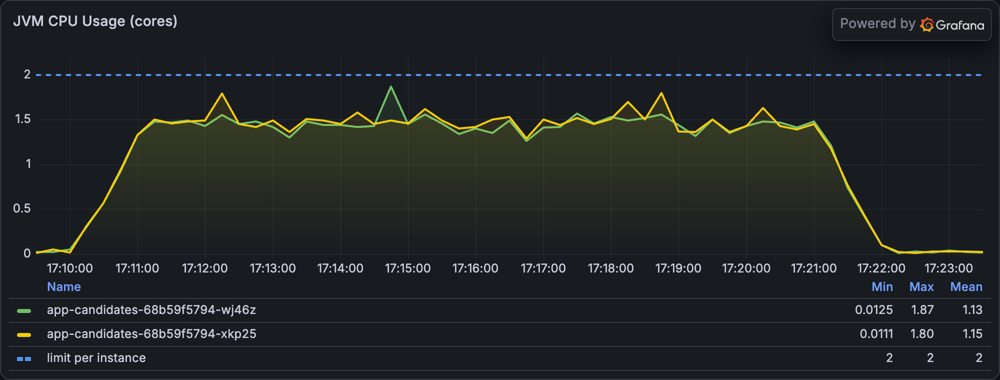 | 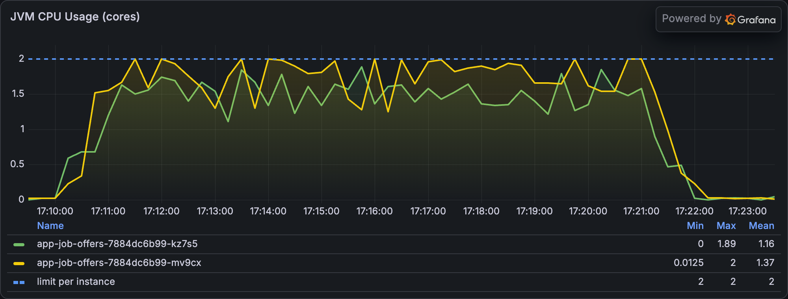 |

| Heap `app-candidates` (one replica) | Heap `app-job-offers` (one replica) |
|---|---|
| 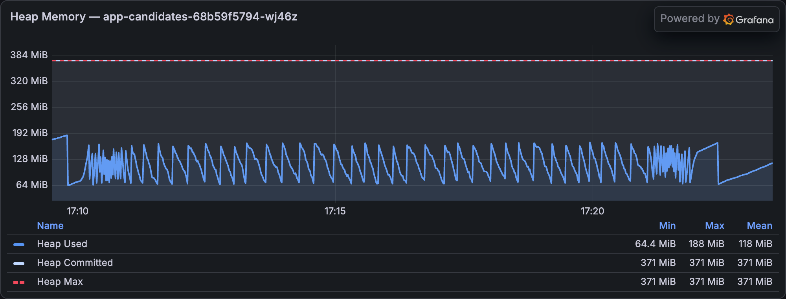 | 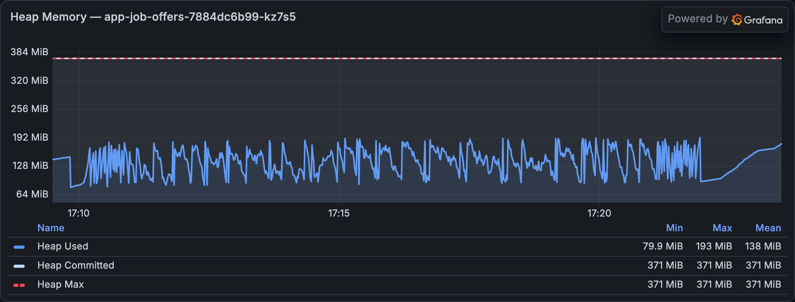 |

</details>

</details>

### 2026-09-20 — CPU 3 on the apps

**1700 rps** — 10 min, 1,122,000 requests, 0% KO · bottleneck: `app-job-offers` CPU

<details>
<summary>Details</summary>

| p50 | p95 | p99 | max |
|---|---|---|---|
| 22 ms | 143 ms | 671 ms | 1,191 ms |

**Change:** CPU limit 2 → 3 on `app-candidates`, `app-job-offers` and `postgres-candidates` — each app replica still
has its own node, so the extra core was idle hardware before. The JVMs now see 3 processors; still Serial GC with
the pinned 384 MB heap.

**Bottleneck:** `app-job-offers` CPU — 2.56 and 2.23 of 3 cores per replica (throttled 23% / 5%), its 10-connection
Hikari pools queue 76% of the time (max 79). At 1800 rps the busier replica reaches 2.87/3 (51% throttled), the queue
never empties and the tail breaks (p95 1.1 s, 0.1% KO). `app-candidates` 2.2-2.5 of 3; `postgres-job-offers` 2.1 of
3; worker nodes at 75-85% CPU including Cilium and DaemonSets.

<details>
<summary>Key code changes</summary>

`k8s-cluster/manifests/{candidates,job-offers}/app.yaml, candidates/postgres.yaml`

<table>
<tr><th>Before</th><th>After</th></tr>
<tr>
<td>

```yaml
limits:
  cpu: "2"
```

</td>
<td>

```yaml
limits:
  cpu: "3"
```

</td>
</tr>
</table>

</details>

<details>
<summary>Screenshots</summary>

| Gatling — responses per second | Gatling — response time distribution |
|---|---|
| 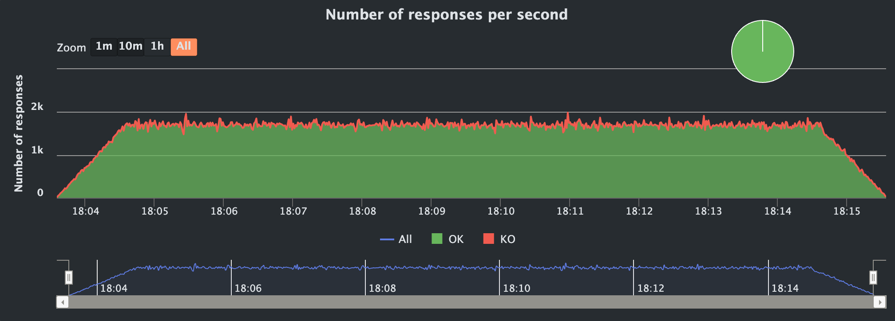 | 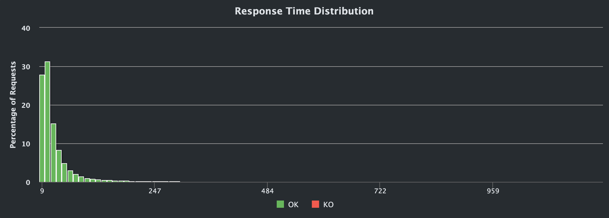 |

| `postgres-candidates` CPU | `postgres-job-offers` CPU |
|---|---|
| 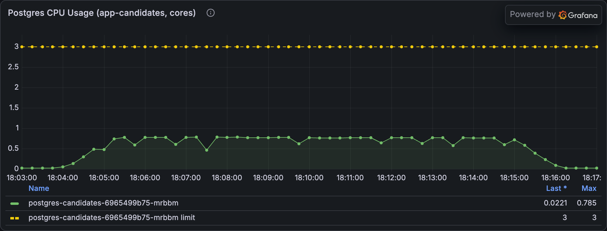 | 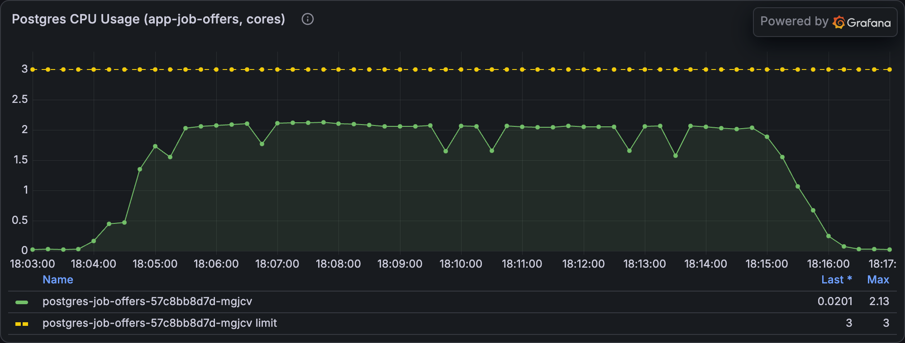 |

| Hikari pending `app-candidates` | Hikari pending `app-job-offers` |
|---|---|
| 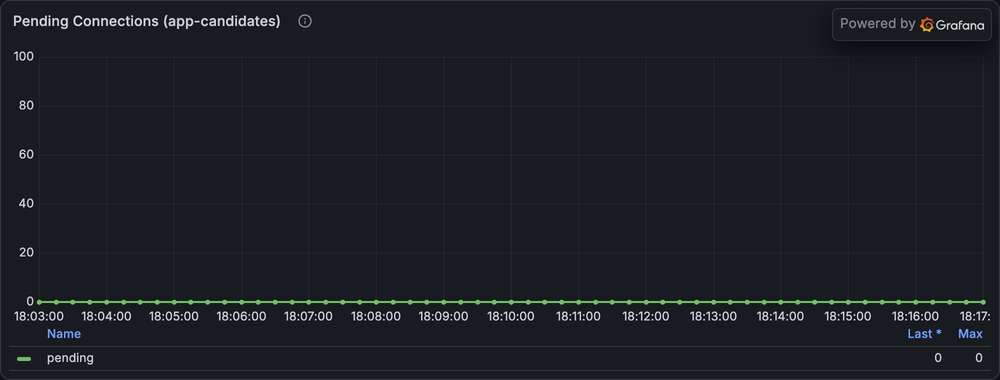 | 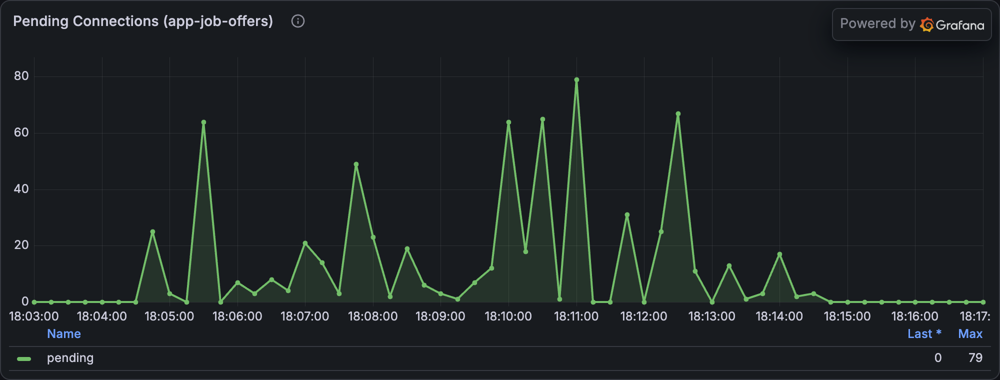 |

| JVM CPU `app-candidates` | JVM CPU `app-job-offers` |
|---|---|
| 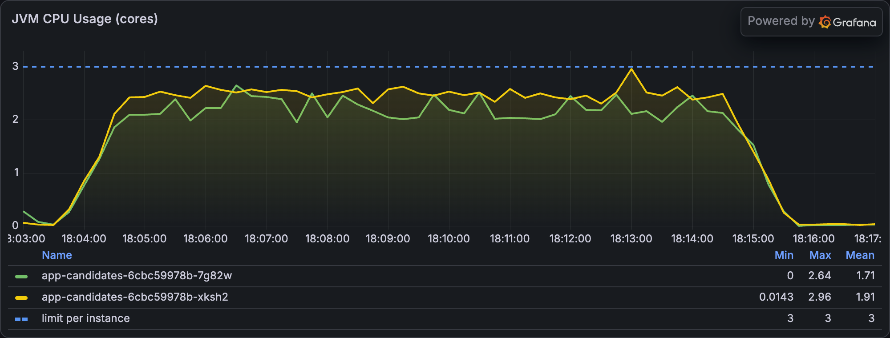 | 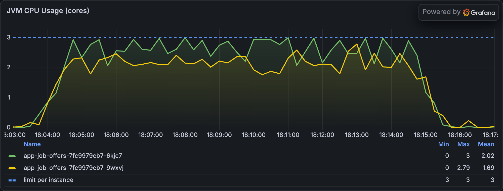 |

| Heap `app-candidates` (one replica) | Heap `app-job-offers` (one replica) |
|---|---|
| 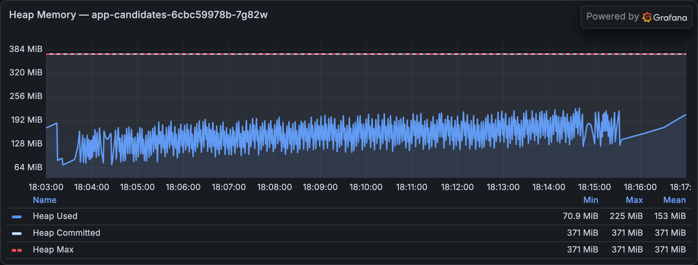 | 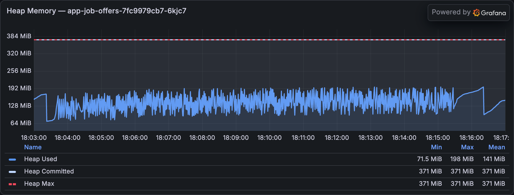 |

</details>

</details>

### 2026-09-24 — native search query

**1800 rps** — 10 min, 1,188,000 requests, 0% KO · bottleneck: `app-candidates` CPU

<details>
<summary>Details</summary>

| p50 | p95 | p99 | max |
|---|---|---|---|
| 23 ms | 147 ms | 405 ms | 1,248 ms |

**Change:** `findCandidateMatchIds` as a native SQL query instead of JPQL. Its two `IN (:list)` parameters kept
Hibernate from caching the HQL → SQL translation, so every request recompiled the query; native SQL skips that step,
and Postgres receives the same statement as before. `app-job-offers` CPU per request ~2.8 → ~2.4 ms (−17%).

**Bottleneck:** `app-candidates` CPU — 2.4 and 2.7 of 3 cores per replica (throttled 3% / 25%), its 30-connection
Hikari pool queues up to 131 waiting. At 1900 rps the busier replica reaches 2.91/3 (65% throttled), its pool is full
all the time, and the tail breaks (p95 2 s, 1% KO). `app-job-offers` 2.0-2.2 of 3, `postgres-job-offers` 2.15 of 3;
the node under the busier `app-candidates` replica runs at ~90% CPU.

<details>
<summary>Key code changes</summary>

`JobOfferRepository`

<table>
<tr><th>Before</th><th>After</th></tr>
<tr>
<td>

```java
@Query("""
    SELECT DISTINCT o.id FROM JobOffer o
    JOIN o.offeredEmploymentTypes t
    JOIN o.company c
    WHERE o.status = 'ACTIVE'
    AND c.geoLat BETWEEN :latMin AND :latMax
    AND c.geoLon BETWEEN :lonMin AND :lonMax
    AND o.salaryTo >= :expectedSalary
    AND t IN :employmentTypes
    AND EXISTS (
        SELECT jos FROM JobOfferSkill jos
        WHERE jos.jobOffer = o
        AND jos.skill.name IN :skillNames
    )
    """)
List<UUID> findCandidateMatchIds(...,
    Collection<EmploymentType> employmentTypes,
    Collection<String> skillNames);
```

</td>
<td>

```java
@NativeQuery(sqlResultSetMapping = ID_RESULT_MAPPING, value = """
    SELECT DISTINCT o.id FROM job_offer o
    JOIN job_offer_employment_type t ON t.job_offer_id = o.id
    JOIN company c ON c.id = o.company_id
    WHERE o.status = 'ACTIVE'
    AND c.geo_lat BETWEEN :latMin AND :latMax
    AND c.geo_lon BETWEEN :lonMin AND :lonMax
    AND o.salary_to >= :expectedSalary
    AND t.employment_type IN (:employmentTypes)
    AND EXISTS (
        SELECT 1 FROM job_offer_skill jos
        JOIN skill s ON s.id = jos.skill_id
        WHERE jos.job_offer_id = o.id
        AND s.name IN (:skillNames)
    )
    """)
List<UUID> findCandidateMatchIds(...,
    Collection<String> employmentTypes,
    Collection<String> skillNames);
```

</td>
</tr>
</table>

`JobOfferEntity`

<table>
<tr><th>Before</th><th>After</th></tr>
<tr>
<td>

```java
@Entity(name = "JobOffer")
```

</td>
<td>

```java
@SqlResultSetMapping(name = JobOfferEntity.ID_RESULT_MAPPING,
        columns = @ColumnResult(name = "id", type = UUID.class))
@Entity(name = "JobOffer")
```

</td>
</tr>
</table>

</details>

<details>
<summary>Screenshots</summary>

| Gatling — responses per second | Gatling — response time distribution |
|---|---|
|  | 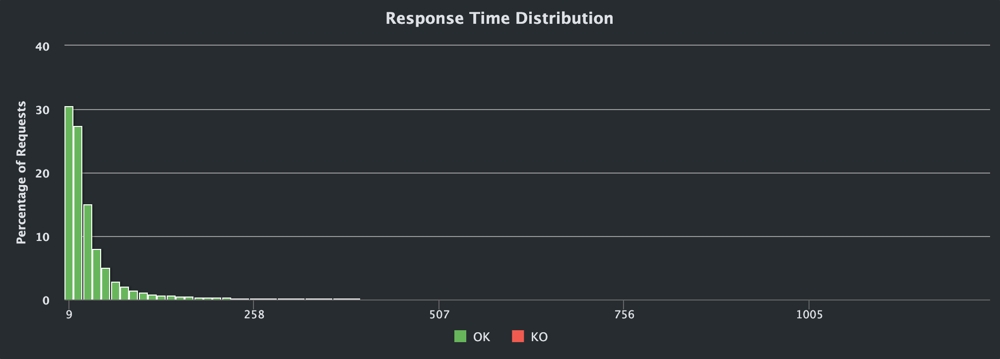 |

| `postgres-candidates` CPU | `postgres-job-offers` CPU |
|---|---|
| 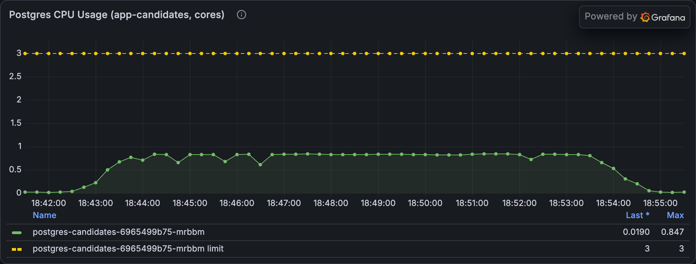 | 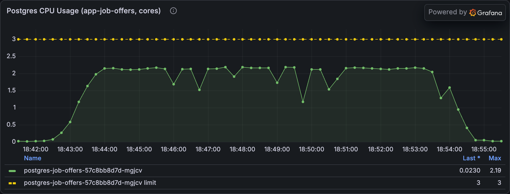 |

| Hikari pending `app-candidates` | Hikari pending `app-job-offers` |
|---|---|
| 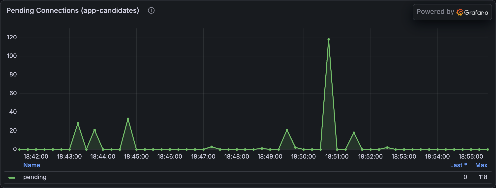 | 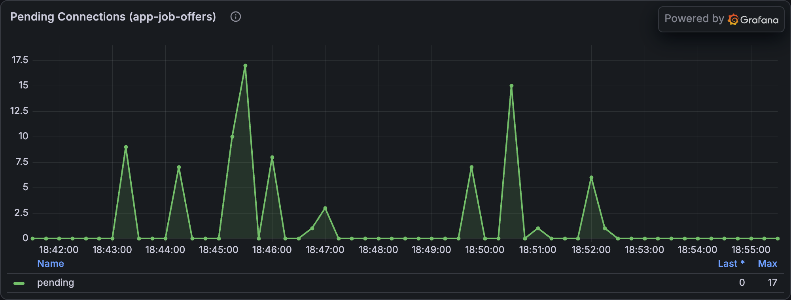 |

| JVM CPU `app-candidates` | JVM CPU `app-job-offers` |
|---|---|
| 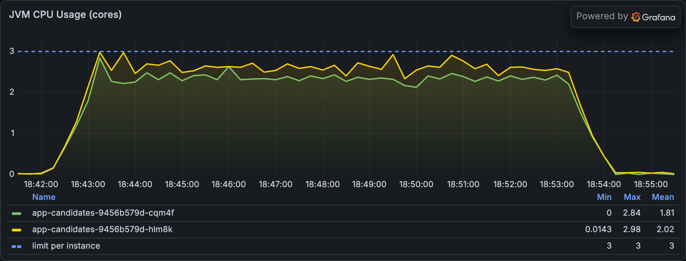 | 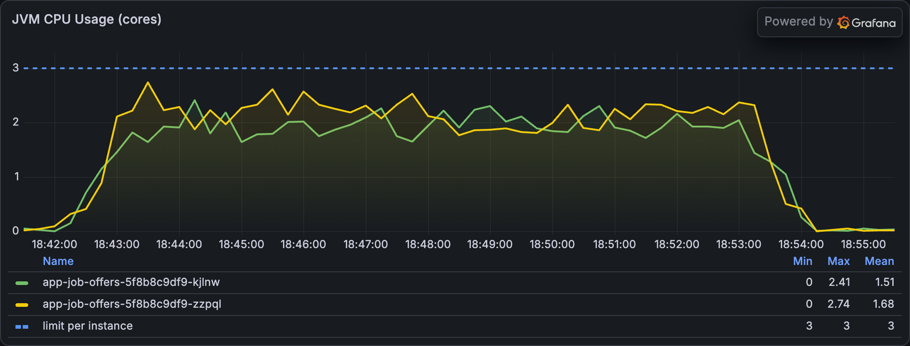 |

| Heap `app-candidates` (one replica) | Heap `app-job-offers` (one replica) |
|---|---|
| 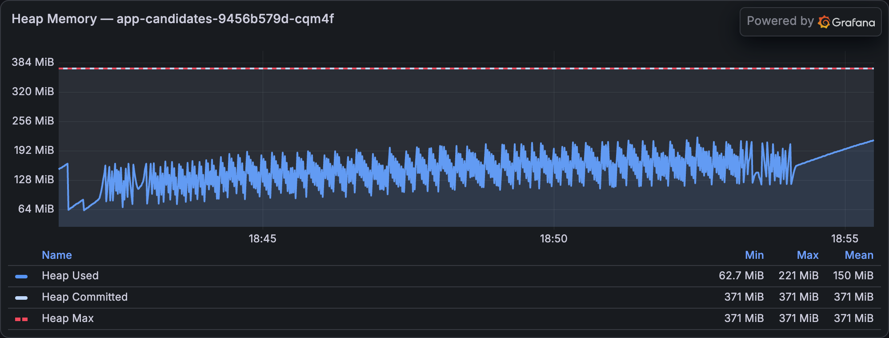 | 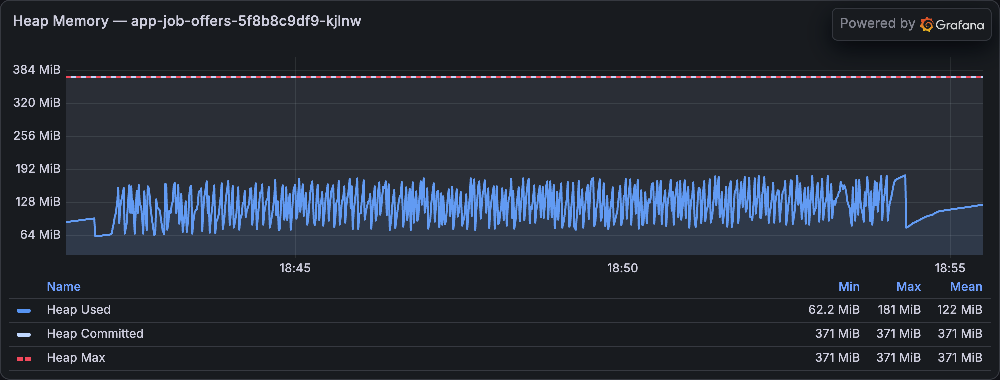 |

</details>

</details>

### 2026-09-28 — candidate loaded with `JOIN FETCH`

**2000 rps** — 10 min, 1,320,000 requests, 0% KO · bottleneck: `app-job-offers` Hikari pool + `postgres-job-offers` CPU

<details>
<summary>Details</summary>

| p50 | p95 | p99 | max |
|---|---|---|---|
| 22 ms | 160 ms | 1,316 ms | 1,701 ms |

**Change:** `app-candidates` loads the candidate with one JPQL query using `LEFT JOIN FETCH` on skills and employment
types instead of `findById` with an entity graph. Hibernate never caches a load plan with an applied entity graph,
and the graph also loaded one collection with a separate query. `app-candidates` CPU per request ~2.8 → ~2.1 ms
(−26%), `postgres-candidates` CPU −42%, and its Hikari pool stopped queueing (3 connections in use on average, was 17).

**Bottleneck:** `app-job-offers` Hikari pool and `postgres-job-offers` CPU. The 10-connection pools queue 81% of the
time (up to 190 waiting) — the search holds its connection through scoring — while Postgres runs 2.44 of 3 cores,
throttled 9%, and the busier `app-job-offers` replica (on `worker-1`) 2.65 of 3 on a node at 88% CPU. 2100 rps is the
edge: one of three 10-minute runs passed with 0% KO, two had 0.005-0.013% KO, all with the pools full ~97% of the time
and p95 0.6-0.85 s. `app-candidates` ~2.1 of 3.

<details>
<summary>Key code changes</summary>

`CandidateRepository`

<table>
<tr><th>Before</th><th>After</th></tr>
<tr>
<td>

```java
@EntityGraph("Candidate.withSkillsAndEmploymentTypes")
Optional<CandidateEntity> findById(UUID id);
```

</td>
<td>

```java
@Query("""
        SELECT c FROM Candidate c
        LEFT JOIN FETCH c.skills
        LEFT JOIN FETCH c.preferredEmploymentTypes
        WHERE c.id = :id
        """)
Optional<CandidateEntity> findWithSkillsAndEmploymentTypesById(UUID id);
```

</td>
</tr>
</table>

`CandidateEntity`

<table>
<tr><th>Before</th><th>After</th></tr>
<tr>
<td>

```java
@NamedEntityGraph(name = "Candidate.withSkillsAndEmploymentTypes",
    attributeNodes = {
        @NamedAttributeNode("skills"),
        @NamedAttributeNode("preferredEmploymentTypes")})
...
private List<CandidateSkillEntity> skills = new ArrayList<>();
```

</td>
<td>

```java
...
private Set<CandidateSkillEntity> skills = new HashSet<>();
```

</td>
</tr>
</table>

</details>

<details>
<summary>Screenshots</summary>

| Gatling — responses per second | Gatling — response time distribution |
|---|---|
| 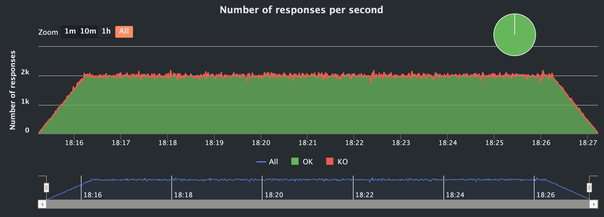 | 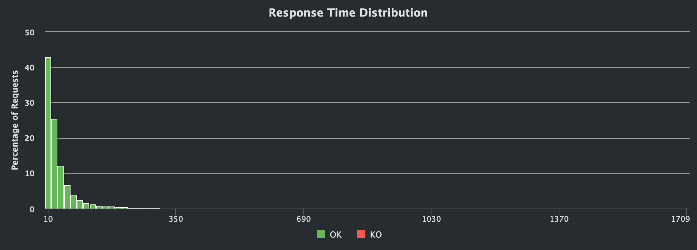 |

| `postgres-candidates` CPU | `postgres-job-offers` CPU |
|---|---|
| 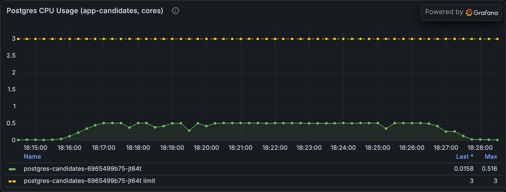 | 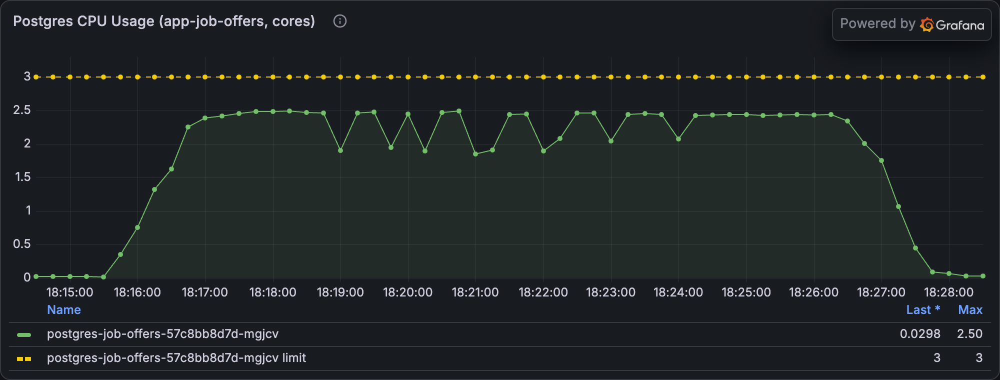 |

| Hikari pending `app-candidates` | Hikari pending `app-job-offers` |
|---|---|
|  | 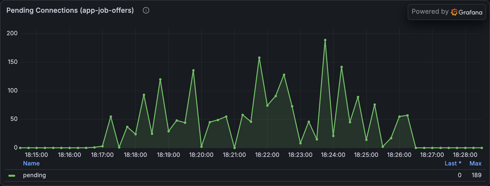 |

| JVM CPU `app-candidates` | JVM CPU `app-job-offers` |
|---|---|
| 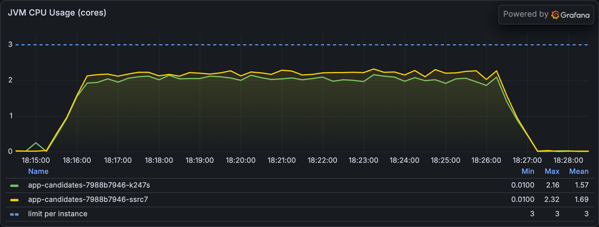 | 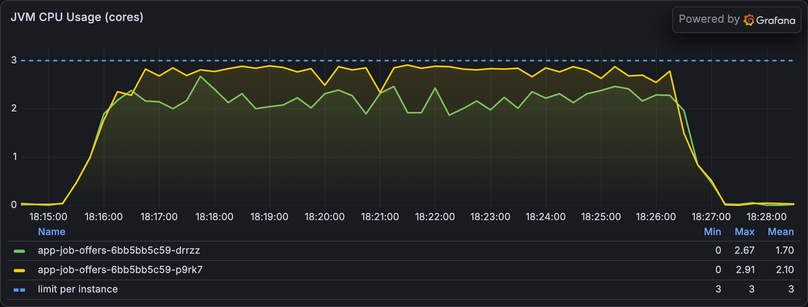 |

| Heap `app-candidates` (one replica) | Heap `app-job-offers` (one replica) |
|---|---|
| 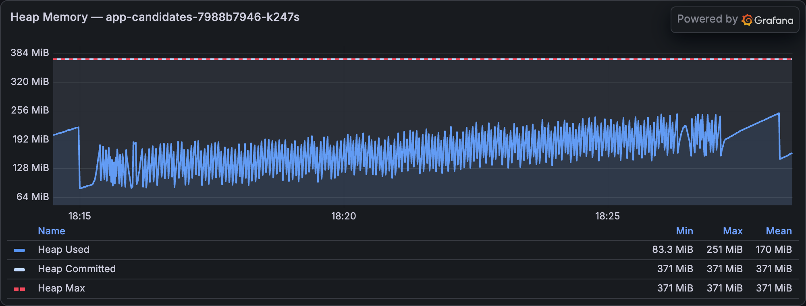 | 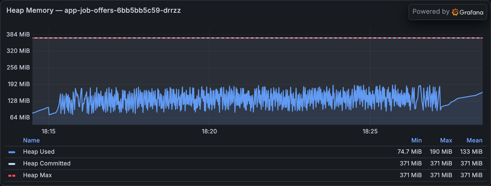 |

</details>

</details>

### 2026-09-28 — `app-candidates` × 3

**2100 rps** — 10 min, 1,386,000 requests, 0% KO · bottleneck: `postgres-job-offers` CPU

<details>
<summary>Details</summary>

| p50 | p95 | p99 | max |
|---|---|---|---|
| 20 ms | 145 ms | 602 ms | 997 ms |

**Change:** a 3rd `app-candidates` replica on the last free worker (`worker-2`), its Hikari pool 30 → 40, and
`postgres-candidates` `max_connections` 100 → 150 to fit 3 × 40. Originally the HPA's ceiling, pinned to a static 3.
`app-candidates` was not the bottleneck, so the gain is small: +100 rps, and at 2100 rps the tail is much shorter
(p95 145 ms vs 0.6-0.85 s) — `app-candidates` drops to ~1.4 of 3 cores per replica.

**Bottleneck:** `postgres-job-offers` CPU — 2.61 of 3 cores, throttled 24%; both `app-job-offers` Hikari pools are busy
85% of the time (up to 189 waiting), and its replicas run ~2.45 of 3 on nodes at 82% CPU. At 2200 rps Postgres reaches
~2.7/3, the pools never empty, full GCs start mid-test and the runs don't hold (KO in two of three). This is where `main` stands too: the next step is cheaper
Postgres queries (e.g. measuring them with `pg_stat_statements`), not more app capacity.

<details>
<summary>Key code changes</summary>

`k8s-cluster/manifests/candidates/hpa.yaml`

<table>
<tr><th>Before</th><th>After</th></tr>
<tr>
<td>

```yaml
minReplicas: 2
maxReplicas: 2
```

</td>
<td>

```yaml
minReplicas: 3
maxReplicas: 3
```

</td>
</tr>
</table>

`app-candidates/src/main/resources/application.yml`

<table>
<tr><th>Before</th><th>After</th></tr>
<tr>
<td>

```yaml
maximum-pool-size: 30
minimum-idle: 30
```

</td>
<td>

```yaml
maximum-pool-size: 40
minimum-idle: 40
```

</td>
</tr>
</table>

`k8s-cluster/manifests/candidates/postgres.yaml`

<table>
<tr><th>Before</th><th>After</th></tr>
<tr>
<td>

```yaml
image: postgres:18.3
ports:
```

</td>
<td>

```yaml
image: postgres:18.3
args: ["-c", "max_connections=150"]
ports:
```

</td>
</tr>
</table>

</details>

<details>
<summary>Screenshots</summary>

| Gatling — responses per second | Gatling — response time distribution |
|---|---|
| 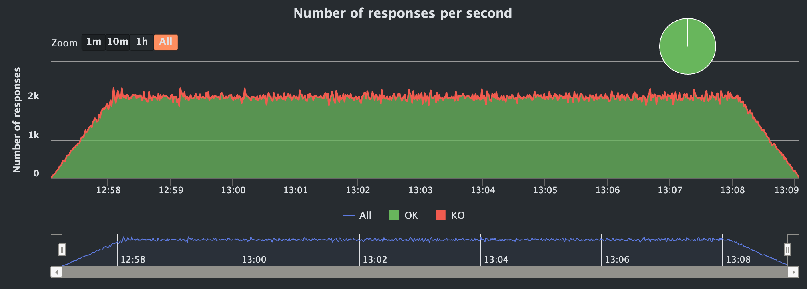 | 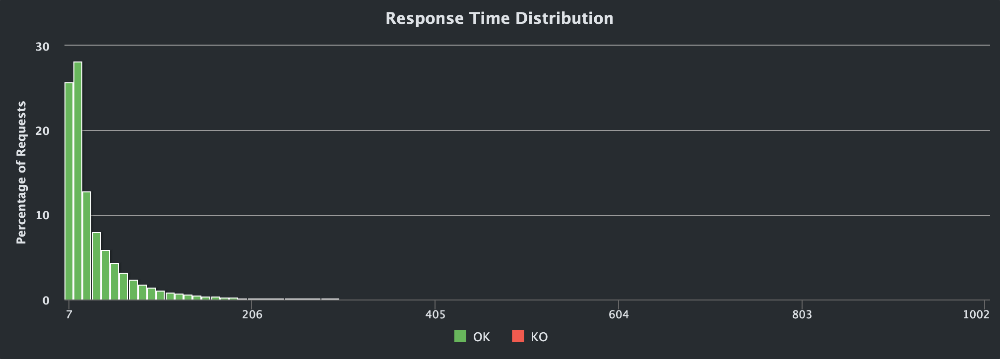 |

| `postgres-candidates` CPU | `postgres-job-offers` CPU |
|---|---|
| 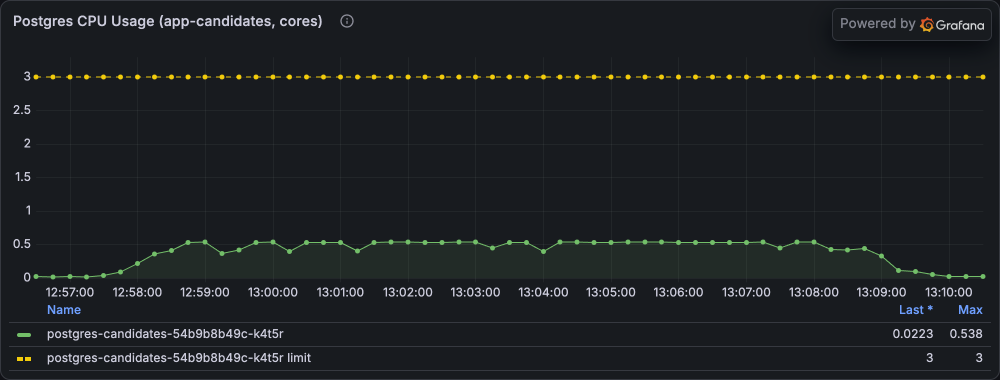 | 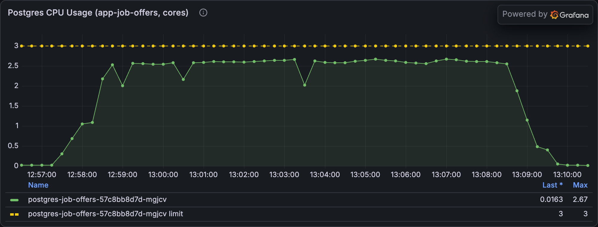 |

| Hikari pending `app-candidates` | Hikari pending `app-job-offers` |
|---|---|
| 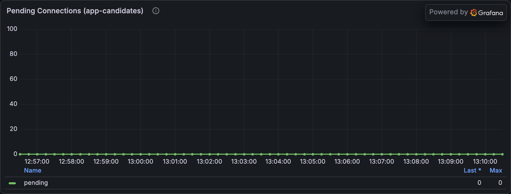 | 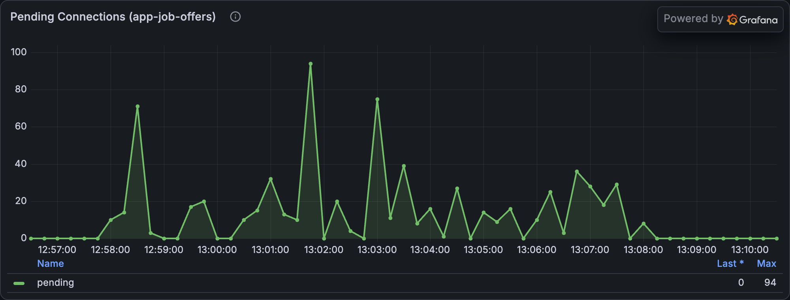 |

| JVM CPU `app-candidates` | JVM CPU `app-job-offers` |
|---|---|
| 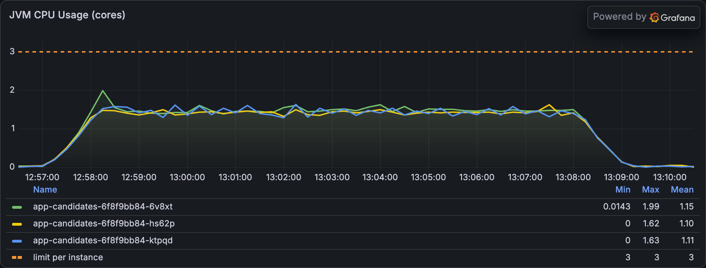 | 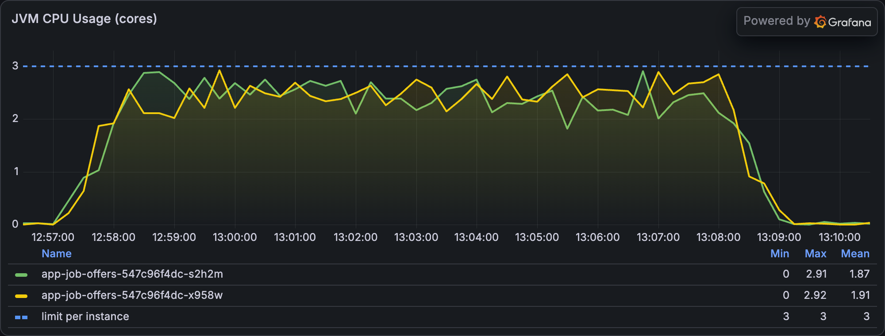 |

| Heap `app-candidates` (one replica) | Heap `app-job-offers` (one replica) |
|---|---|
| 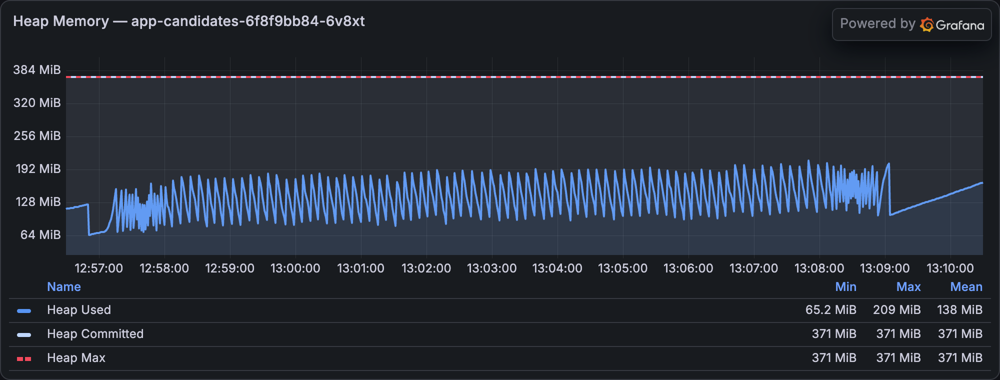 | 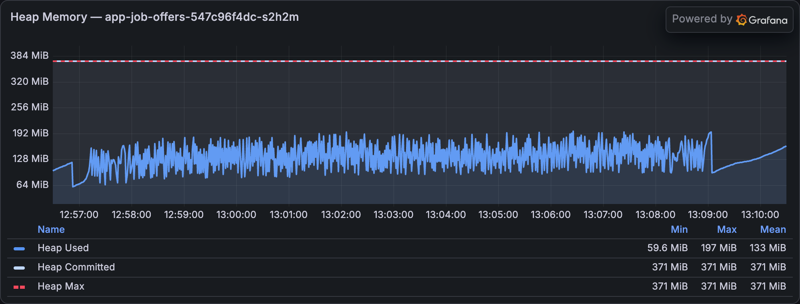 |

</details>

</details>
